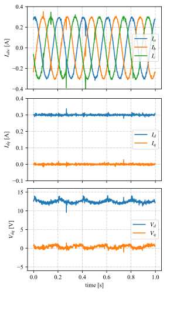

# AMDS in action
Example showing the benefit of using the AMDS.

## Introduction

The bane of all control engineers since the dawn of time (or rather since the field was discovered) has been noise. While several methods have been 
discovered to mitigate the effects of noise, including using filters, observers etc., the best solution is always to minimize (or eliminate) the root cause
of the problem. The AMDS (Adavanced Motor Design Sensing) board was designed with this goal in mind. By sampling signals (current, voltage) right at the 
sensor output, great reductions in external field coupling can be achieved, leading to a much cleaner waveform. This information can then be communicated 
to the AMDC, or any other controller, via a digital interface to facilitate high-integrity data transmission. 

## Experimental Validation of AMDS

To practically demonstrate the usefulness of the AMDS, an experiment comparing current waveforms on a 3 phase RL load under closed loop 3 phase current 
control was conducted. Images of two nearly identical test setups are shown below and the alogrithm executed on the AMDC under both cases is identical as
well. The only differentiating factor in both test setups is in how the current signals are sampled. In Test Setup 1, the currents are sampled on the AMDC 
using the on-board analog input channels. To interface between the current cards and the AMDC, an analog breakout board is used in this test setup, as 
highlighted with the red box. In Test Setup 2, the phase currents are measured using the same current sensors, but have been sampled very close to the 
signal point of origin using the AMDS on-board processor. The data is then communicated to the AMDC via a digital interface, as highlighted with the 
double-sided red arrow line. The absence of the analog breakout board can be clearly observed in this particular test setup.
 
```{figure} images/test_setup1.jpg
:alt: fishy
:class: bg-primary
:width: 500px

Test Setup 1
```
<br>

```{figure} images/test_setup2.jpg
:alt: fishy
:class: bg-primary
:width: 500px

Test Setup 2
```

The current readings obtained from both test setup 1 and 2 respsectively are shown below. The improvement obtained with the AMDS can be clearly observed 
in the second plot, so much so that the waveforms almost seem to be obtained from simulation rather than from hardware testing. These plots clearly
illustrate the advantages gained by using the AMDS.

 
