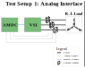
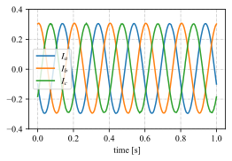
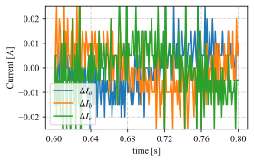
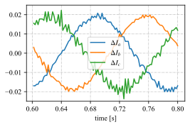
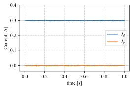
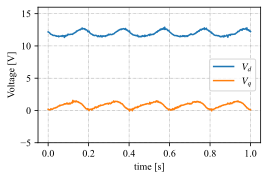

# AMDS in Action
Example showing advantages of using the AMDS.

## Introduction

The bane of all control engineers since the dawn of time (or rather since the field was discovered) has been noise. While several methods have been 
discovered to mitigate the effects of noise, including using filters, observers etc., the best solution is always to minimize (or eliminate) the root
cause of the problem. The AMDS (Adavanced Motor Design Sensing) board was designed with this goal in mind. By sampling signals (current, voltage) 
right at the sensor output, great reductions in external field coupling can be achieved, leading to a much cleaner waveform. This information can then
be communicated to the AMDC, or any other controller, via a digital interface to facilitate high-integrity data transmission. Subsequent sections will 
demonstrate the benefits of using the AMDS with the aid of test results obtained from the closed loop field oriented current control on a 3 phase R-L 
load with and without the AMDS.

## Required Hardware

To run this experiment, the following hardware was employed:
1. AMDC: to run the control loop and log data (qty 1)
2. AMDS: for obvious reasons (qty 1)
3. Current cards: to measure currents flowing all phases (qty 3)
4. 3-Phase Voltage Source Inverter: to create the voltages commanded by the AMDC (qty 1)
5. DC Power Supply: to provide power to the voltage source inverter (qty 1)
6. 3-Phase R-L Load: to excite sufficiently large currents for regulation and measurement (qty 1)


## Test Setup

As mentioned previously, the goal of this experiment is to showcase the benefits of using the AMDS. To do so, `d-q current control` on a 3-phase R-L 
load was conducted under two conditions: 1) with the currents sampled using the AMDC on-board Analog to Digital Converters and 2) with the currents 
sampled on the AMDS and communicated to the AMDC via a digital interface. Everything else, including the current cards, the voltage source inverter, 
the control algorithm etc. was kept identical between both tests to ensure that the changes observed are due to the AMDS alone. A block diagram 
showing the test setup under both conditions, as well as pictures of the hardware setup, are provided below. The difference between the test setups 
have been made apparent in both sets of figures.

 

```{figure} images/test_setup1.jpg
:alt: hw1
:class: bg-primary
:width: 500px

Test Setup 1
```
<br>

```{figure} images/test_setup2.jpg
:alt: hw2
:class: bg-primary
:width: 500px

Test Setup 2
```


## Results

### Phase Currents

The current readings obtained from both test setup 1 and 2 respsectively are shown below. The improvement obtained with the AMDS can be clearly 
observed in the second plot, so much so that the waveforms almost seem to be obtained from simulation rather than from hardware testing. 

 

In order to further drive home the improvement obtained with the AMDS, plots comparing the difference between subsequent current samples (or `.diff()`)
are shown below. For an ideal sinuisodal wave, one would expect the `.diff()` waveform to be sinuisodal as well. As the noise content in the waveform
increases, it becomes harder to perceive this characteristic on account of higher order harmonics. The relatively high noise content in test setup 1
can be clearly observed from the `.diff()` plots of the phase current waveforms.

 

### Control Signals

With the improvement in phase current waveforms on account of the AMDS established, we can now look into how this improvement impacts signals within 
the control algorithm. To do so, plots of `Id, Iq` and `Vd, Vq` are compared under both test conditions. Again, a significant improvement can be 
observed with the AMDS, which can be correlated directly to the improvements obtained with the phase current waveforms.
 
 
 

## Conclusion

The AMDS is capable of sampling and communicating data obtained from upto 8 sensor signals at a time. This combined with the significant noise 
reductions in the sensor signals, as presented above, makes the AMDS the ideal companion to the AMDC for Advanced Motor Drive Control algorithm 
implementation. 