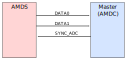

# Firmware

Description of the architecture design of the AMDS mainboard firmware.

## Introduction

This document outlines the firmware architecture which runs the AMDS mainboard. By understanding how the mainboard works, users will be able to understand the performance limitations of the system. While the current firmware design will work for most applications, some users will find that the design must be tweaked to meet their system performance goals. Potential ideas for improvements are provided in the following sections which could be implemented in the future.

The main goal of the AMDS mainboard is to interface voltage/current sensor cards to an external control board (typically the AMDC). Therefore, the AMDS platform should be thought of as a slave to the main controller (master). The master must provide the signal to the AMDS that instructs it to sample all of the sensor cards. After all sampling is complete, the AMDS immediately transmits the latest sampled data back to master over two data lines.  

Since the AMDS is typically used in motor drives, these operations happen in real-time at 1000s of times per second. To facilitate the desired real-time operation, the AMDS has an embedded processor which orchestrates its behavior. The firmware running on this processor directly determines the performance of the sensor interface in terms of sampling latency and throughput.

## Architecture

While the architecture of the AMDS firmware is fairly simple, the I/O interface, priority of code, and latencies are critical to the overall performance.

### Interface to Master

The AMDS firmware is designed to interface to the master controller over three logical wires: one signal from the master, and two data lines to the master. Physically, these signals are all differential pairs for noise immunity.

#### RX Signal: `SYNC_ADC`

The `SYNC_ADC` signal is used to trigger ADC sampling, which is followed by data transmission. This signal from the master should be a square wave. On each rising or falling edge, the AMDS samples all the sensor cards on the mainboard. Normally, the master triggers a transition on this RX signal when the PWM carrier is at a peak or valley. This synchronizes the ADC sampling to the inverter PWM, thus reducing sampling noise.

After all sensorcards have been sampled, the AMDS streams all sampled data back to the master (see below for data format).

#### TX Signals: `DATA0` and `DATA0`

The two TX signals are controlled by the AMDS and go to the master. These are only used to send ADC sample data to the master. As soon as all ADCs are sampled, the AMDS starts sending the latest data to the master using the two TX wires. Two lanes are used so that the data can be transmitted at twice the speed, thus reducing latency.

The format of the data sent on the TX signals is UART. This means there is no clock line between the master and AMDS: the interface is completely asynchronous. The UART is configured to run at 25 Mbps. Conceptually, the TX lines are actually two distinct UART devices, each with only one-way communication. Both UARTs are configured as 8-bit data, 2 stop bits, and odd parity.

##### Data Format

The ADCs on the sensor cards are assumed to be 16-bit devices which are all compatible with each other (i.e. they can be daisy-chained and support equal clock rates). See each sensor card's hardware design files for specs on the specific ADCs which are supported. The 16-bit raw data from the ADCs are packed into bytes which are sent across the `DATA0` and `DATA1` UART lines. `DATA0` is used to send the contents of the first four sensor cards and `DATA1` sends the last four sensor card data. The transmissions happen in parallel between the data lines.

The message structure is equal between both `DATA0` and `DATA1`. However, each message corresponds to different sensor cards between `DATA0` and `DATA1` (i.e. 1-4, 5-8). Data is sent LSB first across the wire.

**Packet 1:** (first packet sent across `DATAx` line)

| Byte 0 | Byte 1 | Byte 2 |
| ---- | ---- | ---- |
| 0x90 | MSB of sample 1 | LSB of sample 1|

**Packet 2:**

| Byte 0 | Byte 1 | Byte 2 |
| ---- | ---- | ---- |
| 0x91 | MSB of sample 2 | LSB of sample 2|

**Packet 3:**

| Byte 0 | Byte 1 | Byte 2 |
| ---- | ---- | ---- |
| 0x92 | MSB of sample 3 | LSB of sample 3|

**Packet 4:** (last packet sent across `DATAx` line)

| Byte 0 | Byte 1 | Byte 2 |
| ---- | ---- | ---- |
| 0x93 | MSB of sample 4 | LSB of sample 4|

_NOTE: there is no full CRC included in the transmission. The simple protocol relies on the parity check in the UART packet. This is not a terribly robust approach, but has worked well is moderate EMI environments._

### Interrupt-Driven Design

After start-up, the AMDS firmware is completely interrupt driven. This means that all processing occurs within an interrupt context, not the main loop. The interrupt which used to drive the firmware occurs on the rising and falling edges of the `SYNC_ADC` signal.

The typical flow is as follows:

- The master is operating its PWM output and thus triggering the `SYNC_ADC` ISR periodically. Therefore, the ADCs on the sensor cards have been read and the latest data is stored in the AMDS memory.
- Once all the latest data is stored in memory, the AMDS sends the data back to the master. Once the data is sent, the AMDS waits for the next `SYNC_ADC` interrupt.

### Performance Limitations

The AMDS firmware design directly affects the operation limits of the `SYNC_ADC` signal. It will continue to work up to some threshold, at which point some ISRs will be missed and the performance will drop. However, the system will not "crash" -- it will continue to work, albeit not as well.

The maximum ADC sampling rate is limited to about 280kHz, or about 3.6usec. The latency for data transmission back to the master over the `DATAx` signals is about 6usec total. When factoring in additional delay between the trigger, as well as delay between sampling and transmission, the total time to sample and transmit data is just under 12usec.

This means that each edge of `SYNC_ADC` can occur every 12usec, for a total period of 24usec, or a frequency of 41666 kHz. This means that the AMDS cannot "keep up with" a PWM switching frequency of 100 kHz. 

Note that the AMDS firmware always assumes all eight sensor cards must be sampled. Even when they are not populated, the firmware timing remains as if all sensor cards were in pairs of daisy chains. This acts to limit the overall sampling throughput.

 This means that all eight sensor cards can be read at more than 100kHz. Practically, the bandwidth of transmitting data is not the issue since control typically only runs at 10-20kHz. However, the 6usec latency is important. This means that, for 10kHz control (i.e. Ts = 100usec), at least 6% of the control period is taken by simply transmitting data back to the master. This does not include the delay in sampling from the ADC devices, which is about 1.3usec. Therefore, a conservative estimate of the latency from the AMDS is the 12usec mentioned above.

#### Performance Specifications

Given a control frequency of `Fs` and PWM switching frequency of `Fsw`, the following constraints must be satisfied for the AMDS firmware to perform well:

- `Fsw` <= 100kHz
- 2 x `Fs` <= `Fsw`

For application with SiC or GaN inverters where `Fsw` is typically much faster than `Fs`, the AMDS firmware works well.

**Warning:** When `Fs` is close to `Fsw` (i.e. control frequency is equal to PWM frequency), **the current AMDS firmware design will not work well.**

## Future Improvements

The AMDS firmware works, albeit with limitations as described above. Some ideas to improve the system are now described:

1. The AMDS cannot be configured from the master. Improvements could use an additional TX/RX pair to enable simple register protocol for config. This could be used to set digital filter bandwidths, turn on/off sensor card slots for faster sampling, etc.

2. The ADC sampling throughput could be improved above 280kHz. Theoretically, the ADC devices support upwards of 1Msps, or 500ksps in two device daisy chain. This would probably require shortening the delay when the ADC is doing the sampling. The latest AMDS mainboard provides `BUSY` signals for each ADC which can be used for ISRs to end the ADC sampling window. These are not used in the current firmware. Instead, the simpler approach of busy waiting until the max timeout occurs is used (i.e. wait for 1300ns). However, the nominal wait time is only about 50% of this.

3. There is no robust CRC error detection on the data transmission from the AMDS to the master device, although the UART parity is used. Future improvements could add a footer CRC to ensure the received message at the master is valid. Error correction codes could also be used to further increase the communication robustness in high EMI environments (e.g. SECDED). There is no free lunch: all of these methods would increase the data transmission latency from the AMDS.

4. There is no need to transmit the data from all eight sensor cards if they are not all populated. Theorhetically, a user could run the AMDS interface MUCH faster with fewer sensor cards installed, if changes are made such that only real data acquired from a populated sensor card are transmitted back to the master.
