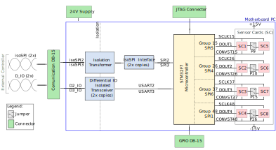
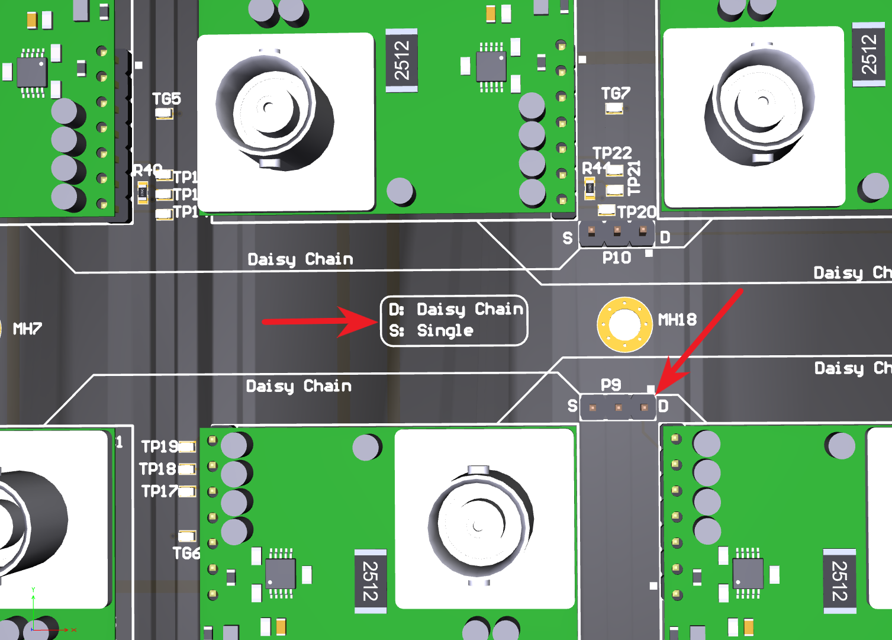
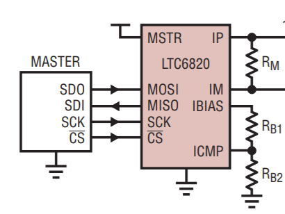

# Mainboard

This document describes the design consideration, implementation details, and board interface details for the sensor mainboard. A block diagram is presented and each component is discussed in detail.

## Relevant Hardware Versions

REVD

## Application / Purpose

The mainboard is specifically designed to interface directly to the [GPIO expansion port on the AMDC](/hardware/subsystems/expansion-port.md).

## Features

- Can connect up to 8 sensor daughter cards.
- Can communicate with an external controller (like AMDC). An external controller can obtain the measurement results and also is allowed to control the digital conversion process.
- Robust differential IO communication is used to transmit sensor data to an external controller.
- High throughput of up to 1 MSPS (depending on ADC device on daughter cards).

## Block Diagram and SPI Connection Configuration

The eight daughter cards (DC) transmit data to the STM32 MCU using standard SPI protocol. The daughter cards are grouped into four pairs of daisy chain connections. See the following block diagram.

The daughter cards can be connected in daisy chain pair configuration (D) or single SPI configuration (S). The daisy chain configuration will have a throughput of 500 kSPS. If the number of daughter cards is less than or equal to four, then a single SPI configuration can be used to get higher throughput. This single SPI configuration will have a throughput of 1 MSPS. The configuration can be changed using jumpers (P9, P10, P15, P16) as shown in the following figure.

## External Connections

There are two interfacing DB-15 connectors on the measurement board. The first connector is used for interfacing with the external controller via isoSPI and differential IO communication. The second connector is intended as an expansion port connection, which is connected to the GPIO port of the MCU.

### DB15 Connector 1: IsoSPI and Differential IO 

| Pin number | Signal name | Voltage level | Protocol |
|------------|--------|--------|--------|
| 1 | 5V_IN | 5V | - |
| 2 | D2_I_P | 5V | Differential IO |
| 3 | D2_I_N | 5V | Differential IO |
| 4 | D3_I_P | 5V | Differential IO |
| 5 | D3_I_N | 5V | Differential IO |
| 6 | NC | - | - |
| 7 | isoSPI2_P | 5V | IsoSPI |
| 8 | isoSPI2_N | 5V | IsoSPI |
| 9 | isoSPI3_P | 5V | IsoSPI |
| 10 | isoSPI3_N | 5V | IsoSPI |
| 11 | GND | - | - |
| 12 | D2_O_P | 5V | Differential IO |
| 13 | D2_O_N | 5V | Differential IO |
| 14 | D3_O_P | 5V | Differential IO |
| 15 | D3_O_N | 5V | Differential IO |

### DB15 Connector 2: GPIO

| Pin number | Signal name | Voltage level |
|------------|--------|--------|
| 1 | 3V3 | 3.3V |
| 2 | GPIO_1 | 3.3V |
| 3 | GPIO_2 | 3.3V |
| 4 | GPIO_3 | 3.3V |
| 5 | GPIO_4 | 3.3V |
| 6 | GPIO_5 | 3.3V |
| 7 | GPIO_6 | 3.3V |
| 8 | GPIO_7 | 3.3V |
| 9 | GPIO_8 | 3.3V |
| 10 | GPIO_9 | 3.3V |
| 11 | GPIO_10 | 3.3V |
| 12 | GPIO_11 | 3.3V |
| 13 | GPIO_12 | 3.3V |
| 14 | GND | - |
| 15 | GND | - |

Implementation details of [IsoSPI](#IsoSPI-Communication-Interface) and [Differential IO](#Differential-IO-Isolated-Transceiver) is described later in the document.

## Systems on Board

Per the block diagram above, the mainboard is made of several systems, as explained below.

### STM32F7 Microcontroller

STM32F7 microcontroller is used as an interface between the daughter card and an external controller. This MCU has a core ARM 32-bit Cortex M7 CPU. This IC can operate at a supply voltage of 1.7 V to 3.6 V. JTAG / SWD interface is used for debugging and programming the MCU. It has 6 SPIs which is used for daughter card and AMDC isoSPI interfaces. The maximum speed of the MCU SPI interface is 54 Mbps. It has 4 USART with a maximum baud rate of 26 Mbps, which are used to transmit daughter card data to the AMDC. GPIO pins of the MCU can be accessed using GPIO connector. More information on this MCU can be found [here](https://www.st.com/content/ccc/resource/technical/document/datasheet/group3/c5/37/9c/1d/a6/09/4e/1a/DM00273119/files/DM00273119.pdf/jcr:content/translations/en.DM00273119.pdf).

### Differential IO Isolated Transceiver

The MCU transmits sensor data via USART communication. These USART signals are converted to differential IO using differential transceiver [ISO3086T](https://www.ti.com/lit/ds/symlink/iso3086t.pdf?HQS=TI-null-null-digikeymode-df-pf-null-wwe&ts=1596613093516). Differential IO has the ability to communicate over long distances and at faster communication rate compared to standard USART. This IC has an in-built isolation barrier. A signaling rate of up to 20 Mbps is obtained from this IC. The operating voltage is provided in the following table.

| Parameter                             |    Conditions     |   MIN   |  MAX  |
|---------------------------------------|-------------------|---------|-------|
| Supply voltage VCC2 (Bus-side)        |                   | 4.5 V   | 5.5 V |
| IO supply voltage VCC1 (UART side)    |   3.3V operation  | 3 V     | 3.6 V |
| IO supply voltage VCC1 (UART side)    |    5V operation   | 4.5 V   |  5 V  |

The maximum supply current consumed by the IC including to drive currents for differential lines is 60 mA, which corresponds to 300 mW for 5 V supply. 

### IsoSPI Communication Interface

The isoSPI communication interface is implemented using [LTC6820](https://www.analog.com/media/en/technical-documentation/data-sheets/LTC6820.pdf). This IC provides a bi-directional interface between standard SPI signals and differential pulses. The operating conditions are provided in the following table.

| Parameter                             |    Conditions     |   MIN   |  MAX  |
|---------------------------------------|-------------------|---------|-------|
| Supply voltage VDD (Differential side)|                   | 2.7 V   | 5.5 V |
| IO supply voltage VDDS (SPI side)     |                   | 1.7 V   | 5.5 V |
| High-level input voltage              |VDDS = 2.7V to 5V  | 0.7 VDDS| VDDS  |
| High-level input voltage              |VDDS = 1.7V to 2.7V| 0.8 VDDS| VDDS  |
| Low-level input voltage               |VDDS = 2.7V to 5V  | 0       | 0.3 VDDS  |
| Low-level input voltage               |VDDS = 1.7V to 2.7V| 0       | 0.2 VDDS  |

This IC can operate at a maximum SPI communication speed of 1 Mbps. The bias resistors (`RB1` and `RB2`) are used to adjust the drive currents to the differential lines. These resistors are selected such that the drive currents are set at 10 mA. These resistors are on the schematic, see the following figure.

The maximum supply current consumed by the IC including to drive currents for differential lines is 17 mA, which corresponds to 85 mW for 5 V supply.

### IsoSPI Isolation Transformer

A transformer is required for implementing isoSPI. This will provide an isolation barrier to the differential SPI signals. This is implemented by adding pulse transformer HX1188NLT, which has 1:1 turns ratio. More information on the pulse transformer is found in the [datasheet](https://media.digikey.com/pdf/Data%20Sheets/Pulse%20PDFs/10_100BASE-T%20Single%20Port%20SMD%20Magnetics_Rev2008.pdf).

## Daugter Card Interface

In order to design a daugter card, the interface information provided in this section will be useful. Each daughter card slot has two headers, where the daughter card can be plugged in. See the following figure.

One header is used to supply power to the cards and the other header is used for SPI interface. 

### Header 1: Power Supply

| Pin number | Signal name |
|------------|--------|
| 1 | +15V |
| 2 | GND |
| 3 | -15V |

### Header 2: SPI interface

| Pin number | Signal name |
|------------|--------|
| 1 | 5V |
| 2 | 3V3 |
| 3 | GND |
| 4 | DIN (ADC IN, MOSI) |
| 5 | DOUT (ADC OUT, MISO) |
| 6 | SCLK |
| 7 | CONVST (Conversion start) |

For information regarding the placement of the headers, refer to the mainboard PCB Altium file in the AMDS repo located: `/Mainboard/altium/SensorMotherBoard.PcbDoc`. 

For more information on designing a daughter card, refer the [sensor card documentation](/accessories/amds/sensor-cards/index.md).