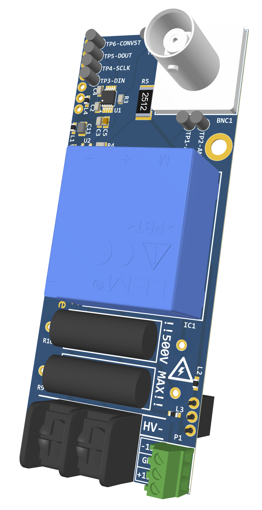
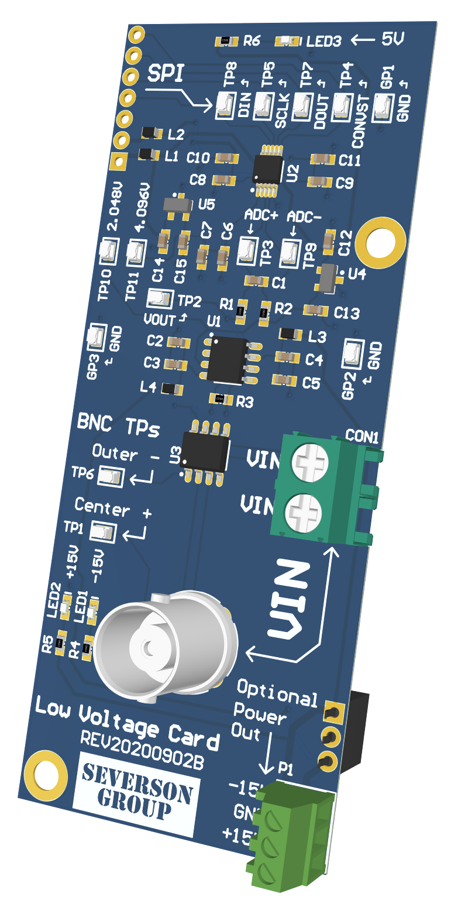
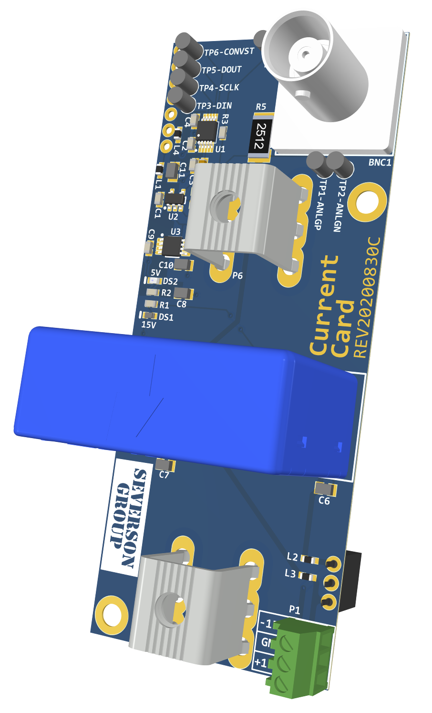

# Sensor Cards

Three sensor card designs are available.

Users are welcome and encouraged to design addition sensor cards.

| [High Voltage](./high-voltage/index.md) | [Low Voltage](./low-voltage/index.md) | [Current](./current/index.md) |
| --- | --- | --- |
|  |  |  |


```{toctree}
:hidden:

high-voltage/index
low-voltage/index
current/index
```