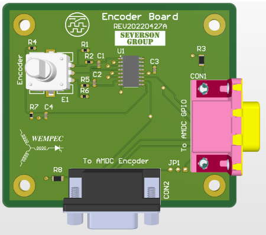
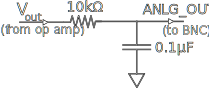

# Knob Board

This document describes the design considerations and implementation details for the AMDC Knob (Encoder) expansion board. A block diagram is presented to explain each component in detail. 

## Relevant Hardware Versions

- `AMDC  REV  D`  with  `Knob  Board  REV  A`  
- `AMDC  REV  E`  with  `Knob  Board  REV  A`

## How To Use
After the AMDC is flashing sequentially and properly working in debug mode ([See this link for set up](https://docs.amdc.dev/firmware/xilinx-tools/building-and-running-firmware.html)) attach a DB9 connector between the AMDC GPIO pins and the Knob Board. 

To get discrete values from the encoder use the following commands in the Xilinx IDE:
-   `hw enc  steps`  - Read encoder steps from power-up
-   `hw enc  pos`  - Read  encoder position
-   `hw enc  init`  - Turn on blue LED until Z pulse found **(Not Currently Functional)**
-   `hw enc  zval`  - Read switch presses from power-up  **(Not Currently Functional)**

## In Progress And Future Work

The Knob Board does not currently support the Encoder's switch feature. An additional register must be allocated in the code and bitstream for this to work. 

The Knob Board may work with a DB15 connector, however, this will also require additional work to implement. 

**Proof of Concept Using LEDs: (Not Optimized)**
Copy the code found [here](https://github.com/Severson-Group/AMDC-Firmware/compare/v1.0.x...encoder-led-display)  to the corresponding locations in your project. Note that the `hw/amdc_revd.bd` file does not need to be copied for the `hw enc steps` and `hw enc pos` commands to work, however, this code is set up to also test the `hw enc zval` command which may cause issues. Additionally this code was set up using a `AMDC  REV  D`

## Design Requirements and Considerations

The AMDC Knob expansion board was designed with the following requirements:

1.  Allow for an additional input to the AMDC
    
2.  Works with DB-15 and DB-9 connectors
    
3.  Designed to run off of 5V power supplied from the AMDC
    
4.  Minimize noise with debouncing and a Signal Differentiator 

### AMDC Connector 
The AMDC Knob expansion board interfaces with the AMDC via either the DB-15 (GPIO) connector or the DB-9 (encoder) connector.  The pinouts of the two connectors differ from one another as shown in the tables below.

### DB-15 Connector
  | Pin Number | Power Stack   |
  | ---------- | ------------- | 
  | 1          | `5V DB-15`    | 
  | 2          | `Encoder 1A`  | 
  | 3          | `Encoder ~1A` | 
  | 4          | `Encoder 1B`  | 
  | 5          | `Encoder ~1B` |
  | 6          | No Connect    |
  | 7          | `Encoder 1Z`  | 
  | 8          | `Encoder ~1Z` |   
  | 9          | No Connect    | 
  | 10         | No Connect    |
  | 11         | `GND`         |
  | 12         | No Connect    |
  | 13         | No Connect    |  
  | 14         | No Connect    | 
  | 15         | No Connect    | 

### DB-9 Connector
  | Pin Number | Power Stack   |
  | ---------- | ------------- | 
  | 1          | `Encoder 1A`  | 
  | 2          | `Encoder ~1A` | 
  | 3          | `Encoder 1B`  | 
  | 4          | `Encoder ~1B`  | 
  | 5          | `Encoder 1Z ` |
  | 6          | `Encoder ~1Z` |
  | 7          | `5V DB-9`     | 
  | 8          | `GND`         | 
  | 9          | `GND`         | 
  
  Both the DB-15 and DB-9 connectors can be connected to the Knob expansion board, however, the single jumper on the Knob board ensures power will only be pulled from one of the connectors.  
  
  ## PCB Layout

Two polygon pours were used to reduce the number of required traces. The top pour is the +5V net, and the bottom pour is the GND net. All components and most traces are also located on the top of the board to simplify the fabrication of the board. Additional PCB properties are outlined in the table below.

| Property                | Value           |
| ----------------------- | --------------- |
| Size                    | 70mm x 80mm     |
| Number of Layers        | 2               |
| Thickness               | 1.6mm           |
| Min Track/Spacing       | 6/6mil          |
| Min Hole Size           | 0.3mm           |
| Surface Finish          | HASL (Tin-Lead) |
| Silkscreen              | Top Only        |
| Unique Part Count       | 9               |
| Unique SMD Part Count   | 5               |
| Total Parts             | 17              |
| Through-Hole Count      | 53              |
| Cost per Board (Unit 1) | $8.64           |
| Cost per Board (Unit 10)| $7.17           |

### LPFs

Low pass filters such as the one shown below are used throughout the Knob expansion board. These low pass filters are used to prevent debouncing while still allowing for signals to be sent at a rate of 160 times per second. 

  

The cutoff frequency is achieved based on the resistance and capacitance values of the filter:

  

_f_c = 1 / (2*_π*R_*C_)

  

The LPF’s cutoff frequency is set to 160Hz (a resistor with _R_ = 10kΩ and a capacitor with _C_ = 0.1μF achieves the desired frequency).
  
  ## Datasheets

-   Encoder: [`PEC12R-4220F-S0024-ND`](https://www.bourns.com/docs/Product-Datasheets/PEC12R.pdf)
    
-   Signal Differentiator: [`AM26C31CNS`](https://www.ti.com/lit/ds/symlink/am26c31.pdf?HQS=dis-dk-null-digikeymode-dsf-pf-null-wwe&ts=1652390392703&ref_url=https%253A%252F%252Fwww.ti.com%252Fgeneral%252Fdocs%252Fsuppproductinfo.tsp%253FdistId%253D10%2526gotoUrl%253Dhttps%253A%252F%252Fwww.ti.com%252Flit%252Fgpn%252Fam26c31)

