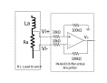
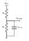

# uInverter Hardware Design

This document describes the requirement and design considerations for the selection of components on the uInverter board.  

## Relevant Hardware Versions

- uInverter: REV A
- AMDC: REV D

## Block Diagram

## Requirements 

The main idea behind the uInverter board is to serve as a simple, low-power benchtop setup to demonstrate three phase current regulation using AMDC. The abstract requirements of the uInverter board are outlined as follows:    
1. Emulate high speed motor circuit behavior as much as possible.  
2. Sense the DC supply voltage and phase current feedback for three phase current regulation.
3. Easy to operate using standard 12V low power off-shelf wall-wart supply.
4. Keep the board size to minimum by reducing circuit complexity. 

For the above requirements, the following specific operational requirements of the board are derived.

### Absolute Ratings

|  State variable     | Min   | Max	 | Unit |
| ------ | ----- | ----- | ---- |
| DC bus voltage : $V_\text{dc}$ | 10 |12 | V |
| Switching frequency: $f_s$ | 20 | 1000 | kHz
| Load current (AC) : $I_\text{ac}$ | 0 | 4 | Arms
| DC Bus Voltage ripple: $\Delta V_\text{dc}$ ||  0.5 | %  

## Component Selection

### Gate Driver

It is desired to reduce the circuit complexity as far as possible.
Since the board is intended to be operated at low power / current, it is possible to eliminate the discrete switching devices and instead use an IC that can serve as a half bridge.
This significantly reduces the circuit complexity, size, and the number of components on board.

The **IXYS [IXDN614YI](https://www.digikey.com/en/products/detail/ixys-integrated-circuits-division/IXDN614YI/2424709) gate driver** has a continuous output current capability of 4 A as source as well as sink.
This gate driver serves as a half bridge arrangement.
The IC works for an input voltage range of 10V to 35V. For the purpose of current regulation, this gate driver IC can be used to drive the RL load.
The driver suits the application requirements well.

### Current Sense Amplifier

For three-phase current regulation, phase currents need to be sensed and fed back to the AMDC. A precision resistor is used in the phase leg to sense the phase current. A difference amplifier is used to amplify the voltage across this resistor and bring it to the voltage level suited for the analog input to AMDC. The amplifier increases the signal to noise ratio of the current sense signal.

The supply voltage available from the AMDC analog sensing connector is ±15V, and the AMDC accepts analog signal value in the range of ±10V -- see the AMDC  for more information.

Therefore, the difference amplifier is required to work on ±15V supply and should amplify the voltage signal across the current sense resistor to a maximum of ±10V.

The `INA143` difference amplifier, which is used on the AMDC board works on ±15V supply and is also capable of 0.1x or 10x gain.
This differential amplifier can be used for the uInverter board with the gain setting of 10x instead of 0.1x (as on the AMDC).
This helps in homogenizing the components across accessory boards.

While operating on the uInverter board, one of the inputs $V_i$ of the differential amplifier is connected to the floating neutral of the three-phase load.
This introduces a common-mode voltage at the input of the differential amplifier.
The maximum common mode voltage expected at the terminals of the amplifier can be identified by following equation: $V_\text{cm} = \pm V_\text{dc} / 2 = \pm 6~\text{V}$

The [INA143U](https://www.digikey.com/en/products/detail/texas-instruments/INA143U/301019) analog difference amplifier has an acceptable common mode voltage range of -15.4V to +15.4V per the datasheet.
Thus, this amplifier serves well in terms of the operational requirements.

### Current Sensing Resistor

In this section, the current sensing resistor is selected.
The resistor serves two purposes:

1. Adds to the total effective series phase resistance
2. Creates a measurable voltage drop proportional to phase current

The resistance value is computed to result in the largest voltage drop measurable by the current sense amplifier.
For difference amplifier `INA143U` selected in the [current sense amplifier section](#current-sense-amplifier), the acceptable voltage at the output of the amplifier (i.e., at the AMDC input) and the amplifier gain is:

- $V_\text{out,isense} = \pm 10~\text{V}$
- Amplifier gain: $A_g = 10$

To maximize the utilization of the available voltage for analog measurement, the shunt resistor value is selected such that the output voltage $V_\text{out,isense}$ is maximum for the maximum phase current $I_\text{ac}$ = 4 Arms.
For this, the differential input voltage for the current sense amplifier should be equal to:

\begin{align}
V_\text{r,isense,max} &= V_\text{out,isense} / A_g \\
&= 10 / 10 \\
&= 1~\text{V}
\end{align}

Therefore, the shunt resistor should have 1 V drop at maximum current of $I_\text{ac}$ = 5.7 Apeak.

From this, the required shunt resistor value is computed:

\begin{align}
R_\text{shunt,max} &= V_\text{r,isense,max} / I_\text{ac} \\
&= 1~\text{V} / 5.7~\text{A} \\
&= 0.17~\Omega
\end{align}

Based on the above calculations, the current sense resistor is selected to be [15FR150E](https://www.digikey.com/en/products/detail/ohmite/15FR150E/822919), which is 150 mΩ.

The power loss in the resistor can be found as:

\begin{align}
P_\text{loss} &= I^2 R_\text{shunt} \\
&= 4^2 \times 0.15 \\
&= 2.4~\text{W}
\end{align}

The resistor is rated for 5 W (ambient cooling) condition, so it is a good fit for the application.

### Load Inductor

A motor load can be modeled as an RL-load circuit. Each load branch consists of an inductor and a resistor load. For determining the value of load inductor, there are four aspects to be considered:

1. **R/L ratio:**
The load R and L values on the uInverter are chosen to emulate real-life high-speed low-inductance motors.
A brief survery of [high-speed low-inductance motors](#ref) was performed -- the R/L ratio for the surveyed motors lie somewhere in the range of 10 to 100 Ω/mH with L being in the range of 20 to 100 uH.
The inductor is chosen in such a way that the overall load impedence (seen by the AC source) has a R/L ratio in the above mentioned range.

2. **Resistance:**
The load inductor should have high enough series resistance value.
This eliminates the need for a separate resistor in the RL load and also reduces the number of large components on the board.

3. **Load impedance:**
The maximum allowable load (phase) impedance at the maxium desired current fundamental frequency is determined by the maximum voltage output and current magnitude.
For the load AC circuit, the impedance is limited by the following equation:
$Z_m < V_\text{ac} / I_\text{ac} = 8~\text{V} / 4~\text{A} = 2~\Omega$

4. **Ripple current:**
The maximum ripple current in the load depends on the value of inductance and is given by the following equation: $\Delta I = \frac{0.25 \times V_\text{dc}}{1.5 \times L \times f_s}$ where $L$ is the phase inductance.
The factor of 1.5 comes in the denominator due to the 3-phase symmetrical load condition.
At any time instant, all three inductors are connected to the DC bus (1 series and 2 parallel).

From the above discussion, it would be desirable to have as high inductance as possible for minimizing the ripple current.
However, this reduces the R/L ratio.
On the other hand, if the inductance is reduced to achieve a good R/L ratio, the ripple current increases.
The two objectives are in conflict.

In an effort to emulate the real-life high-speed low-inductance motors, a 100 uH inductor, [PA4344.104NLT](https://www.digikey.com/en/products/detail/pulse-electronics-power/PA4344.104NLT/5436742), is chosen.

This inductor has an Equivalent Series Resistance (ESR) of 118 mΩ.
Including the sensing resistor and the gate driver output resistance, the half bridge yields the R/L ratio of about 8.
This is close to the R/L ratio of example motors which were benchmarked below: [reference motors](#benchmark-motors).

### DC Link Capacitor

The main selection criterion for the DC link capacitor is the ripple voltage.
The DC bus is expected to have a ripple of less than 0.5% (<0.06V) for good current regulation.

The maximum ripple in the voltage is given by: $\Delta V = \frac{1}{32} \frac{V_\text{dc}}{L C f_s^2}$

Solving for the required capacitance value given the other values, $C = 625~\mu\text{F}$

Considering a margin of 1.5x, the capacitor [EEU-FM1V102B](https://www.digikey.com/en/products/detail/panasonic-electronic-components/EEU-FM1V102B/6109617) of 1000 uF is selected.   

### DC Link Voltage

The maximum allowed DC supply voltage is 12V.
This is considering the safety of the components and the AMDC board in case of single-phasing or short circuit between any two phases on the uInverter board.
Accidentally, if the input PWM signal of one phase is turned ON and that of another phase is turned OFF for a sufficiently long time, a DC current would flow in the phase circuit.
A sustained DC current would damage the current sensing resistor and the inductor in the phase circuit on the board.
It will also push the current sense amplifier in saturation, which could exceed the acceptable voltage levels at the input of the analog amplifiers on the AMDC board.   

The equivalent resistance of each phase RL branch is the sum of the gate driver's internal resistance, the equivalent series resistance of the inductor and the current sense resistance.
Thus, the equivalent series resistance per phase: $R_s \approx 0.8~\Omega$.

For the case mentioned above, the DC current flowing in the circuit would be:

\begin{align}
I_\text{phase,max} &= 12~\text{V} / (2\times 0.8\Omega) \\
&= 7.5~\text{A}
\end{align}

The voltage output of the current sense amplifier:

\begin{align}
V_\text{amp} &= (\text{amplifier gain}) \times (\text{current} \times R_\text{sense}) \\
&= (10) \times (7.5A \times 0.15Ω) \\
&= 11.25 V
\end{align}

When the DC supply voltage exceeds 12V, the phase current increases significantly and may push the current sense amplifier in saturation.
To aviod any damage to components on the AMDC board, the DC supply voltage must be limited to no more than 12V.  

### DC link voltage sensing filter

A filter capacitor is provided at the voltage sensing point (see image) to filter out high frequency noise in DC link voltage measurement.

It is important to consider sizing of this capacitor and bandwidth of the low pass filter in this particular configuration is given by:

\begin{align}
\omega_b &= \frac{1}{R_1C_{filter}} + \frac{1}{R_2C_{filter}}\\
\end{align}

For, $R_1\ =\ 4.4\ k\Omega$ and $R_1\ =\ 2.2\ k\Omega$ and a desired filter bandwith of 1 kHz, the filter capacitor value is approximately 100 nF. Desired bandwidth of the filter should be high enough to capture actual DC link voltage variations. 

## Pinouts

For detailed descriptions of the pinouts of the uInverter connectors and connections with AMDC, refer to  document.

## Benchmark Motors

Benchmark motor specifications:

| Motor                 | `R` (ohm) |  `L` (uH) | `R/L` (Ω/ mH) |
| -------               | ------- | ------- | ----------- |
| [Thingap - LSI-25-10](https://www.thingap.com/wp-content/uploads/2020/12/LSI-25-10-Datasheet-Rev_C.pdf)   | 0.993     | 11.878 | 83.6
| [Thingap - TG2310](https://www.thingap.com/wp-content/themes/ndic/pdf/TG2310.pdf)       | 0.31 | 20 | 15.5 |
| [Portescap - 16ECP36 Ultra EC](https://www.portescap.com/en/products/brushless-dc-motors/all-bldc-motors) | 0.47 | 40.4 | 11.7
