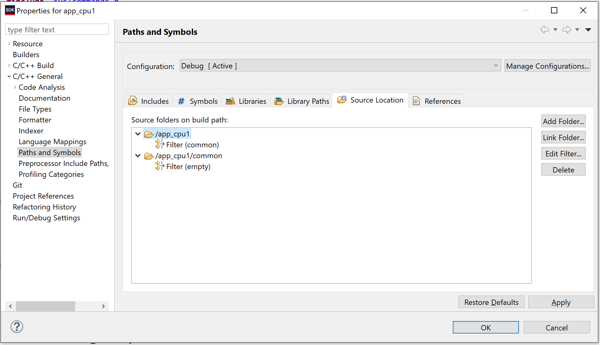
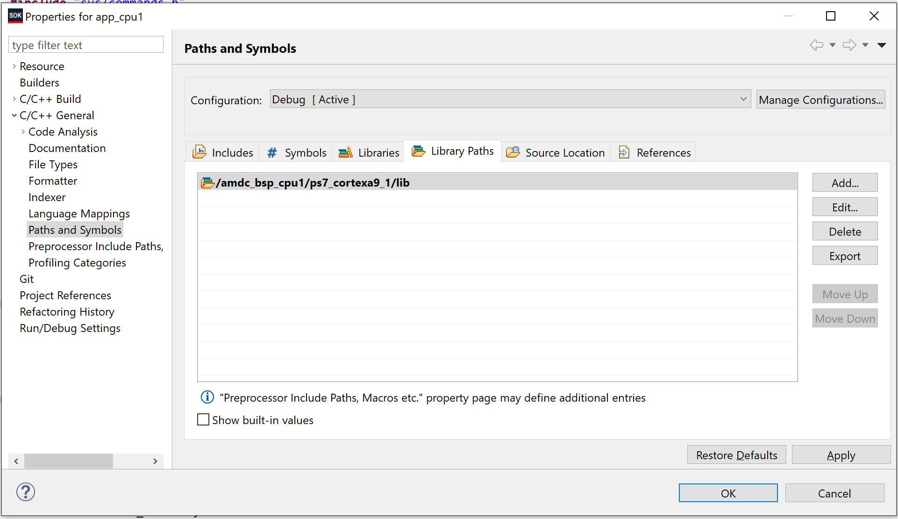
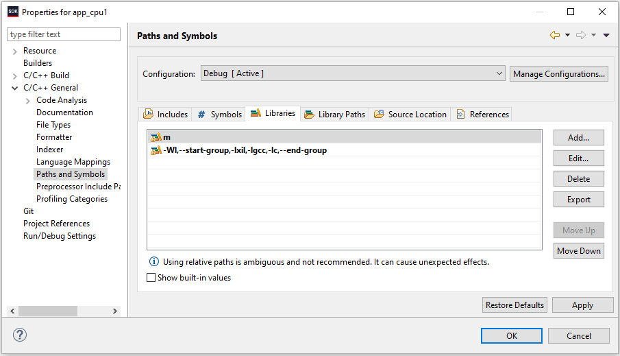
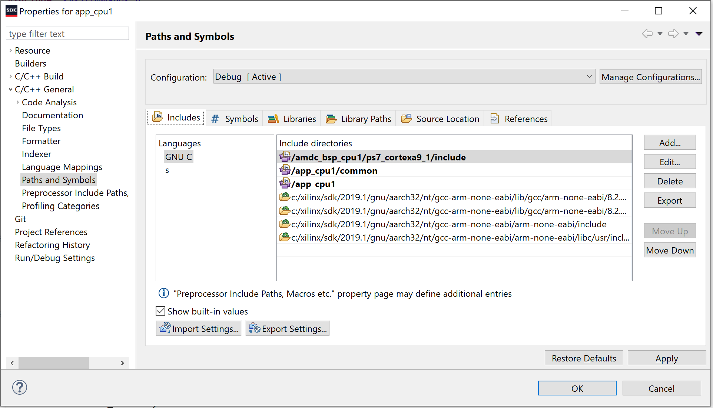

# Building and Running Firmware

Following these instructions will get the AMDC firmware environment up and running on your local machine for development and testing purposes.


## Required Software

Firmware development environment needs a few things:

- Xilinx Vivado 2019.1 and SDK (if you don't have these, [follow these steps to install them](installing-xilinx-tools.md))
- `em.avnet.com:picozed_7030_fmc2:part0:1.1` board definition
    1. Go [here](https://github.com/Severson-Group/AMDC-Firmware/issues/10#issuecomment-847993684)
    2. Download the zip file and unzip it
    3. Move the resulting folder (`picozed_*`) to `C:\Xilinx\Vivado\2019.1\data\boards\board_files\...`

## Cloning from GitHub

There are two recomended options for cloning the `AMDC-Firmware` repo from GitHub and creating a local working space on your computer. To choose between them, you must first decide if your user application(s) will be private or open-source. Most likely, your code will be private. This means that you will not contribute it back to the `AMDC-Firmware` repo as an example application.

### Open-Source Example Applications

If you are _not_ creating private user applications, i.e. your code will be contributed back to the `AMDC-Firmware` repo as an example application:

1. Download the `AMDC-Firmware` git repo to your local machine like normal:
    1. `git clone https://github.com/Severson-Group/AMDC-Firmware`
2. Ensure it is in a permanent location (i.e., not `Downloads`)
3. Ensure the path doesn't contain any spaces.

NOTE: `$REPO_DIR` represents the file system path of the `AMDC-Firmware` repository.

### Private User Applications

For the majority of use cases, your user application(s) will be private and reside in a _different_ repo than the `AMDC-Firmware` repo (i.e. your own personal repo):

1. Create your master repo (which will eventually contain your private code as well as a copy of `AMDC-Firmware`)
    1. Ensure it is in a permanent location (i.e., not `Downloads`)
    2. Ensure the path doesn't contain any spaces.
2. In this repo:
    1. Add a git submodule for the `AMDC-Firmware` repo: `git submodule add https://github.com/Severson-Group/AMDC-Firmware`
    2. Optional (and suggested): add `branch = develop` to `.gitmodules` so your submodule will track the develop branch by default
    3. **Copy** `AMDC-Firmware/sdk/app_cpu1/user` to your repo's root directory, and rename (perhaps as "my-AMDC-private-C-code")

You should now have a master repo with two subfolders:

```
my-AMDC-workspace/              <= master repo
    AMDC-Firmware/              <= AMDC-Firmware as library
        ...
    my-AMDC-private-C-code/     <= Your private user C code
        ...
```

NOTE: In the rest of this document, `$REPO_DIR` represents the file system path of the `AMDC-Firmware` repository, _not your master repo_.

#### Common `git submodule` commands

Your repo now contains `AMDC-Firmware` as a _git submodule_. Read about submodules [here](https://git-scm.com/book/en/v2/Git-Tools-Submodules) or [here](https://www.vogella.com/tutorials/GitSubmodules/article.html). The most common command you will use is the **update** command, which updates your submodule from the remote source. Execute this command from your master repo: `git submodule update`. If you have not initialized your submodules, append `--init` to the previous command.


## Vivado

Vivado is used to configure the Zynq-7000 SoC (clocks, pins, etc). All FPGA development happens within Vivado. All users must set up a Vivado project and build a FPGA bitstream.

If you are not doing anything specialized that would require changes to the FPGA, after following these steps, you do not need to use Vivado again. All your future development will happen within the SDK.

### Creating Vivado Project

Only source files and IP is version controlled which mean you must generate a local Vivado project. To do this:

1. Open Vivado Application
2. `Tools` > `Run Tcl Script...`
3. Select `$REPO_DIR\import_rev*.tcl` script (use appropriate script for the target AMDC hardware)
4. `OK`

Upon successful project generation, the block diagram will open. If the block diagram does not open, fix the errors and try reimporting project. See the errors by opening the `Tcl Console` pane in Vivado.

#### Common Errors

Having spaces in the file system path for the Vivado project is not supported. For example, if your repo is located in your user directory and your username has a space in it: `C:\Users\**John Doe**\Documents\GitHub\AMDC-Firmare`. If this is the case, the project import will fail. Move the repo elsewhere and try again.

The import script **will not** overwrite the `amdc/` Vivado project folder on disk. If you are trying to regenerate the Vivado project, you must delete the old `amdc/` folder before running the script.

### Generating Bitstream

After generating the project itself, you need to generate a bitstream to load into the FPGA.

1. In Vivado...
2. `PROGRAM AND DEBUG` > `Generate Bitstream`
3. Click through the pop-ups until it starts actually working
4. If there are `Launch Run Critical Messages` about `PCW...`, ignore them and click OK

This step will take a while (~10 minutes). Upon successful generation, the bitstream is ready to load onto AMDC. This happens in the SDK section of this document.

### Export Hardware

You now need to export the hardware from Vivado to the SDK environment.

1. `File` > `Export` > `Export Hardware...`
2. Make sure to uncheck `Include bitstream`
3. Set location to export to: `$REPO_DIR\sdk`
4. `OK`

### Open SDK from Vivado

This is an important step. The first time you generate the FPGA hardware configuration files, etc, you must launch the Xilinx SDK *directly from Vivado*. This sets up a hardware wrapper project which is needed for the firmware, and some environment variables.

1. `File` > `Launch SDK`
2. Select `$REPO_DIR\sdk` for both "Exported location" and "Workspace"
3. `OK`
4. SDK will open
5. Ensure the project `amdc_rev*_wrapper_hw_platform_0` is in `Project Explorer`

You may now close Vivado if you do not plan on changing the FPGA HDL. Also, you may now close the SDK. You will need to open it in the next section, but practice opening it directly -- not from Vivado.


## Xilinx SDK

Xilinx SDK (referred to as just SDK) is used to program the DSPs on the Zynq-7000 (i.e., C firmware). You will use the SDK to write your code and compile it. Then, you will use it to program the AMDC with your new code and debug issues. Finally, you can use the SDK to flash the AMDC after code development is complete with a permanent image (i.e., will automatically boot when powered on).

### Open SDK

1. Open Xilinx SDK 2019.1
2. Set workspace to: `$REPO_DIR\sdk`
3. Once open, close the Welcome tab

### Create BSP Project

```{attention}
To run dual-core programs, you need to make a seperate BSP project targeting **each core individually**.
Follow the below steps *twice*, but change the `Target Processor` for each one to CPU0/CPU1.
Name each BSP project: `amdc_bsp_cpu0` and `amdc_bsp_cpu1`.

After creating both BSPs, you must update the settings for `amdc_bsp_cpu1` to add an extra compiler flag: `-DUSE_AMP=1`.

See the [](./dual-core.md) docs for more information.
```

1. `File` > `New` > `Board Support Package`
2. Set `Project name` to "amdc_bsp"
3. `Finish`
4. Pop-up will appear
5. Select `lwip***`
6. Select `xilffs`
7. `OK`
8. The BSP will build

### Import Projects into SDK

The SDK workspace will initially be empty (except for `amdc_rev*_wrapper...` from above and new `amdc_bsp`). You need to import the projects you want to use.

#### Open-source example applications:

Follow these steps to import projects directly from the core `AMDC-Firmware` repo (i.e. open-source example applications):

1. `File` > `Open Projects from File System...`
2. `Directory...`
3. Select: `$REPO_DIR\sdk`
4. Ensure all projects are selected
5. `Finish`

#### Private user applications:

Follow these steps to import projects from your private user repo:

1. `File` > `Open Projects from File System...`
2. `Directory...`
3. Select: `your master user repo` / `my-AMDC-private-C-code`
4. `Finish`

After clicking `Finish`, the SDK will attempt to build the new private user applications. The compilation will fail. If it doesn't, you did not import your private user application project correctly -- delete the project from the SDK and try again until it fails to build.

Once it fails to build your new imported project, follow the steps below to fix the compilation. This will restructure the compiler / linker so they know where to find the appropriate files.

### Fix `common` code compilation

This section explains how to configure the SDK build system to correctly use the AMDC `common` code from the submodule.

**Only complete these steps if the build failed after you imported the user project!!!** If there were no errors, skip this section. There should be no errors if you have imported the `app_cpu1` project as an open-source project (i.e. not a private user application).

Link `common` folder to project:
1. In the `Project Explorer`, delete `common` folder from `app_cpu1` project (if present)
2. Open `app_cpu1` project properties
3. `C/C++ General` > `Paths and Symbols` > `Source Location` > `Link Folder...`
4. Check the `Link to folder in the file system` box
5. Browse to `$REPO_DIR\sdk\app_cpu1\common`
6. `OK`

Fix compiler includes to reference `common`:

7. Change to `Includes` tab
8. `Edit...` on `/app_cpu1/common`
9. Click `Workspace...` and select `app_cpu1` / `common`
10. `OK`
11. `OK`

Fix strange SDK issue:

12. `Edit...` on `/app_cpu1/app_cpu1`
13. Change directory to `/app_cpu1`
14. `OK`

Fix another strange SDK issue:

15. `Edit...` on `/app_cpu1/amdc_bsp_cpu1/ps7_cortexa9_1/include`
16. Change directory to `/amdc_bsp_cpu1/ps7_cortexa9_1/include`
17. `OK`

Add library path for BSP:

18. Change to `Library Paths` tab
19. `Add...` > `Workspace...` > `amdc_bsp_cpu1` / `ps7_cortex9_1` / `lib`
20. `OK`

Update linker library options:

21. Change to `C/C++ Build` > `Settings`
22. `Tool Settings` tab
23. `ARM v7 gcc linker` > `Inferred Options` > `Software Platform`
24. Add the following for `Inferred Flags`: `-Wl,--start-group,-lxil,-lgcc,-lc,--end-group`
25. `ARM v7 gcc linker` > `Libraries`
26. Add `m` under `Libraries`
27. Click `OK` to exit properties dialog

#### Expected `Paths and Symbols` Settings

After following the above steps, the project build settings should resemble the following screenshots:






### Build SDK Projects

SDK will attempt to build the projects you just imported. Wait until all projects are done compiling... Could take a few minutes...

There shouldn't be any errors. Ensure there are no errors for `amdc_bsp` and your desired application project (i.e. `app_cpu1`)

All done! Ready to program AMDC!


## Ensure `git` Synchronized 

At this point, you are done generating code / importing / exporting / etc. Now we will ensure git sees the correct changes.

### Discard changes to AMDC-Firmware

Your submodule `AMDC-Firmware` should be clean, i.e. no changes. Chances are, this is not true. Please revert your local changes to `AMDC-Firmware` to make it match the remote version.

Vivado probably updated the `*.bd` file... Simply run: `git restore ...` to put this file back to a clean state.

### Add `.gitignore` as needed (private user code only)

Run `git status` in your private user repo. If git sees changes to the following folders, create a gitignore file so that they are ignored.

- `.metadata/`
- `Debug/`
- `Release/`

## Making Private Repository Portable

Please read [this document](create-private-repo.md) for instructions on how to further configure your private repository to support expedited cloning.

## Programming AMDC

Ensure the AMDC JTAG / UART is plugged into your PC and AMDC main power is supplied.

### Setup SDK Project Debug Configuration

1. Right-click on the project you are trying to debug, e.g. `app_cpu0`
2. `Debug As` > `Debug Configurations...`
3. Ensure you have a `System Debugger using Debug_foo.elf on Local` launch configuration ready for editing. _If not:_
    1. Right-click on `Xilinx C/C++ application (System Debugger)` from left pane > `New`
    2. A new panel should appear on the right half of popup
4. Ensure the `Target Setup` tab is open
5. Select `Browse...` for `Bitstream File`
    1. Find the bitstream which Vivado generated (should be at `$REPO_DIR\amdc\amdc.runs\impl_1\amdc_rev*_wrapper.bit`) and click `Open`
7. Check the following boxes: `Reset entire system`, `Program FPGA`, `Run ps7_init`, `Run ps7_post_config`
8. Click `Apply`
9. Click `Close`

```{attention}
If you are targeting dual-core operation, you must manually specify the `*.elf` file for both cores.

In the second tab, browse for the ELF files which are located under the `Debug/` sub-folder.

Uncheck the "stop on main" checkbox to ensure both cores start running right away during debug.
```

### Running Project on AMDC

Now, you are ready to start the code on AMDC!

1. Right-click on application, e.g. `app_cpu0`
2. `Debug As` > `Launch on Hardware (System Debugger)`
3. `SDK Log` panel in the GUI will show stream of message as AMDC is programmed
    1. System reset will occur
    2. FPGA will be programmed
    3. Processor will start running your code (must click play button to start it running)
4. NOTE: You only have to do the right-click and debug from the menu the first time -- next time, just click the debug icon from the icon ribbon in the GUI (located to left of play button).

### Connecting to AMDC over USB-UART

To interface with the serial terminal on AMDC, your PC needs the appropriate driver: 

- For `REV D` hardware, the UART interface is the `Silicon Labs CP210x USB-UART Bridge`
- For `REV E` hardware, the UART interface is from `FTDI` and should be natively supported by your operating system

#### For Silicon Labs UART-USB Driver (`REV D` hardware)

1. Open: https://www.silabs.com/products/development-tools/software/usb-to-uart-bridge-vcp-drivers
2. Download the right drivers for your platform and install them.
3. Verify the drivers are installed:
    1. Connect a micro USB cable to the "UART" input on AMDC
    2. Check that a `Silicon Labs CP210x USB-UART Bridge` appears as a connected device.

## Issues

Getting AMDC to start and run FPGA and C code can be hard. If it isn't working, try repeating the programming steps. Make sure to reset the board by either power cycling AMDC or pushing `RESET` button on AMDC.

If you are getting compilation errors in the SDK (especially during the linking phase), consider deleting the `amdc_bsp` project(s) and regenerating -- doing so sometimes resolves common issues.

NOTE: Pushing the `RESET` button on PCB **is NOT** exactly the same as doing a full power cycle of board. The `RESET` button performs a different type of reset (it keeps around debug configurations, etc). During development, you may need to perform a full power cycle, while other times, a simple `RESET` button push will work. 

Xilinx tools also have **many** quirks. Good luck getting everything working!
