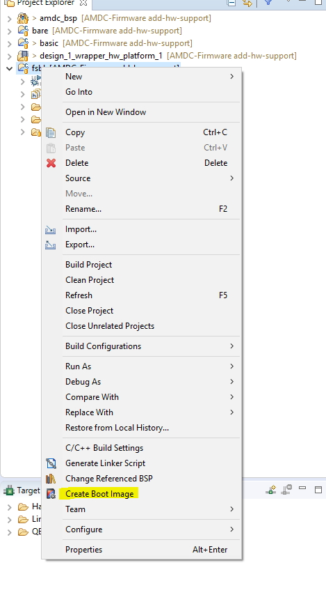
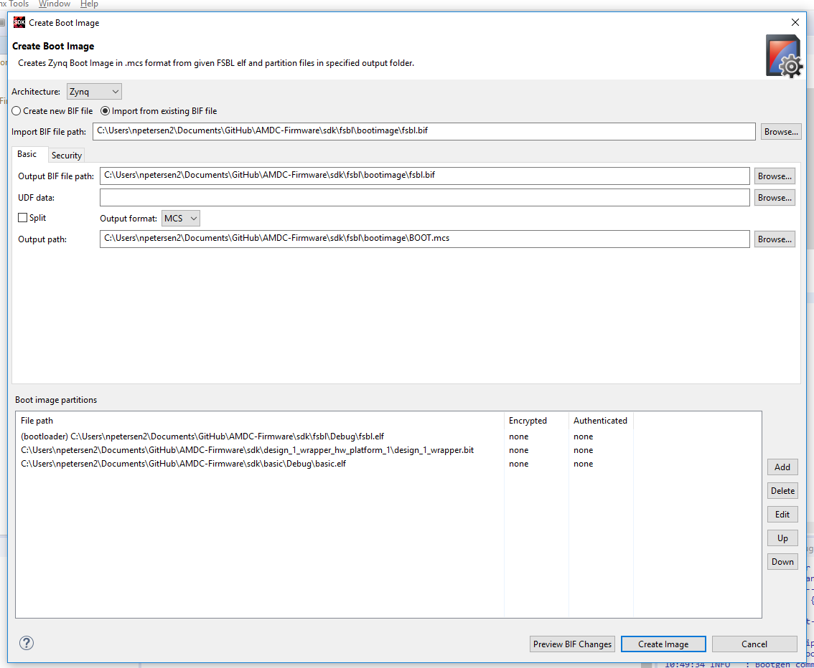
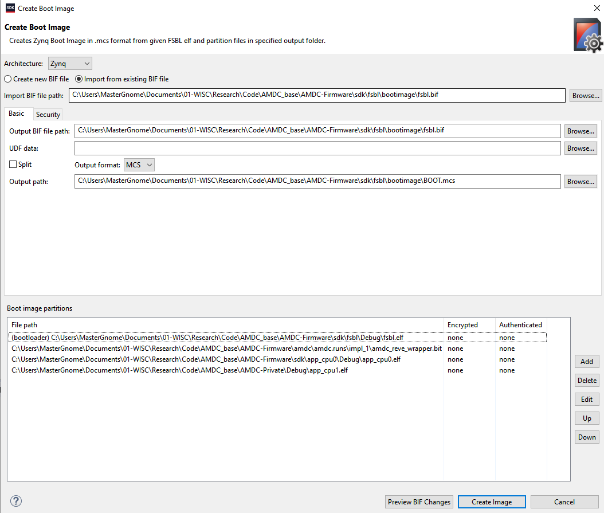
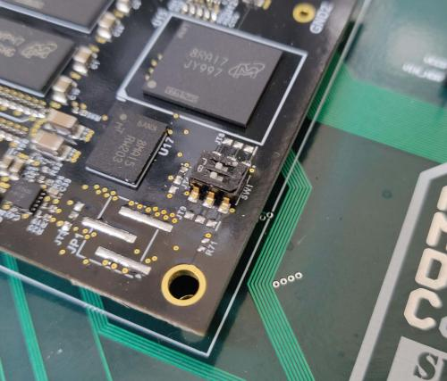
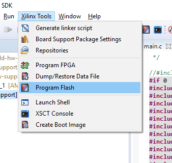
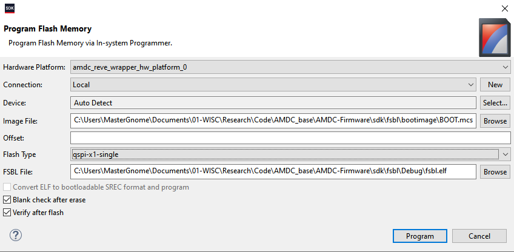
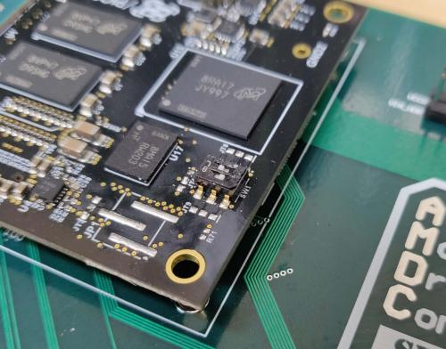

# Flashing AMDC

During development, JTAG will be the primary interface for programming and debugging the AMDC firmware. Once code is stable, an image can be programed into the AMDC non-volatile memory (NVM). This allows board to boot itself when powered up.

The following steps outline how to create a boot image and flash the AMDC NVM. 

This process varies slightly between single core, and dual core projects. Differences will be noted in the appropriate steps.

Going through this process for the first time, the "create boot image" dialogs may differ slightly from the ones shown below. Use good judgement here and it should be evident what the appropriate steps are. Once you have created an initial boot image - even if it is incorrect and needs to be fixed, you can then match the dialogs exactly to the ones shown below. 

## Generating boot image file

The PicoZed system-on-module (SoM) on AMDC includes a flash memory device which stores the boot image for start-up. We need to first generate the appropriate image which will be loaded into this memory. This process is the same for both single core, and dual core projects.

### Ensure you have `fsbl` project in SDK

Xilinx provides a First-Stage Bootloader application project which we will use to create our boot image. If you do not have the `fsbl` project in SDK:

1. `File` > `New` > `Application Project`
2. Name it `fsbl`
3. Ensure `Board Support Package:` is `Use existing: amdc_bsp`
4. Click `Next >`
5. Select `Zynq FSBL` template
6. Click `Finish`
7. Your new `fsbl` project will be imported and build. It should not have issues.

### Generate boot image

1.  Right click on the `fsbl` project directory in SDK
2.  Select `Create Boot Image`



4. Ensure popup menu settings look like the following.

Explaination of settings: `.MCS` is the file format which is supported for QSPI flashing. The list of three items for "Boot image partitions" must always be the following in this order: fsbl.elf, FPGA bitstream .bit file, your user *.elf file. 

Skip below for dual core project procedure.



```{attention}
For dual core projects, there will be multiple *.elf files*. The order is important! 
* Navigate to your `$REPO_ROOT\AMDC-Firmware\sdk\app_cpu0\Debug` folder and locate the file `app_cpu0.elf`. 
    * Add this to the _Boot Image Partitions_ area
* Navigate to your `app_cpu1` location, usually this is located in the `$REPO_ROOT\AMDC-Private\Debug` folder.
    * Add the *.elf* file to your _Boot Image Partitions_ after the `app_cpu0.elf` file. 
```




5. Click `Create Image`
6. If it warns that another file already exists, click `OK`
7. It will take a second to create the boot image

## Programming the flash memory device

After generating the boot image `*.MCS`file, we need to program the flash device for persistent storage.

1. Ensure you powered up the board in the correct boot mode. This is selected via the switches on the PicoZed PCB. See image below for switch positions for JTAG mode (what you want).


 
2. Click `Xilinx Tools` from the main dropdown in the SDK
3. Click `Program Flash`



4. Ensure popup window looks like the following:



5. Click `Program`
6. It will start flashing the board. This will take ~3 minutes...

### Known Issues

Sometimes, when you try to flash the device (i.e. set 5-6 above), the `fsbl` main function will appear in SDK because a breakpoint is reached. This occurs because the SDK debugger is still attached to the AMDC. To fix this, disconnect the processor from the SDK Hardware Manager window.

## Configure PicoZed to boot from flash

Now the boot image has been loaded onto the PicoZed flash device. We need to configure PicoZed to use it when booting.

1. Set PicoZed switch positions to the flash boot mode (see image below).



## Test

AMDC should now be programed and ready to go! Time to test.

1.  Power cycle the board.
2.  Ensure that `FPGA DONE` yellow LED comes on after ~1 second of powering up, and your loaded code is running. 

```{attention}
If you see the `FPGA DONE` LED turn on, but your program appears to not be running, check the order of the boot partition with the above steps.
```

## Notes

NOTE: you will need to put the PicoZed switches back to JTAG mode if you would like to continue development using JTAG.
