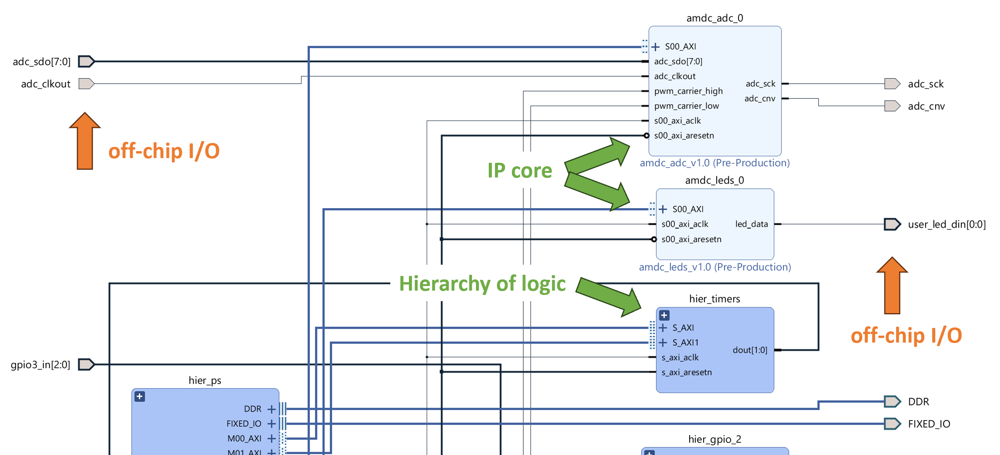
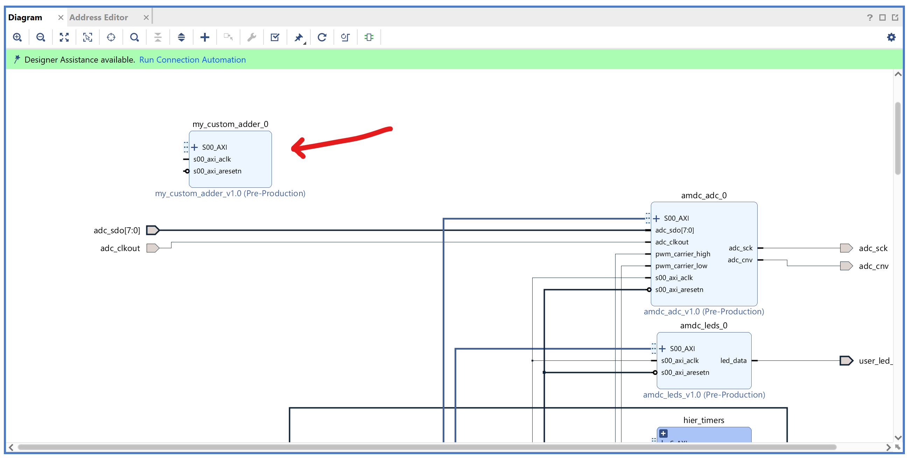
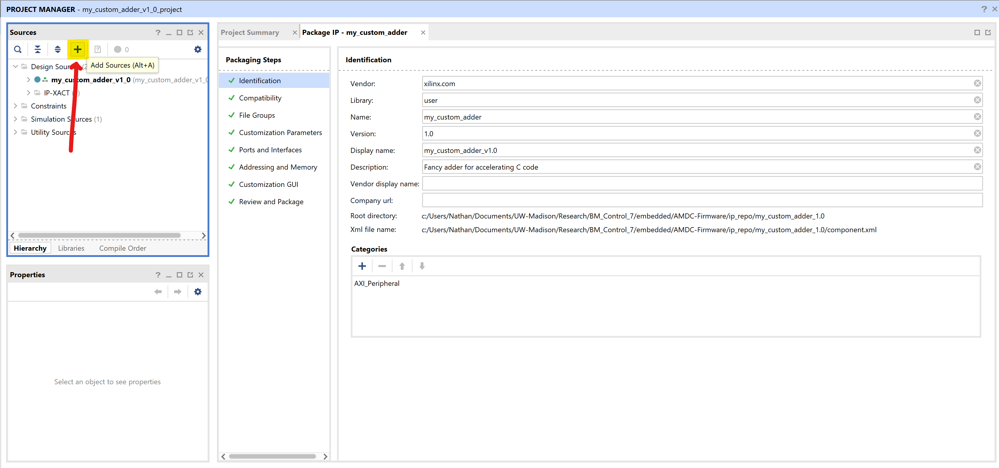

# Tutorial: Custom FPGA IP Core

- **Goal:** Run custom Verilog code in the FPGA.
- **Complexity:** 5 / 5
- **Estimated Time:** 90 min

This tutorial goes over the procedure to create and add a custom FPGA IP core in Vivado.
Step by step instructions are given which walk the user through each part.

## Tutorial Requirements

1. Working AMDC hardware for testing
2. Completion of the [VSI tutorial](/getting-started/tutorials/vsi/index.md)
3. Review of the `v1.0` firmware [system architecture documentation](/firmware/arch/system)
4. Working knowledge of digital logic and Verilog
    - UW-Madison courses ECE 551/552
    - Online tutorials, e.g., [1](https://nandland.com/fpga-101/), [2](https://fpgatutorial.com/verilog/), [3](http://www.asic-world.com/verilog/veritut.html), etc

## Background

The AMDC processor is the Xilinx Zynq-7000 SoC---see its [Technical Reference Manual](https://docs.xilinx.com/v/u/en-US/ug585-Zynq-7000-TRM).
It includes a "Processing System" (PS) and "Programmable Logic" (PL). In the other AMDC docs besides this tutorial, the PS is referred to as the DSP, and PL means FPGA.
Keep in mind that this tutorial is applicable to any system built on top of Xilinx's system-on-chip (PL + PS) architecture family, not just the AMDC/PicoZed/Zynq-7000 combination.

Xilinx provides extensive documentation for exactly the aim of this tutorial: FPGA IP cores.
Seriously, there are over 20 PDFs/videos/resources provided specifically for this from Xilinx, see [here](https://www.xilinx.com/support/documentation-navigation/design-hubs/2019-1/dh0003-vivado-designing-with-ip-hub.html).
The main Xilinx resources are this [tutorial](https://www.xilinx.com/content/dam/xilinx/support/documents/sw_manuals/xilinx2019_1/ug1119-vivado-creating-packaging-ip-tutorial.pdf) and this [user guide](https://www.xilinx.com/content/dam/xilinx/support/documents/sw_manuals/xilinx2019_1/ug1118-vivado-creating-packaging-custom-ip.pdf).
Unfortunately, these two PDFs alone are a combined 178 pages long, which can make it hard/overwhelming for new users.

The goal of this tutorial is to walk advanced AMDC users who care about using the FPGA through the process of creating a basic IP core.
The tutorial does not try to help the user understand every single piece of the system.
If you want to truly understand FPGA design for the Xilinx PL+PS architecture, you need to invest the hours to read the official documentation.

## Motivation

After completing this tutorial, answers to the following questions should become apparent:

- How do I run my custom Verilog code in the FPGA?
- How does the C code interact with Verilog code?
- Can the FPGA be used for hardware acceleration of C code?
- I need to implement a new hardware I/O driver to interface to a new sensor/accessory for the AMDC...how do I add it to the FPGA?

Verilog is structured in files which contain `module` definitions.
Each `module` has external inputs and outputs and can implement internal combinational and sequential logic.
Modules can be instantiated inside other modules to build a hierarchy of "blocks".
Typically, external (i.e., off-chip) signals propagate up to and come from the top-level `module`.

Consider the following Verilog module which implements an `add` operation of two registers, but with a constant offset and scaling of inputs.
The math expression is: $y = 8 x_1 + x_2/4 - 10203$.
It returns the result back to the caller block.

```Verilog
// my_custom_adder.v

module my_custom_adder(clk, rst_n, in1, in2, out);

input clk, rst_n;

// User-supplied arguments
input wire [31:0] in1;
input wire [31:0] in2;

// Computed summation
output reg [31:0] out;

always @(posedge clk, negedge rst_n) begin
    if (!rst_n)
        out <= 32'b0;
    else
        out <= (in1 << 3) + (in2 >> 2) - 32'd10203;
end

endmodule
```

We want to be able to use this module from the processor C code.
How do we inject values from the C code into the inputs `in1` and `in2`?
How do we access the output register `out`?

In C code, we want to compare the performance of our Verilog-based FPGA adder "accelerator" block versus the C-code-based processor adder.

```C
int main() {
    uint32_t in1 = 1234567;
    uint32_t in2 = 2345678;
    uint32_t out;

    // C code version
    out = 8*in1 + in2/4 - 10203;

    // FPGA version
    out = somehow_access_my_custom_adder(in1, in2);
}
```

The key question is: how do we implement the `somehow_access_my_custom_adder()` function above?

**This is the role of the FPGA IP core.**

## FPGA IP Cores

An IP (intellectual property) core, see [Wikipedia article](https://en.wikipedia.org/wiki/Semiconductor_intellectual_property_core), is a way to modularize and encapsulate digital logic for use in digital hardware.
This applies more broadly than just the Xilinx Zynq-7000 architecture---IP cores are an industry-wide concept and any digital system can use IP cores, for example, digital logic design engineers for FPGAs and ASICs can use IP cores as reusable building blocks.
Each IP core encapsulates a single "job" to be done in the digital logic.
For example, an Ethernet MAC, HDMI interface, FFT calculation engine, video transcoder, digital communication protocol (e.g., SPI/CAN/UART/USB/etc), neural network inference accelerator, etc.

The term "IP" refers to the custom logic and "smarts" that are contained within the digital logic.
Users of the logic block do not have to understand the "IP" baked within to use the module, simply the block interface and I/O requirements.

### Example IP Cores for Sale

Designers can purchase pre-made IP cores from many companies.
For example, the three major FPGA providers (AMD/Xilinx, Intel/Altera, and Lattice) all sell IP cores to accelerate development using their products.

A few examples you can buy/license:

- [FFT IP core from Intel/Altera](https://www.arrow.com/en/products/ip-fft/intel) costs over $7k
- [CAN IP core from AMD/Xilinx](https://www.avnet.com/shop/us/products/amd-xilinx/ef-di-can-xc-site-3074457345626042380/) costs $18k
- [USB 2.0 IP core from AMD/Xilinx](https://www.avnet.com/shop/us/products/amd-xilinx/ef-di-usb2-device-site-3074457345625974081/) costs $14k
- [2D video frame scaling IP core from Lattice](https://www.arrow.com/en/products/scaler-e3-u1/lattice-semiconductor) costs $3.5k
- [IP Cores, Inc](http://www.ipcores.com/) IP core product offering
- [ZIPcores](https://www.zipcores.com/ip-core-listings.html) IP core products, e.g.,
    - [FIR filters](https://www.zipcores.com/ultra-speed-fir-filter.html) costs $4k
    - [Floating point square root](https://www.zipcores.com/floating-point-square-root.html) costs $4k
    - [I2C master controller](https://www.zipcores.com/i2c-master-serial-interface-controller.html) costs $3k

As seen above, commercially available IP cores are relatively expensive for casual users, but can greatly accelerate the time to solution and reduce development risk.
If you possess the skills to create custom Verilog code which can implement the desired functionality, designing and building your own IP cores can be a rewarding alternative compared to buying commercial solutions.

## IP Cores in Xilinx Vivado

In the AMDC-Firmware, Vivado manages the FPGA design using three entities:

1. The "block design" `.bd` file---encodes the different elements, configurations, and connections
2. The constraints file `.xdc`---stores hardware-related information like port/pin mappings
3. IP repo---folder of custom IP cores which integrate into the block design

These files are visible directly in the [AMDC-Firmware](https://github.com/Severson-Group/AMDC-Firmware) repository:

1. Block design: [/hw/amdc_reve.bd](https://github.com/Severson-Group/AMDC-Firmware/blob/develop/hw/amdc_reve.bd)
2. Constraints: [/hw/constraints_amdc_reve.xdc](https://github.com/Severson-Group/AMDC-Firmware/blob/develop/hw/constraints_amdc_reve.xdc)
3. IP repo: [/ip_repo/](https://github.com/Severson-Group/AMDC-Firmware/tree/develop/ip_repo)

### Block Design File

The block design `.bd` file is the top-level visual representation of the FPGA design.
Below is an example screenshot which shows off-chip inputs and outputs (I/O), IP cores (light blue), and hierarchy containers (dark blue) which are simply a way of making the block design appear cleaner.



Vivado can also support plain HDL module blocks in the block design (i.e., not IP cores, just an instantiated Verilog file), but the AMDC-Firmware project does not use this approach. Plain modules are "static" meaning their I/O cannot be dynamically updated from the C code. Therefore, their functionality is rather limited.

Notice that each IP core has three common inputs:

1. `s00_axi_aclk`---clock input, runs at 200 MHz (often called `clk` in Verilog files)
2. `s00_axi_aresetn`---asynchronous reset input, active low (often called `rst_n` in Verilog files)
3. `S00_AXI`---bus of many signals which form the AXI4 interconnect

### AXI Interconnect

The [AXI interconnect](https://www.xilinx.com/support/documentation/ip_documentation/ug761_axi_reference_guide.pdf) is the bus that goes between IP cores and the main processor.
AXI is part of [ARM AMBA](https://en.wikipedia.org/wiki/Advanced_Microcontroller_Bus_Architecture), a family of microcontroller buses first introduced in 1996.
AMBA 4.0, released in 2010, includes the second version of AXI, AXI4.
Xilinx has adopted the Advanced eXtensible Interface (AXI) protocol for Intellectual Property (IP) cores.

There are three types of AXI4 interfaces:

1. AXI4---for high-performance memory-mapped requirements
2. AXI4-Stream---for high-speed streaming data.
3. AXI4-Lite---for simple, low-throughput memory-mapped communication (e.g., to and from control and status registers)

Most IP cores in the AMDC-Firmware use **AXI4-Lite** since it implements a simple register interface for low-throughput data transfer.
The remainder of this tutorial will walk through creating and testing a basic IP core using AXI4-Lite.

## Creating AXI4-Lite IP Core in Vivado

This section goes over all the required steps to create and add the `my_custom_adder` module IP core and hook it up in the block design.
It is assumed the reader has already installed the Xilinx Vivado software per [these instructions](/firmware/xilinx-tools/installing-xilinx-tools), as well as built the Vivado project per the first part of [these instructions](/firmware/xilinx-tools/building-and-running-firmware).
If not, go back and complete the steps now.

```{caution}
The instructions below attempt to show and explain all the steps. However, Vivado has many quirks so users might find things not working for them.
If so, please reach out for help via the `AMDC-Firmware` [GitHub Discussions page](https://github.com/Severson-Group/AMDC-Firmware/discussions).
Per the feedback, we will try to update this tutorial to make these steps as fool-proof as possible.

Vivado works well and does the right things, but requires careful user inputs to get it to do what is desired.
It is quirky.
```

### 1. IP Creation Wizard

Vivado comes with an IP creation wizard that automatically writes all the required Verilog for a base IP core.
To use this, follow these instructions:

1. Open Vivado, load the `amdc` project, and open the block design
2. Start the IP wizard: `Tools` > `Create and Package New IP`
3. Read the window and click `Next >`
4. Select `Create a new AXI4 peripheral` and click `Next >`

#### Peripheral Details

1. Update the name to be `my_custom_adder` (note: all AMDC-Firmware IP uses the `amdc_***` namespace, but for this tutorial, no need for that)
2. Update the `Description` box to a short (5-10 word) description of the new IP core
3. Ensure the `IP location` is the `/ip_repo/` folder of the `AMDC-Firmware` repo installation
4. Review the screenshot below as an example
5. Click `Next >`

```{image} images/vivado_ip_wizard1.png
:alt: Example dialog contents for peripheral details
:width: 600px
```

#### Add Interfaces

1. Keep the AXI interface `Name` as default: `S00_AXI`
2. Set `Interface Type` to `Lite`
3. Set `Interface Mode` to `Slave`
4. Set `Data Width (Bits)` to `32`
5. Set `Number of Registers` to `4`
6. Review the screenshot below as an example
7. Click `Next >`

```{image} images/vivado_ip_wizard2.png
:alt: Example dialog content for add interfaces
:width: 600px
```

#### Create Peripheral

1. Read the dialog and ensure the `Next Steps` is `Add IP to repository`
2. Click `Finish`

The wizard will close and a new loading pop-up will appear.
After a few seconds, it will finish and the block design will appear again.

Look around. Nothing has changed! So where did the new IP core go?

Check in `git`: the new IP core indeed was created and all its contents are located at `/ip_repo/my_custom_adder_1.0/`.

### 2. Adding IP to Block Design

Once you create the IP core as above, it does not automatically appear in the block design.
The following steps are required to instantiate it and "hook it up" so it can be used.

#### Instantiate IP Core

1. From the block design, click the `+` button and search by name for the IP core: `my_custom_adder`
2. Double click the name of the IP core and it will be added to the block design

```{image} images/vivado_add_ip1.png
:width: 400px
```

The new IP core will be *somewhere* in the block design.
Scroll around until you find it.
For example, when creating this tutorial, it was added like this:



If desired, the IP core can be dragged around to a new location.
Or, Vivado can automatically redraw the block design based on how it thinks the "best" arrangement would be by clicking the `Regenerate Layout` button from the Diagram pane toolbar (the forward circular arrow, 3rd from right in the above image).

#### Hook Up IP Core

Notice that the new IP core has only three inputs, like discussed earlier.
However, by default, these are not connected to anything.
To hook them up, do the following:

1. Attach the clock `s00_axi_aclk` to the common clock that all other IPs use by clicking on the pin and dragging the mouse to the common clock signal
2. Attach the reset `s00_axi_aresetn` to the common reset signal like above

Once `clock` and `reset` are connected, it should look like this.
Here, the signals are highlighted to easily see where they go---do this by `Ctrl`-clicking on the nets.

```{image} images/vivado_add_ip3.png
:width: 600px
```

Finally, the IP core `AXI` interface needs to be hooked up.
Do this by clicking on the `Run Connection Automation` from the green `Designer Assistance` bar.
A pop-up appears.

By default, it should have selected the unconnected AXI interface to the new IP core.
There should be no settings to change here.
Simply click `OK`.

```{image} images/vivado_add_ip4.png
:width: 600px
```

Congrats! The IP core is now properly instantiated and hooked up.

### 3. IP Core Base Address

As will become apparent later, the "base address" of the IP core is very important.

The base address of the IP core is assigned in Vivado from the `Address Editor` pane.
By default, it gets the next available IP core address:

```{image} images/vivado_ip_address.png
:width: 600px
```

Here, the address was assigned as: `0x43DB0000`.
We will use this value later.

### 4. Summary of "Empty" IP Core

Let's take a moment to understand the current state of the FPGA and our new IP core.

We created an IP core that uses AXI4-Lite for external communication.
It has 4 internal registers which are accessible from the C code via memory-mapped operations.
The IP core has no custom functionality since it is only composed of the template code from the IP Wizard.

Think of the blank IP core as exposing 4 additional read/write (R/W) variables to the C code that are not standard RAM---these new "variables" are actually 32-bit wide registers in the FPGA. We will unpack what this means in the remainder of the tutorial.

### 5. Editing IP Cores

The "empty" IP core which comes from the IP wizard is not very useful.
Unfortunately, it is rather difficult to edit the IP core to add custom features.
The following steps must be followed in order to edit the contents of the IP core.

The next sections will give concrete examples of these steps and provide screenshots as we add the `my_custom_adder` module.

1. In the block design, right-click on the instantiated IP core and select `Edit in IP Packager`
2. In the pop-up, leave the defaults and click `OK`
3. It will load and then **open a new instance of Vivado** where the top-level is the IP core (no longer the top-level block design of the full FPGA)
4. Inside this new Vivado instance, make edits to the Verilog source code which composes the IP core
5. Once done and ready to save, go to the `Package IP -- my_customer_adder` pane
6. Click each of the steps under `Package Steps` which does not have a green checkmark and click the link to make the step have a green checkbox
7. Once all steps are green, select the last step: `Review and Package IP`
8. Click `Re-Package IP` at the bottom
9. In the pop-up, click `Yes` to close the project and return back to the top-level block design

Now, the IP core itself has been updated.
However, the "old" instantiated IP core in the block design still has the "old" code.
To propagate the new changes to the existing IP cores in the block design, the IP needs to be "upgraded".

1. Click `Reports > Report IP Status` (or, click the link from the yellow toolbar if it appeared)
2. Locate the `IP Status` pane which appears after the report runs
3. Review the changes and select `Upgrade Selected`
4. After it finishes upgrading, click `Skip` to not rebuild at this moment
5. Re-run the `IP Status` report and it should show no changes are found

Editing IP source and propagating the changes into the actual block design can be a source of pain.
If you edit the source files directly (like through VS Code), you still need to do the `Report IP Status` steps above to have Vivado recognize your changes.
However, you shouldn't need to re-package the IP if you edit in an external editor.

```{tip}
If you make changes to the IP core but it doesn't seem to change/fix anything, Vivado might not be building your latest changes.
Make sure to run the `IP Status Report` to ensure the new changes have propagated to the instantiated IP cores in the block design.
```

### 6. Adding Custom Adder

We will now follow the [steps from above](#edit-the-ip-core) to add the `my_custom_adder` Verilog module to the new IP core.

#### Create Source File

1. Outside of Vivado, create a `src` folder in the new IP repo folder to house the custom code: `ip_repo\my_custom_adder_1.0\src`
2. In your favorite text editor, create a file in this `src/` folder named `my_custom_adder.v`
3. Populate this file with the module as defined in the beginning of this tutorial
4. Save the file

#### Add Source File to IP Core

1. Open Vivado to the block design which has the "empty" `my_custom_adder` IP core
1. Right-click the `my_custom_adder` IP core, select `Edit in IP Packager`, and click `OK`
2. Click the `+` to add sources to the IP

3. In the pop-up, ensure `Add or create design sources` is selected and click `Next >`
4. Click `Add Files`
5. Browse to the `my_custom_adder.v` file you created and select it
6. Uncheck `Copy sources into IP Directory` since they are already in the right location
7. Click `Finish`

Now, the new Verilog file should appear in the `Sources` pane.
Double-click it to open an editor from within Vivado.

```{image} images/vivado_edit_ip2.png
:width: 100%
```

#### Integrate Custom Logic to AXI4-Lite Interface

Even though we added the right Verilog source file, the IP core will still behave the same.
We need to modify the existing template Verilog files to instantiate our new module.

1. From the `Sources` pane, open the top-level wrapper for the IP core, `hdl/my_custom_adder_v1_0.v`, in the built-in editor
2. Scroll through the source code
3. Notice all this top-level wrapper does is instantiate the other auto-generated Verilog file: `hdl/my_custom_adder_v1_0_S00_AXI.v`
4. Open `hdl/my_custom_adder_v1_0_S00_AXI.v` in the editor (you will need to expand the dropdown in the `Sources` pane to find it)

The `*_S00_AXI.v` file implements a slave for the AXI4-Lite interface.
Scroll down and skim the template code.
For the most part, we will never edit this code.

Find the 4 registers named `slv_reg0` through `slv_reg3`.
These are the 32-bit wide registers which we can write to from C code.
Read the template code to see how read and write operations work.
Notice that the data from the read/write bus is loaded/stored from/to these slave registers.
This is the core of how the C code interfaces to the FPGA!

Finally, we will implement our custom adder.

1. Scroll to the bottom of the file with the AXI interface: `hdl/my_custom_adder_v1_0_S00_AXI.v`
2. Find the comment that says: `// Add user logic here`
3. Below that comment, add the following logic:

```Verilog
my_custom_adder adder (
    .clk(S_AXI_ACLK),
    .rst_n(S_AXI_ARESETN),
    .in1(slv_reg0),
    .in2(slv_reg1),
    .out(my_custom_adder_output)
);
```

Now, our adder will compute the desired output where `in1` and `in2` come from the slave registers

Handling custom logic "read" operations from the slave registers is easy---just as above, we can make use of any slave register by simply using it as normal.

However, custom logic "write" operations to the slave registers is a bit more complicated.
By default, the template Verilog code simply returns the appropriate slave register contents based on the requested address---see how the `reg_data_out` signal is used.
In Verilog, you cannot have two sources driving a single register without them coordinating access.

To get around this, we will simply override the return value for our output signal.

1. Create a new 32-bit wide register near the top of the Verilog file (put it near the `slv_reg0` definition): `reg [31:0] my_custom_adder_output;`
2. Update the assignment of `reg_data_out` for case `2'h2` to be `my_custom_adder_output` instead of `slv_reg2`

```{image} images/vivado_edit_ip3.png
:width: 500px
```

Now, read requests at offset "2" (i.e., for the second slave register `slv_reg2`) will return our adder module output, not the actual contents of `slv_reg2`.

It is interesting to think about *write* operations to `slv_reg2` from the C code.
The template Verilog will still update the value stored in `slv_reg2`, but this has no effect.
To the user, `slv_reg2` has become a "read-only" register, as desired!


### 7. Re-Package IP Core

Following the [steps from above](#edit-the-ip-core), re-package `my_custom_adder` IP core and return to the top-level FPGA block design.

1. Ensure all Verilog source files are saved
2. Go back to the `Package IP` pane
3. Notice that the `File Groups` step is not a green checkbox
4. Click the `File Groups` step and click `Merge changes from File Groups Wizard`
5. Now, all the steps are green except the last
6. Select the `Review and Package` step
7. Click `Re-Package IP`
8. Click `Yes` to close the temporary project

### 8. Upgrade the IP

Follow the [above steps](#edit-the-ip-core) to upgrade the IP status.

### 9. Generate the Bitstream

Finally, click the `Generate Bitstream` as usual to create the bitstream file.

### 10. Export Hardware

After successful bitstream generation, re-export the hardware from Vivado, like was done in the [building and running firmware guide](/firmware/xilinx-tools/building-and-running-firmware). You should see a pop-up in the SDK after re-exporting the hardware. Select `Yes` in the pop-up to confirm the hardware export from Vivado.

**Whew! The new custom IP core is complete!**

## Access IP Core from C Code

Per the above section and discussion, you should now be aware that the access to the IP core comes from the slave registers which the AXI4-Lite interface reads and writes. Let's understand our new IP core from the prospective of the C code.

### Memory-Mapped FPGA Registers

The core "magic" of the AXI4-Lite interface to the FPGA is the hardware support in the PS for memory operations.
When the C code reads/writes to memory addresses near the IP core base address, this causes an AXI read/write transaction to occur.
The template Verilog from the IP Wizard implements the slave side for the transaction response.

Let's read/write from/to a slave register in our new IP core from C code:

```C
// Base address of our new IP core
// 
// This is simply a pointer with a manually assigned address per Vivado,
// which might seem odd since we never do this in typical programming
//
// Recall this value came from the Address Editor pane in Vivado,
// and also gets exported into the xparameters.h file
volatile uint32_t *base_addr = (volatile uint32_t *) 0x43DB0000;

// Define pointer to slv_reg3 (it was unused in the FPGA design)
volatile uint32_t *slv_reg3 = &base_addr[3];

// Write to the FPGA register slv_reg3 in a couple ways
*slv_reg3 = 0x123;
base_addr[3] = 0x123;

// Read slv_reg3 from FPGA
uint32_t slv_reg3_from_fpga;
slv_reg3_from_fpga = *slv_reg3; // should return 0x123
slv_reg3_from_fpga = base_addr[3]; // should also return 0x123
```

### Access `my_custom_adder` from C Code

We can **finally** implement our `somehow_access_my_custom_adder()` function from the first part of this tutorial:

```C
uint32_t somehow_access_my_custom_adder(uint32_t in1, uint32_t in2) {
    // Get pointer to our custom IP core
    volatile uint32_t *base_addr = (volatile uint32_t *) 0x43DB0000;

    // Apply inputs
    base_addr[0] = in1;
    base_addr[1] = in2;
    
    // No need to wait for the IP core to finish since the adder logic
    // only takes one clock cycle to run and compute the value.
    //
    // The AXI transactions themselves take multiple clock cycles!

    // Return output
    return base_addr[3];
}
```

## Testing

Let's test on hardware to ensure the new IP core works as expected.
Futhermore, let's profile the execution time from the C code side and see if our new IP core adder can accelerate the processor version.

### Code Performance Timing

Add a new command to the AMDC user code which allows us to profile the code.
If adding commands is unfamiliar, review the template code provided in the [VSI tutorial](/getting-started/tutorials/vsi/index).

The command will require the two number inputs from the user and return the computed output.
It will compute the output `N` times and return the average execution time.
This will be done for the FPGA version or the C code version.

**Command:** `adder test [cpu|fpga] <N> <in1> <in2>`

```C
#include "drv/cpu_timer.h"

int cmd_adder(int argc, char **argv) {
    if (argc == 6 && STREQ("test", argv[1])) {
        int N = atoi(argv[3]);
        if (N < 1) {
            return CMD_INVALID_ARGUMENTS;
        }

        uint32_t in1 = (uint32_t) atoi(argv[4]);
        uint32_t in2 = (uint32_t) atoi(argv[5]);
        uint32_t out;

        uint32_t now_start, now_stop;
        uint32_t total_time = 0; // in units of CPU cycles
        if (STREQ("cpu", argv[2])) {
            for (int i = 0; i < N; i++) {
                now_start = cpu_timer_now();

                // Compute result using CPU
                out = 8*in1 + in2/4 - 10203;

                now_stop = cpu_timer_now();
                total_time += (now_stop - now_start);
            }
        } else if (STREQ("fpga", argv[2])) {
            // Pointer to our custom IP core
            volatile uint32_t *base_addr = (volatile uint32_t *) 0x43DB0000;

            for (int i = 0; i < N; i++) {
                now_start = cpu_timer_now();

                // Compute result using FPGA
                base_addr[0] = in1;
                base_addr[1] = in2;
                out = base_addr[3];

                now_stop = cpu_timer_now();
                total_time += (now_stop - now_start);    
            }
        } else {
            return CMD_INVALID_ARGUMENTS
        }

        double total_time_usec = cpu_timer_ticks_to_usec(total_time);
        cmd_resp_printf("out: %d\r\n", out);
        cmd_resp_printf("average time [us] per operation: %f\r\n", 
                            total_time_usec / ((double) N));

        return CMD_SUCCESS;
    }

    return CMD_INVALID_ARGUMENTS;
}
```

### Results

Run on hardware and get results

## Conclusion

**Congrats!** If you made it this far, be proud of yourself.
Getting custom Verilog code into the FPGA via an IP core and accessing it from C code memory-mapped operations in quite the feat.

You can now add custom logic to the FPGA. [The world is your oyster!](https://nosweatshakespeare.com/quotes/famous/the-worlds-your-oyster/)
