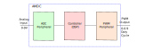

# Control with AMDC Using Simulink Autogen

## Background

Modern motor drive systems rely on embedded controllers to execute control algorithms in real time. Traditionally, these algorithms are implemented manually in C/C++, which is time-consuming and prone to implementation errors, especially for complex control systems.

However, Simulink provides a MATLAB-based graphical environment for modeling and simulating control systems. It is extensively used to model, simulate, and analyze complex dynamical systems, including motor drives. The GUI and block diagram environment in Simulink make it user-friendly and easy to validate system performance and controller performance.

The process of converting a user Simulink model for a controller to equivalent C-code for an embedded system (such as the AMDC) is called Automatic Code Generation (Autogen). By using the Autogen capability, control algorithms developed in a block-diagram form can be automatically converted into C code for execution on embedded platforms. This enables developers to design, simulate, and validate control strategies before deploying them to hardware. As a result, it improves development efficiency, reduces implementation errors, and provides a more intuitive framework for control system design.

## Control Approach with Simulink and AMDC

The Simulink + AMDC workflow separates control development into two domains:

- **Design domain (Simulink):**  
  The control algorithm is developed and validated using a graphical model.

- **Execution domain (AMDC):**  
  The generated C code is executed in real time on the embedded controller.

In this workflow, the Simulink model represents the control logic, while the AMDC is responsible for executing this logic at a fixed time interval using real sensor data. The Simulink model is typically structured into three subsystems:

1. **Input/Output (I/O):** Used for simulation and visualization only  
2. **Plant:** Represents the physical system (used for simulation)  
3. **Controller:** Contains the control logic to be deployed  

Only the **controller subsystem** is converted into embedded C code.

## Generated Code and Execution Model

Simulink Autogen produces C code that represents the controller as a callable function. This generated code should be treated as a black-box implementation of the Simulink controller. Within the AMDC, the control task is responsible for executing the controller at a fixed time interval. This fixed-time execution model is fundamental to digital control implementation on the AMDC. The execution sequence is:

1. Populate inputs using sampled sensor data  
2. Call the controller step function 
3. Route outputs to actuators (e.g., PWM duty cycles)  

The generated code has the following structure:

```c
void control_task_callback(void)
{
    // Populate inputs
    modelName_U.current = measured_current;
    modelName_U.voltage = measured_voltage;

    // Execute controller
    modelName_step();

    // Apply outputs
    set_pwm_duty(modelName_Y.duty);
}
```

- Input and output data structures:

```c
modelName_U   // Inputs to controller
modelName_Y   // Outputs from controller
```

- A function that executes the control algorithm:
  
```c
modelName_step();
```

## Development Environment and Workflow

To develop control code using Simulink Autogen, the following software components are required:

- MATLAB  
- Simulink  
- Simulink Coder  
- Embedded Coder  

Additional toolboxes may be required depending on the specific control design.

### Recommended Workflow

The recommended workflow for developing control code is:

1. Develop and validate the control algorithm in Simulink  
2. Isolate the controller subsystem  
3. Generate C code using Simulink Autogen  
4. Integrate generated code into the AMDC project  
5. Execute and validate on hardware  

### Repository Organization and Integration

After code generation, Simulink creates a folder (typically named `modelName_ert_rtw`) that contains all generated source and header files. This folder must be incorporated into the AMDC project. A recommended approach is to place the generated folder within the application directory in the AMDC repository. For example:

```
apps/
└── my_app/
    ├── src/
    ├── include/
    └── autogen/
        └── modelName_ert_rtw/
```

In this structure:

- The `modelName_ert_rtw` folder contains all autogenerated `.c` and `.h` files.  
- The folder is kept separate from hand-written code for clarity and maintainability.  

The autogenerated code should then be integrated into the AMDC project as follows:

- Add the `modelName_ert_rtw` directory to the compiler include paths.  
- Add all generated `.c` files to the project source files.

Once added, the autogen folder should appear as part of the project within the SDK environment.

### Integration Notes

- Do not delete any generated files, as some auxiliary files may be required during compilation.
- Generated source (`*.c`) and header (`*.h`) files must be included in the AMDC project.
- The path to the folder containing the MATLAB script and the Simulink model should not contain any whitespace. If the folder or any parent directory contains whitespace in its name, the code generation process may result in a build error  

This organization ensures that the autogenerated controller code is correctly compiled and integrated into the AMDC firmware.

## Important Considerations for Simulink Models

For successful development and integration of control code, the following considerations must be observed:

1. **Discrete-Time Implementation**: All blocks within the controller must be discrete-time, since the AMDC executes control logic at fixed sampling intervals.
2. **Fixed-Step Solver**: The Simulink model must use a fixed-step solver to ensure compatibility with real-time execution.
3. **Consistent Sample Time**: The entire controller subsystem should operate at a single, well-defined sample time before converting to an atomic subsystem and creating a referenced model.
4. **Code Generation Settings**: The code generation target should be set to Embedded Coder (`ert.tlc`). The build configuration should enable "Generate Code Only".
5. **Referenced Model Usage**: The controller subsystem should be converted to an atomic subsystem, then converted to a referenced model. Any updates to model settings should be performed after opening the referenced model as the top model.
6. **AMDC Integration Details**

    - All generated source files should be included in the project.  
    - The autogenerated folder must be added to the compiler include paths.  

7. **File and Path Constraints**: File paths must not contain whitespace. If the folder or any top-level folder has white spaces in the name, it will result in a build error.

## Example Model

A simple example is provided to illustrate the Simulink Autogen workflow and its integration with the AMDC. This example serves as a reference for how a Simulink-based controller is translated into embedded code and executed within the AMDC framework. The example implements a simple control function with the following behavior:

1. Read an analog input in the range of 0–9 V. 
2. Map the input to a PWM duty ratio in the range of 0–0.9.  
3. Apply saturation limits:
   - Output is limited to 0.9 if the input exceeds 9 V.
   - Output is limited to 0 if the input is below 0 V.  

The functional behavior of this example can be understood using the following system diagram:



In this structure:

- The ADC peripheral samples the analog input.  
- The controller (generated from Simulink) computes the control output.  
- The PWM peripheral applies the resulting duty ratio.  

This reflects the execution model described earlier, where the AMDC samples inputs, executes the controller, and applies outputs at a fixed time interval.

### Simulink Model

The complete Simulink model used in this example is provided below:

- Simulink model: [`autogenExample.slx`](./resources/autogenExample.slx)  
- Initialization script: [`autogenExampleInit.m`](./resources/autogenExampleInit.m)  

The Simulink model follows the recommended structure, with the controller implemented as a referenced model and appropriate solver and code generation settings already configured. Within the model, the block `exampleController` represents the controller subsystem that is converted into C code using Simulink Autogen, by running the script `autogenExampleInit.m`.

### Generated Code Structure

After running the initialization script (`autogenExampleInit.m`), Simulink generates code for the controller subsystem, resulting in a folder named `exampleController_ert_rtw`. Among the generated files, the most relevant are:

- `exampleController.c` — implementation of the control logic  
- `exampleController.h` — interface definitions (inputs, outputs, function declarations)  

These files define the controller as a callable function with input and output structures, consistent with the execution model described earlier.

## Conclusion

The Simulink Autogen workflow provides a structured and efficient approach for implementing control algorithms on the AMDC. By separating control design from embedded implementation, this approach enables:

- Rapid development and iteration  
- Improved reliability through simulation  
- Clear mapping between design and execution  

This methodology is recommended for developing advanced control systems on the AMDC platform.
