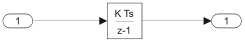
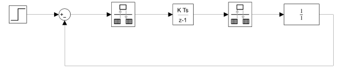
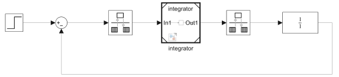

# Simulink Automatic Code Generation for AMDC

- This article explains how to implement the Simulink automatic code generation (autogen) by demonstrating an example using a simple integrator.

## Example of Model Configuration

- A simple discrete-time integrator ($\frac{K T_{\mathrm{s}}}{z - 1}$) will be used for creating the Simulink automatic code generation.

<p align="center">
  
</p>

## Procedure

### Pre-Requisites

- User needs to install the dedicated MATLAB/Simulink toolbox/features - Embedded coder.  

### File Organization

- Provide a preferred file organization so that the AMDC can access the generated C-code

### 1. Create a Setup Model

1. Save a new .m file as setup.m and define Ts = 1/(10e3), Tsim = Ts/10.
2. Open a blank model of Simulink.
3. Add a Step function with the default setting.
4. Add a Discrete-time integrator ($\frac{K T_{\mathrm{s}}}{z - 1}$) with the default setting.
5. Add a rate transition block before the integrator. In the rate transition, put $T_{\mathrm{s}}$ as a sampling time.
6. Add a rate transition block after the integrator. In the rate transition, set the sampling time to -1.
7. Add a continuous-time transfer function as a Plant (= 1).
8. Add a Sum function and connect each block as shown below.

<p align="center">
  
</p>

### 2. Model Setting

1. Press Model Settings and go to Solver. In the Solver Selection, press Fixed-step. Set Fixed-step size as Tsim. 
2. In the Model Settings, go to Code Generation and click Browse for the System target file. Select ert.tlc Embedded coder.
3. In the Model Settings, go to Model Settings and click Code Generation. In the Build process section, check Generate code only.
4. In the Code Generation, go to Optimization and choose None for the Leverage target hardware instruction set extensions in the Target specific optimizations.
5. In the Code Generation, go to Templates and uncheck Generate an example main program in the Custom templates section. Then, click Apply and OK.

### 3. Create a Reference Model

1. Select the discrete-time integrator, and right-click. Select Create Subsystem from Selection.

<p align="center">
  
</p>

2. Right-click on the subsystem. Select Block parameters (Subsystem), check 'Treat as atomic unit', and click OK.
3. Right-click on the subsystem and select Subsystem & Model Reference. Select Convert and click Reference Model.
4. In the Input Parameters section, define the New model name as integrator.
5. Click Apply and Convert
6. Rename the reference model to be integrator.

### 4. Reference Model Setting

1. Double-click the integrator subsystem and click Model Settings. Click Model Settings in the Reference Model section.
2. Click Solver and in the Solver details, put Ts.
3. Save the Simulink file.

### 5. Generate C-code

1. Open the setup.m.
2. Copy and paste the following code. 
```m
%% Autogen code for the controller
model='integrator'; % Name of the controller to be built
slbuild(model);     % Generates the autogen code
oldFolder = cd('C:integrator_ert_rtw\');
command = 'for /r %i in (*.c, *.h) do copy /y %i ..\autogen';
[status, cmdout] = system(command);
cd(oldFolder);
```

### Integration with AMDC

- Provide an example C-code to call the Autogen files within SDK, i.e., we need a following code:

https://github.com/Severson-Group/ARL-eturbo/blob/1ae4479c934d486e06f233d98f9384fda36a545d/Embedded/My-C-Code/usr/bm_4dof/task_bm_4dof.c#L649

## Results

- After running the AMDC, show the input and output value through logging feature
