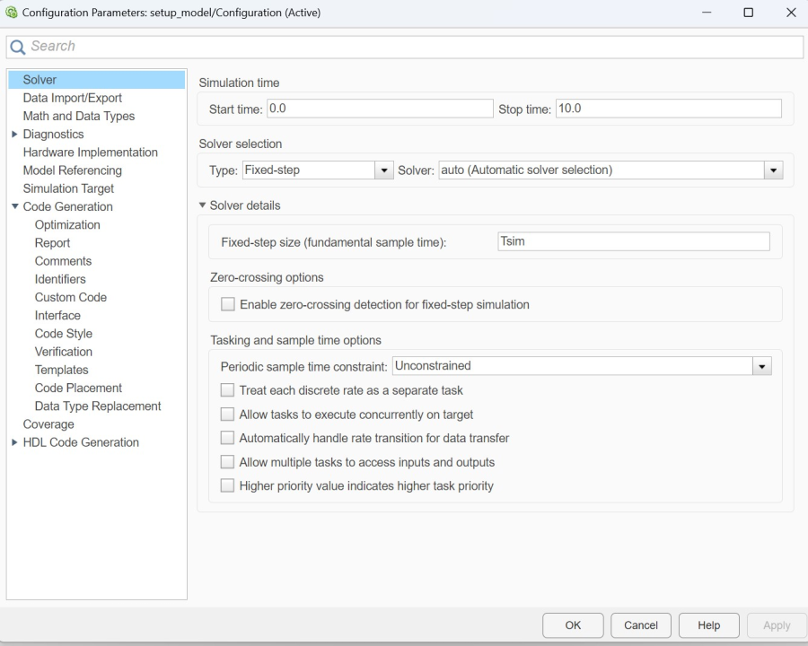
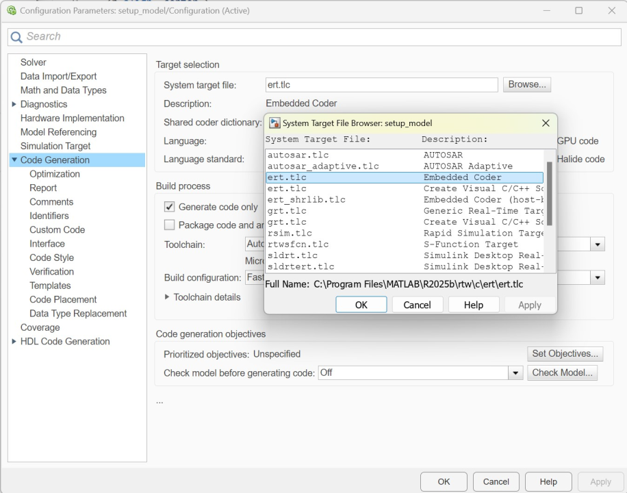
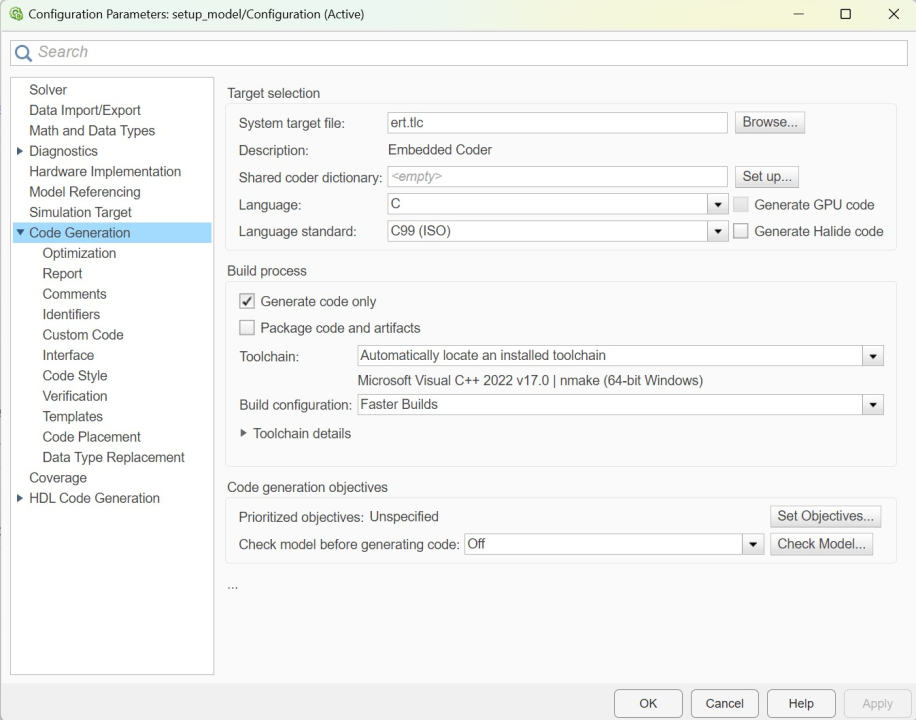
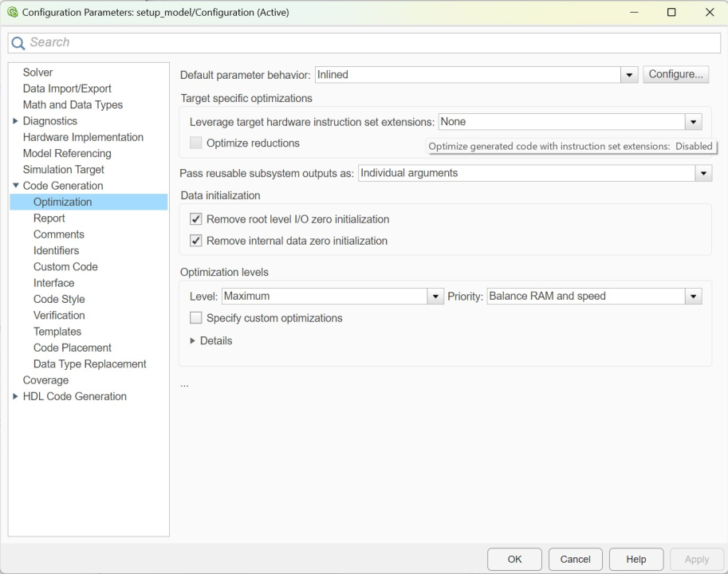
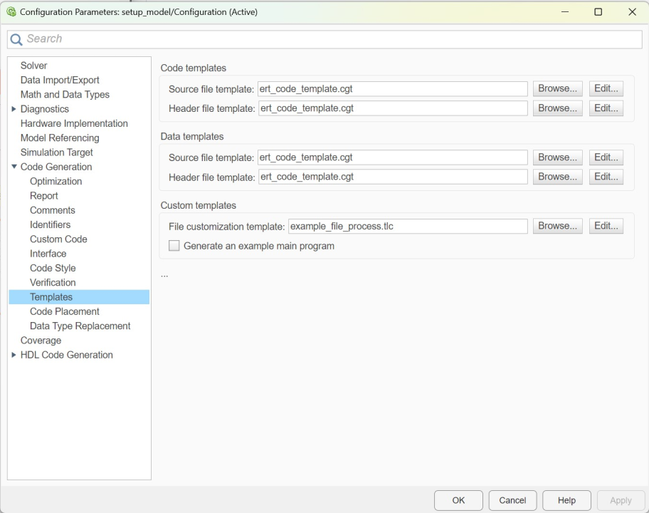

# Simulink Automatic Code Generation for AMDC

- This article explains how to implement the Simulink automatic code generation (autogen) by demonstrating an example using a simple integrator.

## Example of Model Configuration

- A simple discrete-time integrator ($\frac{K T_{\mathrm{s}}}{z - 1}$) will be used for creating the Simulink automatic code generation.

  

## Procedure

### Pre-Requisites

- User needs to install the dedicated MATLAB/Simulink toolbox/features - Embedded coder.  

### File Organization

- Provide a preferred file organization so that the AMDC can access the generated C-code

### Create a Setup Model

- Save a new .m file as setup.m.
- Open a blank model of Simulink.
- Add a Discrete-time integrator
- Let us make a continuous time transfer function as a Plant (= 1).
- Add rate transition block before the integrator.
- In the rate transition, put T_{\mathrm{s}} as a sampling time.

- Make a (discrete time) integrator 
- Provide a process of how to create a reference model (see [this](https://github.com/Severson-Group/AMDC-Examples/blob/develop/docs/autogen/Autogen.md#creating-a-referenced-model))

### Model Setting

- Press Model Settings and go to Solver. In the Solver Selection, press Fixed-step. Set Fixed-step size as Tsim. 

  

- In the Model Settings, go to Code Generation and click Browse for the System target file. Select ert.tlc Embedded coder.

  

  

  

  
</p

### Create a Reference Model

- Make a (discrete time) integrator 
- Provide a process of how to create a reference model (see [this](https://github.com/Severson-Group/AMDC-Examples/blob/develop/docs/autogen/Autogen.md#creating-a-referenced-model))

### Generate C-code

- Provide a process of how to generate C-code using Autogen feature, i.e., run `slbuild(modelName.slx)` command. 

### Integration with AMDC

- Provide an example C-code to call the Autogen files within SDK, i.e., we need a following code:

https://github.com/Severson-Group/ARL-eturbo/blob/1ae4479c934d486e06f233d98f9384fda36a545d/Embedded/My-C-Code/usr/bm_4dof/task_bm_4dof.c#L649

## Results

- After running the AMDC, show the input and output value through logging feature
