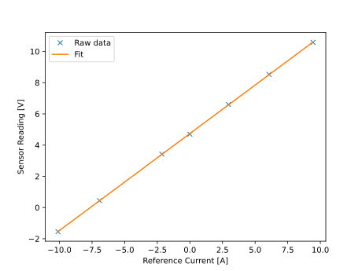

# Current Sensor Calibration

## Background

Current sensors provide the necessary current measurement feedback to the control system in a motor drive. This document describes a method to calibrate the current sensors during commissioning of the motor drive, and arrive at the calibration parameters: gain and offset.

Current sensors are transducers which produce an output signal (either current or voltage) proportional to the primary current flowing through the sensor. There are different types of current sensors relying on different physical phenomenons such as shunt resistors and hall-effect type current sensors. For the purpose of this document, the specific type of sensor does not matter---just that the output signal is linear versus the primary current, and that it is measurable by the control system. The current sensor needs to be calibrated against an appropriate reference before it can be used in the control system. While the manufacturer datasheet provides nominal parameters, calibration of the current sensor is necessary to get accurate measurements to account for any deviation due to process variation.

## Calibration Method


A method is provided to calibrate the current sesnsors connected to a three phase motor drive as shown in the figure. Typically, each phase in a 3 phase motor will have a current sensor associated with it. Hence, each of the three current sensors need to be calibrated. The same method maybe extended to any multi-phase machines. The method is described below:

1. Connect a current clamp to the phase U cable of the motor. The measurement provided by the current clamp can be considered as a reference current measurement.
1. Hook up the current clamp to an oscilloscope so that the reading of the current clamp can be monitored in real-time.
1. Log the raw reading of the current sensor attached to phase U using the logging functionality in the AMDC. 
1. First, note the sensor reading when there is no current flowing through phase U.
1. Next, apply a differential open loop voltage on phase U to cause some current to flow through phase U. The value of voltage is left to the discretion of the user based on the system nominal ratings.
1. Note down the sensor reading as well as the reference current flowing through phase U cable.
1. Progressively increase the applied voltage and note down the readings. It is recommended to go up until the rated value of the current is flowing through phase U.
1. Tabulate the measurements as shown in `exp_data.csv` file [here](./resources/exp_data.csv).
1. Fit a linear expression of the form $\text{Reading [V]} = \text{Gain [V/A]} \times \text{Current [A]} + \text{Offset [V]}$ to the obtained measurements. A [Jupyter notebook](./resources/current_sensor_calibration.ipynb) is provided for this purpose.
1. For the data presented, the fit is shown in the below plot.
1. Now the obtained gain and offset can be used in the control code to convert the sensor reading into the actual current measurement.
1. Repeat the exercise for phases U and V of the system



```{tip}
It is a good idea to have negative currents in the data points as well to account for any variation in the current sensor reading due to directionality of current.
```


## Conclusion

A method to calibrate the current sensors has been presented. The user is also given hints on how the output of the calibration process maybe used in the control code.
