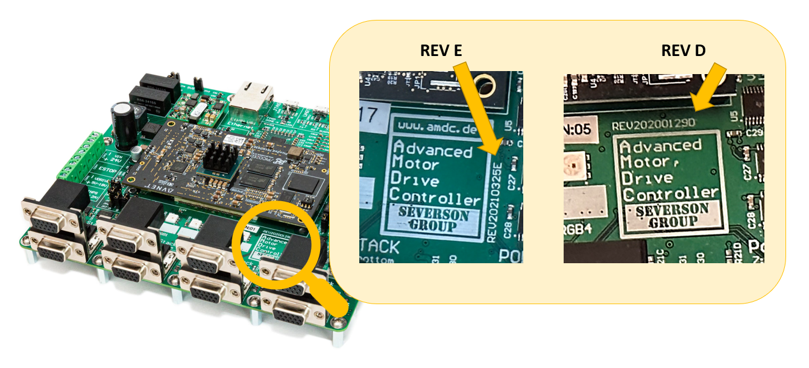

# Tutorial: Meet the AMDC

- **Goal:** Power on the AMDC and explore the I/O.
- **Complexity:** 1 / 5
- **Estimated Time:** 10 min

This tutorial goes over:

- Applying power to the AMDC
- Exploring the input and output available on the AMDC hardware

## Tutorial Requirements

This is the first tutorial, so the only requirements are:

1. Working AMDC hardware

## Step 0: Check hardware revision

Currently, three hardware revisions are supported: 
- [Hardware REV D](/hardware/revisions/rev-d/index.md)
- [Hardware REV E](/hardware/revisions/rev-e/index.md)
- [Hardware REV F](/hardware/revisions/rev-f/index.md)

Figure out which one you have by looking at your PCB:



## Step 1: Hook up power connections to the AMDC

For the AMDC to function, it needs external power.
This is supplied via a two-terminal screw post labeled with `VIN (24V)`.
The user needs to connect an external DC supply to this input, being careful to follow the polarity marking on the PCB (i.e. connect the positive rail to the `+`, negative to `-`):

_Connect a 24 V DC supply to the AMDC:_

```{image} images/01-vin-power.jpg
:height: 15em
```

%Read more about the input power requirements and how the input power is used throughout the AMDC in the [power rail documentation](/hardware/subsystems/power-distribution.md).

After supplying the 24V input to the `VIN` terminals, the AMDC should come to life:

- The LED labeled `PZPWR` (`LED3`, meaning "PicoZed Power") should turn on to indicate power is supplied to the PicoZed connectors.
- If the PicoZed is plugged in, the LED labeled `PZPG` (`LED2`, meaning "PicoZed Power Good") should turn on which indicates that the PicoZed acknowledges it has valid input power.

```{image} images/02-power-leds.jpg
:height: 15em
```

[Read more about the power circuitry architecture on the AMDC](/hardware/subsystems/power-distribution).

## Step 2: [optional] Hook up additional screw post terminals

Next to the main power terminal from above are three more screw terminals:

1. `E-STOP`
2. `VDRIVE`
3. `VINPS`

```{image} images/03-screw-terminals.jpg
:height: 20em
```

Connections to these terminals are optional -- the AMDC processor will run code without any additional connections (just 24V power).
However, these three connections are typically used for a complete drive assembly.

All three additional screw terminals relate to the power stack interface.
They are described below and in the [power stack documentation](/hardware/subsystems/power-stack.md).

### `E-STOP` terminals

The E-STOP input is used to enable/disable PWM output.

An *open circuit* between the two E-STOP terminals *disables* the PWM outputs.

- **Hardware REV D:** the PWM outputs are disabled and will remain `LOW` unless the two terminals of the E-STOP input are shorted together.

- **Hardware REV E & REV F:** same as REV D, except the external E-STOP input can be bypassed and the PWM enabled via jumper `JP11`. Note that `JP11` is required to select between external or bypassed E-STOP input--no jumper means no PWM output.

### `VDRIVE` terminals

The `VDRIVE` terminal allows the user to supply a DC voltage input which is used as the logic `HIGH` voltage rail for the PWM output to the power stack interfaces.
In other words, when PWM is active, the physical voltage signal level will switch between the AMDC's `GND` (i.e. 0V) and the user-supplied `VDRIVE`.

The valid input range for `VDRIVE` is 5V to 18V.

- **Hardware REV D:** this input is required for PWM output to function.
- **Hardware REV E & REV F:** Jumper `JP12` is used to select `VDRIVE` source: external (`EXT`) input or internal 5V.

### `VINPS` terminals

This input is completely isolated from the AMDC.
It is *only* routed to the power stack interfaces, and is meant to simplify system wiring.

Users can supply any low-voltage supply (e.g. 24V) to the `VINPS` terminals and then use the supply in the attached power stacks.

## Step 3: Host interface

The AMDC interfaces to the host computer via the so-called "host interface".
This includes a JTAG connection, USB-UART serial connection, and an optional Ethernet connection.

These connectors are located on the rear of the AMDC board:

```{image} images/04-host-interface.jpg
:height: 15em
```

- **Hardware REV D:** Two micro-USB connectors are used, one for JTAG, one for serial UART
- **Hardware REV E and beyond:** One USB-B connector is used for both JTAG and serial UART

[Read more about the host interface](/getting-started/user-guide/host-interface/index).

## Step 4: Expansion ports

```{image} images/05-gpio.jpg
:height: 15em
```

The AMDC is designed to implement the core functionality needed for a motor drive.
To augment the available features, *expansion ports* are included (sometimes called GPIO ports).

- **Hardware REV D:** two total GPIO ports: one stacked set of two expansion ports
- **Hardware REV E & REV F:** four total GPIO ports: two stacked sets of two expansion ports

[Read more about the expansion ports in the hardware documentation](/hardware/subsystems/expansion-port).

## Step 5: Motor drive interface

The rest of the ports on the AMDC are used to interface to motor drives.
There are three types of ports:

1. Power stack (PWM)
2. Analog inputs
3. Encoder inputs

### Power stack interface

```{image} images/06-power-stack.jpg
:height: 10em
```

These are located at the front of the AMDC as four stacks of two, totaling eight total power stack interfaces.

Each power contains six PWM signals and four status lines, plus power rails.

The AMDC was designed such that each port can drive a single 3-phase 2-level voltage source inverter.

[Read more about the power stack interface in the hardware documentation](/hardware/subsystems/power-stack).

### Analog inputs

```{image} images/07-analog.jpg
:height: 15em
```

The AMDC inputs eight differential analog inputs.

Although the connector appears like Ethernet (i.e. RJ45 plugs), the signals on the wire are *NOT* Ethernet.
The RJ45 connectors each have two diff pair analog inputs.

[Read more about the analog inputs in the hardware documentation](/hardware/subsystems/analog).

### Encoder inputs

```{image} images/08-encoder.jpg
:height: 15em
```

The AMDC supports two encoder inputs. Standard RS-422 signaling is expected for quadrature position signals and once-per-rev index pulse.

[Read more about the encoder inputs in the hardware documentation](/hardware/subsystems/encoder).

## Conclusion

**Congratulations!** You now understand the AMDC external I/O, and you are ready to use the AMDC!