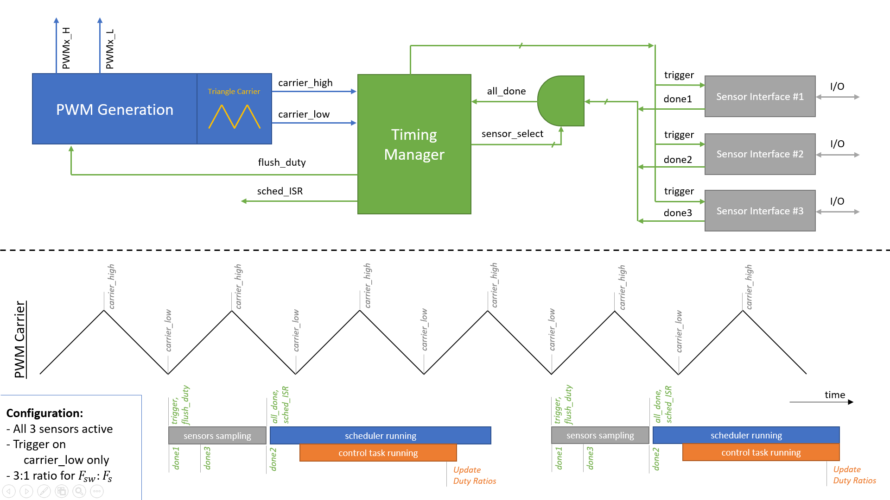

# Tutorial: Sensor Configuration, Feedback, & Profiling

- **Goal:** Learn how to use the AMDC Timing Manager to get feedback from sensors
- **Complexity:** 4 / 5
- **Estimated Time:** TODO


## Tutorial Requirements

1. Working AMDC Hardware
2. Completion of the [Hardware Commands](/getting-started/tutorials/hw-commands/index.md) tutorial
3. Completion of the [Voltage Source Inverter](/getting-started/tutorials/vsi/index.md) tutorial
4. Completion of the [Profiling Tasks](/getting-started/tutorials/profiling-tasks/index.md) tutorial

## Introduction 

The timing manager is added in version 1.3 to allow for syncing control tasks and sensor queries to the pwm carrier.

This tutorial provides the source code for:
* extending the functionality of the [Voltage Source Inverter](/getting-started/tutorials/vsi/index.md) into a closed loop control system

## Scheduling and Synchronizing:



Read [this docs page](/firmware/arch/timing-manager.md) for detailed information on the timing manager

The AMDC synchronizes running tasks and sensor collection to the PWM carrier wave. Every X PWM periods (where X is set by the function timing_manager_set_ratio()), the AMDC will collect data from sensors. In Legacy mode, the AMDC will run control tasks concurrently with sensor collection. In Synchronized mode the AMDC will not run control tasks until the sensor collection is complete. Lets enable Synchronized mode in the `user_config.h` file by setting `USER_CONFIG_ISR_SOURCE` to `1`

```
// Specify the source of the scheduler ISR
// Mode 0: legacy mode - scheduler is triggered based on the PWM carrier events and ratio
//         of carrier frequency to desired control frequency
// Mode 1: synchronized mode - scheduler is triggered when all the enabled sensors are done
//         acquiring their data
#define USER_CONFIG_ISR_SOURCE (1)
```

There are multiple factors that affect when and how fast control tasks run.
 - User set TASK_UPDATES_PER_SEC
 - PWM Frequency
 - timing manager event ratio
 - Sensor collection time (synchronized mode)
 - Control task time (how long it takes for the control task to run)

Consider: Control tasks only have the opportunity to run once every `event_ratio` PWM periods. If the PWM frequency / `event_ratio` < TASK_UPDATES_PER_SEC, then the control task will run at a slower rate than TASK_UPDATES_PER_SEC. Additionally, if the `event_ratio` / PWM frequency > Sensor collection time, then the control tasks will never have an opportunity to run (in synchronized mode), since all time will be spent waiting for sensors to finish collecting. This gives us both a lower and upper bound for these parameters. We also have to ensure that 1 / TASK_UPDATES_PER_SEC > Control task time, otherwise we are not able to run a control task in the time slot allotted.

Lets enable one of the sensors to start observing the effects of the timing manager. In the `controller_init()` function, enable the ADC (analog to digital converter) with `timing_manager_enable_sensor(ADC)`.

To get data from the ADC, use the function `analog_getf(ANALOG_IN1, &output)`. Read about the analog channel mapping on the [analog input page](hardware/subsystems/analog.md)

To understand the specific timings of sensor collection and tasks, we need to know the specific numbers of the factors that control tasks.
 - User set TASK_CONTROLLER_UPDATES_PER_SEC is set in `task_controller.h`, it is (10000)
 - PWM frequency can be set with a hardware command `hw pwm sw`, but the default value is in `common/drv/pwm.h` at (100000.0)
 - timing manager event ratio is set in `common/drv/timing_manager.c` in the `timing_manager_init()` function. It is set to TM_DEFAULT_PWM_RATIO, which is 10.
 - Sensor collection time for the ADC can be gathered with the hardware command `hw tm time adc` or the C function `timing_manager_get_time_per_sensor(ADC)`. It is around 0.86 microseconds. This will be affected by the ADC clock, which is set in `common/drv/analog.h` to `ANALOG_CLKDIV4`, and can be set by the user with the `analog_set_clkdiv()` function.
 - The control task time can be gathered with the user-made command `ctrl stats print`. We are specifically looking at the Run-Time.

## We can now draw our timing diagram with exact parameters:


We can see that we are sampling the sensors once per control task. That's because our event ratio of 10 fits perfectly with the ratio between the PWM frequency and our control task's frequency. This is the gold standard. In this tutorial we will experiment with changes to the parameters of the timing manager and observe the effects on control task timings.

## Experiment 1 - Ratio is too large

## Experiment 2 - Multiple sensor samples per control task

## Experiment 3 - 


Enabling/disabling sensors - INCLUDE EXAMPLE OF DOING THIS IN THE USER APP INIT FUNCTION
- Enable in the timing manager with `timing_manager_enable_sensor()`
- If peripheral, still need to configure GPIO port!! i.e. `gp3io_mux_set_device()`

Getting Sensor data
- This depends on which sensor interface(s) is(are) being used 

Profiling sensor acquisition times `timing_manager_get_time_per_sensor()`

ISR Generation mode: Legacy vs New Mode
- when it makes an impact
- how to use the `is_sensor_done` in a loop to poll/stall in Legacy Mode

changing timing settings - PWM freq, peaks/valleys, ratio
- How "bad" settings will affect task loop time

Timing Manager debug features?
- Trigger mode AUTO vs MANUAL?


```{warning}
When the scheduler checks to see if a task should be scheduled in scheduler_run(), the task's measured loop time is subtracted from the desired loop time. If the former is larger than the latter, the result will be negative and obviously the task should be scheduled. However, it is possible with floating point numbers that the measured loop time will be *just less* than the target loop time, in which case the subtraction result will be a very small positive number. We still want the task to be run in this case, so instead of checking if the subtraction result is less than 0, we check that it is less than a very small positive variance value. This variance has been defaulted to 60ns, but if a user is running their AMDC with "abnormal" timing settings, the magnitude of the tolerance may need to be overridden in user_config.h
```
