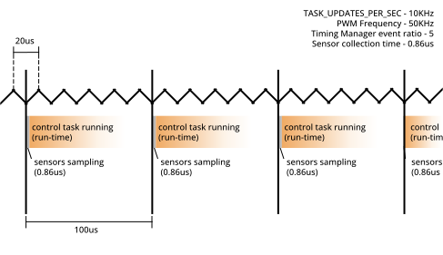

# Tutorial: Sensor Configuration, Feedback, & Profiling

- **Goal:** Learn how to use the AMDC Timing Manager to get feedback from sensors
- **Complexity:** 3 / 5
- **Estimated Time:** 40 min


## Tutorial Requirements

1. Working AMDC Hardware
2. Completion of the [Hardware Commands](/getting-started/tutorials/hw-commands/index.md) tutorial
3. Completion of the [Voltage Source Inverter](/getting-started/tutorials/vsi/index.md) tutorial
4. Completion of the [Profiling Tasks](/getting-started/tutorials/profiling-tasks/index.md) tutorial

This tutorial expands on the code created in the [Voltage Source Inverter](/getting-started/tutorials/vsi/index.md) tutorial, and uses commands created in the [Profiling Tasks](/getting-started/tutorials/profiling-tasks/index.md) tutorial. Both must be completed before this tutorial.

## Introduction 

In motor control applications, it is important for the timing of both sensor data acquisition and control task execution to remain consistent. In its default configuration, the AMDC may allow some jitter (timing incosistency) between sensor measurement time and control loop timing. This tutorial shows how the AMDC's "Timing Manager" peripheral can be configured to eliminate this jitter.

This tutorial provides code that allows users to experiment with the configuration of the AMDC Timing Manager. The effects of this experimentation will be observed through the lense of the previous [Voltage Source Inverter](/getting-started/tutorials/vsi/index.md) tutorial.

## Scheduling and Synchronizing:

The AMDC synchronizes sensor data collection and task execution to the PWM carrier wave. Every X PWM periods (where X is set by the function `timing_manager_set_ratio()`), the AMDC will collect data from sensors. By default, the Timing Manager is set to Legacy Mode, in which the AMDC will run control tasks concurrently with sensor data collection. Alternatively, when configured in Post-Sensor Mode, the Timing Manager guarantees that in each control cycle, the AMDC will wait to execute control tasks until the sensor data collection is complete.s

There are multiple factors that affect when and how fast control tasks run.
 - User set `TASK_UPDATES_PER_SEC`
 - PWM Frequency
 - User Event Ratio
 - Sensor collection time (Post-Sensor Mode)
 - Control task time (how long it takes for the control task to run)

 

Read [this docs page](/firmware/arch/timing-manager.md) for detailed information on the Timing Manager

Consider: Control tasks only have the opportunity to run once every X PWM periods, where X is the User Event Ratio.\
That means we have to satisfy these three inequalities:

$$
\frac{\rm PWM\ frequency}{\rm event\ ratio} \ge \rm TASK\_UPDATES\_PER\_SEC \\
\\
\frac{\rm event\ ratio}{\rm PWM\ frequency} \ge \rm Sensor\ Collection\ Time \\
\\
\frac{1}{\rm TASK\_UPDATES\_PER\_SEC} < \rm Control\ Task\ Time
$$ (eq:tm)

The first inequality is necessary to ensure the control task can run at the specified rate of `TASK_UPDATES_PER_SEC`.\
The second inequality ensures that the sensors don't take up the entire timeslot.\
The third inequality makes sure that we are able to run the control task in the allotted time slot.\
These three combined inequalities give us both an upper and lower bound for User Event Ratio and PWM frequency relative to each other.

## C-Code

In this tutorial, we'll be activating the Timing Manager in Post-Sensor Mode. Let's enable Post-Sensor Mode in the `user_config.h` file by setting `USER_CONFIG_ISR_SOURCE` to `1`.

`user_config.h`:
```
// Specify the source of the scheduler ISR
// Mode 0: legacy mode - scheduler is triggered based on the PWM carrier events and ratio
//         of carrier frequency to desired control frequency
// Mode 1: post-sensor mode - scheduler is triggered when all the enabled sensors are done
//         acquiring their data
#define USER_CONFIG_ISR_SOURCE (1)
```

Let's enable one of the sensors to start observing the effects of the Timing Manager. In the `controller_init()` function, enable the ADC (analog to digital converter) with `timing_manager_enable_sensor(ADC)`.

`app_controller.c`:
```
void app_controller_init(void)
{
    // Enable data sampling for ADC
    timing_manager_enable_sensor(ADC);
    // Register "ctrl" command with system
    cmd_controller_register();
}
```

To get data from the ADC, use the function `analog_getf(ANALOG_IN1, &output)`. Read about the analog channel mapping on the [analog input page](/hardware/subsystems/analog.md). We won't be using the ADC's actual numerical output in this tutorial, we're just enabling it to activate the Timing Manager.

To understand the specific timings of sensor collection and tasks, we need to know the specific numbers of the factors that control tasks.
 - User set `TASK_CONTROLLER_UPDATES_PER_SEC` is set in `task_controller.h`, its value is set to `(10000)`
 - PWM frequency can be set with a hardware command `hw pwm sw`, but the default value is in `common/drv/pwm.h` at `(100000.0)`
 - User Event Ratio is set in `common/drv/timing_manager.c` with the `timing_manager_init()` function. It is set to `TM_DEFAULT_PWM_RATIO`, which is `10`.
 - The ADC's data acquisition time can be retrieved with the hardware command `hw tm time adc` or the C function `timing_manager_get_time_per_sensor(ADC)`. It is around 0.86 microseconds.
 - The control task's Run-Time and Loop-Time can be retrieved with the user-made command `ctrl stats print`. We are specifically looking at the Run-Time.

```
Task Stats:
Loop Num:	21431 samples
Loop Min:	94.52 usec
Loop Max:	106.21 usec
Loop Mean:	100.00 usec
Loop Var:	0.02 usec
Run Num:	21513 samples
Run Min:	3.25 usec
Run Max:	3.92 usec
Run Mean:	3.40 usec
Run Var:	0.00 usec
```

The Loop Mean is how much time there is between successive executions of the control task. It should be `1` / `TASK_CONTROLLER_UPDATES_PER_SEC`. And in this case it is, at `1` / `10000` seconds.

### We can now draw our timing diagram with exact parameters:


We can see that we are sampling the sensors once per control task. That's because our User Event Ratio of `10` fits perfectly with the ratio between the PWM frequency and our control task's frequency. This is the gold standard. In this tutorial we will experiment with changes to the parameters of the Timing Manager and observe the effects on control task timings.

## Experiment 1 - Ratio is too large

If we increase the User Event Ratio, we can cause the control task to run at less than 10kHz. Let's increase it to 20 by putting `timing_manager_set_ratio(20)` in the `controller_init()` function.

`app_controller.c`:
```
void app_controller_init(void)
{
    // Enable data sampling for ADC
    timing_manager_enable_sensor(ADC);
    // set User Event Ratio
    timing_manager_set_ratio(20);
    // Register "ctrl" command with system
    cmd_controller_register();
}
```
What does this do? We've made it so that the sensors will collect data every 20 PWM cycles, and then the scheduler will run the control task. Since our PWM frequency is still 10kHz, that means our sensors will collect data every 200us. It also means that our control task can only run once every 200us, instead of 100us like it should.


Rebuild and run the new program, and use the command `ctrl stats print` to view the loop time (after doing `ctrl init`).

```
Task Stats:
Loop Num:	26806 samples
Loop Min:	193.78 usec
Loop Max:	206.22 usec
Loop Mean:	200.00 usec
Loop Var:	0.02 usec
Run Num:	26932 samples
Run Min:	3.25 usec
Run Max:	4.23 usec
Run Mean:	3.41 usec
Run Var:	0.00 usec
```

The Loop Mean is how much time there is between successive executions of the control task. It should be `1` / `TASK_CONTROLLER_UPDATES_PER_SEC`, but in this case, it is twice that. That indicates that the control task is only running at half of `TASK_CONTROLLER_UPDATES_PER_SEC`.

Making the User Event Ratio too high is one way that control tasks can be slowed down past their target `TASK_CONTROLLER_UPDATES_PER_SEC`.

## Experiment 2 - Multiple sensor samples per control task

By decreasing the User Event Ratio, we can cause multiple sensor samples to occur before one cycle of the control task.

Let's set the User Event Ratio to `1`.

`app_controller.c`:
```
void app_controller_init(void)
{
    // Enable data sampling for ADC
    timing_manager_enable_sensor(ADC);
    // set User Event Ratio
    timing_manager_set_ratio(1);
    // Register "ctrl" command with system
    cmd_controller_register();
}
```

What we've done now is tell the Timing Manager to sample the sensors every `1` PWM cycle.


The Timing Manager triggers the sensors to sample every PWM cycle, but the control tasks do not run every cycle. Remember that the control tasks can only run directly following a sensor sampling, but that doesn't mean that the control task always runs after every sensor sampling. In this way, the User Event Ratio can only slow down the rate of control tasks, not speed them up.

Rebuild and run the new program, and use the command `ctrl stats print` to view the loop time (after doing `ctrl init`).

```
Task Stats:
Loop Num:	48373 samples
Loop Min:	80.46 usec
Loop Max:	119.44 usec
Loop Mean:	100.00 usec
Loop Var:	0.24 usec
Run Num:	48624 samples
Run Min:	9.85 usec
Run Max:	17.02 usec
Run Mean:	10.25 usec
Run Var:	1.40 usec
```

The Loop Mean has returned to 100.00 usec. The Timing Manager is not slowing down the rate of the control task anymore.

But the Run-Time has increased significantly. Why is that?

The answer is that I have no idea. Ask Patrick

## Experiment 3 - Changing PWM frequency

Another way to impact loop time is to change the PWM frequency. Let's return to the situation with a User Event Ratio of 10, but this time modify the PWM ratio from 100kHz to 50kHz. We can do this by adding the code `pwm_set_switching_freq(50000)` to our init function (remember to `#include "drv/pwm.h"` at the top of the file).

`app_controller.c`:
```
#include "drv/pwm.h"

void app_controller_init(void)
{
    // Enable data sampling for ADC
    timing_manager_enable_sensor(ADC);
    // set User Event Ratio
    timing_manager_set_ratio(10);
    // set PWM frequency
    pwm_set_switching_freq(50000);
    // Register "ctrl" command with system
    cmd_controller_register();
}
```

Now we're sampling sensors every `10` PWM cycles, but each PWM cycle takes twice as long as it used to. This means that our sensors are only sampled every 200us again, which will slow down our control task rate!


Rebuild and run the new program, and use the command `ctrl stats print` to view the loop time (after doing `ctrl init`).

```
Task Stats:
Loop Num:	10847 samples
Loop Min:	193.82 usec
Loop Max:	206.22 usec
Loop Mean:	200.00 usec
Loop Var:	0.04 usec
Run Num:	10973 samples
Run Min:	3.25 usec
Run Max:	4.24 usec
Run Mean:	3.39 usec
Run Var:	0.00 usec
```

Indeed our Loop Mean is back to 200us.

We can fix this by adjusting the Timing Manager's ratio from 10 down to 5.

```
void app_controller_init(void)
{
    // Enable data sampling for ADC
    timing_manager_enable_sensor(ADC);
    // set User Event Ratio
    timing_manager_set_ratio(5);
    // set PWM frequency
    pwm_set_switching_freq(50000);
    // Register "ctrl" command with system
    cmd_controller_register();
}
```

Now we're sampling sensors every `5` PWM cycles. Since each PWM cycle takes 20us, that means our sensor sampling and control task will run every 100us once again.



Rebuild and run the new program, and use the command `ctrl stats print` to view the loop time (after doing `ctrl init`).

```
Task Stats:
Loop Num:	27497 samples
Loop Min:	93.69 usec
Loop Max:	106.35 usec
Loop Mean:	100.00 usec
Loop Var:	0.02 usec
Run Num:	27748 samples
Run Min:	3.25 usec
Run Max:	3.84 usec
Run Mean:	3.39 usec
Run Var:	0.00 usec
```