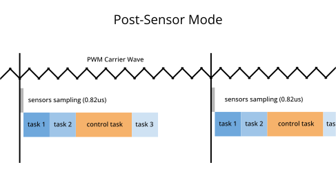
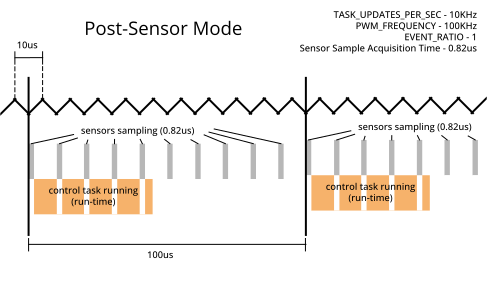
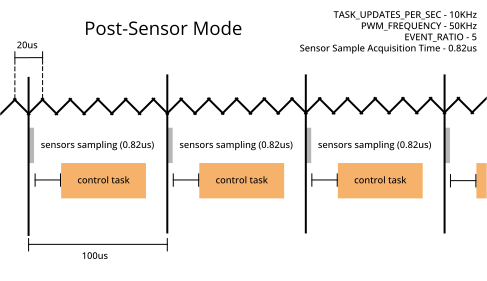

# Tutorial: Timing & Sensors

- **Goal:** Learn how to use the AMDC Timing Manager to synchronize task execution to sensor data acquisition.
- **Complexity:** 3 / 5
- **Estimated Time:** 40 min


## Tutorial Requirements

1. Working AMDC Hardware
2. Completion of the [Hardware Commands](/getting-started/tutorials/hw-commands/index.md) tutorial
3. Completion of the [Voltage Source Inverter](/getting-started/tutorials/vsi/index.md) tutorial
4. Completion of the [Profiling Tasks](/getting-started/tutorials/profiling-tasks/index.md) tutorial

This tutorial expands on the code created in the [Voltage Source Inverter](/getting-started/tutorials/vsi/index.md) tutorial, and uses commands created in the [Profiling Tasks](/getting-started/tutorials/profiling-tasks/index.md) tutorial. Both must be completed before this tutorial.

## Introduction

In motor control applications, it is important for the timing of both sensor data acquisition and control task execution to remain consistent. In its default configuration, the AMDC may allow some jitter (timing incosistency) between sensor measurement time and control loop timing. This tutorial shows how the AMDC's [Timing Manager](/firmware/arch/timing-manager.md) peripheral can be configured to eliminate this jitter.

This tutorial provides code that allows users to experiment with the configuration of the AMDC [Timing Manager](/firmware/arch/timing-manager.md). The effects of this experimentation will be observed through the lens of the previous [Voltage Source Inverter](/getting-started/tutorials/vsi/index.md) tutorial.

## Scheduling and Synchronizing

Through the [Timing Manager](/firmware/arch/timing-manager.md), the AMDC is capable of synchronizing sensor data collection and task execution to the PWM carrier wave. This is desirable to eliminate electromagnetic noise in motor drives (for example, switching harmonics in the phase current measurements) because the inverter does not switch at the peak and trough of the PWM carrier.

Additionally, updates to the PWM duty ratio can be precisely synced with the timing manager, and are by default.

### Timing Manager Modes

Every `X` PWM periods (where the user specifies `X` using the function `timing_manager_set_ratio()`), the AMDC will collect data from the sensors. By default, the [Timing Manager](/firmware/arch/timing-manager.md) is set to `Legacy Mode`, in which the AMDC OS will run tasks independent of whether the sensors have completed data collection.


Alternatively, when configured in `Post-Sensor Mode`, the [Timing Manager](/firmware/arch/timing-manager.md) will instruct the AMDC OS to wait to execute tasks until the sensor data collection is complete. With proper configuration, this can be used to ensure the following:



1. the task has new sensor data and
2. the time elapsed between when the sensor data is acquired and when the task is run is consistent and jitter-free.
3. the pwm duty ratio is updated at a consistent rate (every X pwm cycles)

### AMDC Actions Synchronized by the Timing Manager

There are multiple factors that affect when and how fast control tasks run:
- User set `TASK_NAME_UPDATES_PER_SEC`
- PWM Frequency
- User Event Ratio
- Sensor collection time (`Post-Sensor Mode`)
- Control task time (how long it takes for the control task to run)

This figure illustrates the functionality of the timing manager:


Read [this docs page](/firmware/arch/timing-manager.md) for detailed information on the Timing Manager.

Consider: Control tasks can run, at most, once every `X` PWM periods, where `X` is the User Event Ratio.\
That means we have to satisfy these three inequalities:

### Timing Manager Configuration Rules

$$
\frac{\rm PWM\ frequency}{\rm TASK\_UPDATES\_PER\_SEC} \ge \rm event\ ratio \\
\\
\rm event\ ratio \ge {\rm PWM\ frequency} * {\rm Sensor\ Collection\ Time} \\
\\
\rm Control\ Task\ Time > \frac{1}{\rm TASK\_UPDATES\_PER\_SEC}
$$ (eq:tm)

The first inequality is necessary to ensure the control task can run at the specified rate of `TASK_NAME_UPDATES_PER_SEC`.\
The second inequality ensures that the sensors don't take up the entire timeslot.\
The third inequality makes sure that we are able to run the control task in the allotted time slot.\
These three combined inequalities give us both an upper and lower bound for User Event Ratio and PWM frequency relative to each other.

```{attention}
The first inequality should become an equality for the critical control task.

$$
\frac{\rm PWM\ frequency}{\rm TASK\_UPDATES\_PER\_SEC} = \rm event\ ratio \\
\\
$$ (eq:tmeq)

To understand why, see [Experiment 2](#experiment-2---ratio-is-too-small)

```


## C-Code
To perform the tutorial, make the following modifications to the C code you created through the [Voltage Source Inverter](/getting-started/tutorials/vsi/index.md) and [Profiling Tasks](/getting-started/tutorials/profiling-tasks/index.md) tutorials.

### Set the Timing Manager Mode
In this tutorial, we will use the [Timing Manager](/firmware/arch/timing-manager.md) in `Post-Sensor Mode`. Enable this in the `user_config.h` file by setting `USER_CONFIG_ISR_SOURCE` to `1`:

`user_config.h`:
```c
// Specify the source of the scheduler ISR
// Mode 0: legacy mode - scheduler is triggered based on the PWM carrier events and ratio
//         of carrier frequency to desired control frequency
// Mode 1: post-sensor mode - scheduler is triggered when all the enabled sensors are done
//         acquiring their data

#define USER_CONFIG_ISR_SOURCE (1)
```

### Link the Timing Manager to Sensor Interaces

We need to link the sensor interfaces we wish to synchronize to with the [Timing Manager](/firmware/arch/timing-manager.md). In this tutorial, we will consider only the internal ADC (analog to digital converter) of the AMDC. However, in general, this can include other sensor peripherals, such as the encoder interface and AMDS.

To link the ADC to the [Timing Manager](/firmware/arch/timing-manager.md), edit the  `...controller_init()` function to include the function call `timing_manager_enable_sensor(ADC)`:

`app_controller.c`:
```C
void app_controller_init(void)
{
    // Enable data sampling for ADC
    timing_manager_enable_sensor(ADC);
    // Register "ctrl" command with system
    cmd_controller_register();
}
```

### Reading Sensor Data
Data can be obtained from the sensor interaces in the usual manner, irrespective of the mode of the [Timing Manager](/firmware/arch/timing-manager.md). For example, the ADC can be read via `analog_getf(ANALOG_IN1, &output)` (see the [analog input page](/hardware/subsystems/analog.md)). Note that we won't be using the ADC's actual numerical output in this tutorial, we're just enabling it to activate the [Timing Manager](/firmware/arch/timing-manager.md).

### Reporting sensor acquisition time and sensor data staleness

We're also going to add functionality to report how old the ADC data is as well as how long it took the sensor to acquire that data.

`task_controller.h` at the top:
```C
extern uint8_t sensorFlag;
```

`task_controller.c` in `task_controller_callback(void *arg)`:
```C
if (sensorFlag) {
    cmd_resp_printf("ADC time to acquire: %lfus\n", timing_manager_get_time_per_sensor(ADC));
    cmd_resp_printf("ADC time since done: %lfus\n", timing_manager_get_time_since_sensor_poll(ADC));
    sensorFlag = 0;
}
```

`cmd_controller.c` at the top:
```C
static uint8_t vsi_initialised = 0;
```

`cmd_controller.c` in `int cmd_vsiApp(int argc, char **argv)`:
```C
if (argc == 3 && strcmp("sensor", argv[1]) == 0 && strcmp("timing", argv[2]) == 0) {
    if (vsi_initialised == 0) {
        cmd_resp_printf("vsi must be initialised\n");
        return CMD_FAILURE;
    }
    sensorFlag = 1;
    return CMD_SUCCESS_QUIET;
}
```

We can then use the command `ctrl sensor timing` to get the information.

```
ADC time to acquire: 0.820000us
ADC time since done: 20.805000us
```

The ADC time to acquire refers to how long between the trigger for the ADC to start sampling to when it was complete.\
The ADC time since done is the "staleness" of the data, it refers to how long ago the ADC reported done. This may be useful when controlling a motor with careful timing considerations.

### System Timing
To understand the specific timings of sensor collection and tasks, we need to know the specific numbers of the factors that control tasks.
 - User set `TASK_CONTROLLER_UPDATES_PER_SEC` is set in `task_controller.h`, its value is set to `(10000)`
 - PWM frequency can be set with a hardware command `hw pwm sw`, but the default value is in `common/drv/pwm.h` at `(100000.0)`
 - User Event Ratio is set in `common/drv/timing_manager.c` with the `timing_manager_init()` function. It is set to `TM_DEFAULT_PWM_RATIO`, which is `10`.
 - The ADC's data acquisition time can be retrieved with the hardware command `hw tm time adc` or the C function `timing_manager_get_time_per_sensor(ADC)`. It is around 0.82 microseconds.
 - The control task's Run-Time and Loop-Time can be retrieved with the user-made command `ctrl stats print`. We are specifically looking at the Run-Time.

```
Task Stats:
Loop Num:	21431 samples
Loop Min:	94.52 usec
Loop Max:	106.21 usec
Loop Mean:	100.00 usec
Loop Var:	0.02 usec
Run Num:	21513 samples
Run Min:	3.25 usec
Run Max:	3.92 usec
Run Mean:	3.40 usec
Run Var:	0.00 usec
```

The Loop Mean is how much time there is between successive executions of the control task. It should be `1` / `TASK_CONTROLLER_UPDATES_PER_SEC`. And in this case it is, at `1` / `10000` seconds.

### We can now draw our timing diagram with exact parameters:


We can see that we are sampling the sensors once per control task. That's because our User Event Ratio of `10` fits perfectly with the ratio between the PWM frequency and our control task's frequency. This is the gold standard. In this tutorial we will experiment with changes to the parameters of the Timing Manager and observe the effects on control task timings.

## Experiment 1 - Ratio is too large

Increasing the User Event Ratio is one way to cause tasks to run at less than their desired frequency.

If we increase the User Event Ratio, we can cause the control task to run at less than 10kHz. Let's increase it to 20 by putting `timing_manager_set_ratio(20)` in the `controller_init()` function.

`app_controller.c`:
```C
void app_controller_init(void)
{
    // Enable data sampling for ADC
    timing_manager_enable_sensor(ADC);
    // set User Event Ratio
    timing_manager_set_ratio(20);
    // Register "ctrl" command with system
    cmd_controller_register();
}
```
What does this do? We've made it so that the sensors will collect data every 20 PWM cycles, and then the scheduler will run the control task. Since our PWM frequency is still 10kHz, that means our sensors will collect data every 200us. It also means that our control task can only run once every 200us, instead of 100us like it should.


Rebuild and run the new program, and use the command `ctrl stats print` to view the loop time (after doing `ctrl init`).

```
Task Stats:
Loop Num:	26806 samples
Loop Min:	193.78 usec
Loop Max:	206.22 usec
Loop Mean:	200.00 usec
Loop Var:	0.02 usec
Run Num:	26932 samples
Run Min:	3.25 usec
Run Max:	4.23 usec
Run Mean:	3.41 usec
Run Var:	0.00 usec
```

The Loop Mean is how much time there is between successive executions of the control task. It should be `1` / `TASK_CONTROLLER_UPDATES_PER_SEC`, but in this case, it is twice that. That indicates that the control task is only running at half of `TASK_CONTROLLER_UPDATES_PER_SEC`.

Making the User Event Ratio too high is one way that control tasks can be slowed down past their target `TASK_CONTROLLER_UPDATES_PER_SEC`.\
This violates [inequality number 1](#timing-manager-configuration-rules)

## Experiment 2 - Ratio is too small

By decreasing the User Event Ratio, we can cause multiple sensor samples to occur before one cycle of the control task. This causes a race condition and can lead to inconsistent sensor staleness times.

Let's set the User Event Ratio to `1`.

`app_controller.c`:
```C
void app_controller_init(void)
{
    // Enable data sampling for ADC
    timing_manager_enable_sensor(ADC);
    // set User Event Ratio
    timing_manager_set_ratio(1);
    // Register "ctrl" command with system
    cmd_controller_register();
}
```

What we've done now is tell the Timing Manager to sample the sensors every `1` PWM cycle.



The Timing Manager triggers the sensors to sample every PWM cycle, but the control tasks do not run every cycle. Remember that the control tasks can only run directly following a sensor sampling, but that doesn't mean that the control task always runs after every sensor sampling. In this way, the User Event Ratio can only slow down the rate of control tasks, not speed them up.

Rebuild and run the new program, and use the command `ctrl stats print` to view the loop time (after doing `ctrl init`).

```
Task Stats:
Loop Num:	48373 samples
Loop Min:	80.46 usec
Loop Max:	119.44 usec
Loop Mean:	100.00 usec
Loop Var:	0.24 usec
Run Num:	48624 samples
Run Min:	9.85 usec
Run Max:	17.02 usec
Run Mean:	10.25 usec
Run Var:	1.40 usec
```

The Loop Mean has returned to 100.00 usec. The Timing Manager is not slowing down the rate of the control task anymore.

However, the task's Run-Time has increased significantly. This is a bug under review that may appear from sub-optimal timing configuration. While this doesn't break any of the [timing manager rules](#timing-manager-configuration-rules), this is an example of a critical task not satisfying equality number 1 (inequality number 1 becomes an equality for the critical task).

## Experiment 3 - Changing PWM frequency

If the AMDC's PWM frequency is changed, the user needs to appropriately update the User Event Ratio to be compatible with the desired control task frequency. Let's return to the situation with a User Event Ratio of 10, but this time modify the PWM ratio from 100kHz to 50kHz. We can do this by adding the code `pwm_set_switching_freq(50000)` to our init function (remember to `#include "drv/pwm.h"` at the top of the file).

`app_controller.c`:
```C
#include "drv/pwm.h"

void app_controller_init(void)
{
    // Enable data sampling for ADC
    timing_manager_enable_sensor(ADC);
    // set User Event Ratio
    timing_manager_set_ratio(10);
    // set PWM frequency
    pwm_set_switching_freq(50000);
    // Register "ctrl" command with system
    cmd_controller_register();
}
```

Now we're sampling sensors every `10` PWM cycles, but each PWM cycle takes twice as long as it used to. This means that our sensors are only sampled every 200us again, which will slow down our control task rate!


Rebuild and run the new program, and use the command `ctrl stats print` to view the loop time (after doing `ctrl init`).

```
Task Stats:
Loop Num:	10847 samples
Loop Min:	193.82 usec
Loop Max:	206.22 usec
Loop Mean:	200.00 usec
Loop Var:	0.04 usec
Run Num:	10973 samples
Run Min:	3.25 usec
Run Max:	4.24 usec
Run Mean:	3.39 usec
Run Var:	0.00 usec
```

Indeed our Loop Mean is back to 200us.

We can fix this by adjusting the Timing Manager's ratio from 10 down to 5.

```C
void app_controller_init(void)
{
    // Enable data sampling for ADC
    timing_manager_enable_sensor(ADC);
    // set User Event Ratio
    timing_manager_set_ratio(5);
    // set PWM frequency
    pwm_set_switching_freq(50000);
    // Register "ctrl" command with system
    cmd_controller_register();
}
```

Now we're sampling sensors every `5` PWM cycles. Since each PWM cycle takes 20us, that means our sensor sampling and control task will run every 100us once again.



Rebuild and run the new program, and use the command `ctrl stats print` to view the loop time (after doing `ctrl init`).

```
Task Stats:
Loop Num:	27497 samples
Loop Min:	93.69 usec
Loop Max:	106.35 usec
Loop Mean:	100.00 usec
Loop Var:	0.02 usec
Run Num:	27748 samples
Run Min:	3.25 usec
Run Max:	3.84 usec
Run Mean:	3.39 usec
Run Var:	0.00 usec
```
