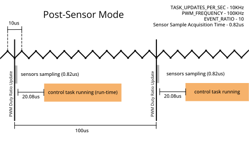
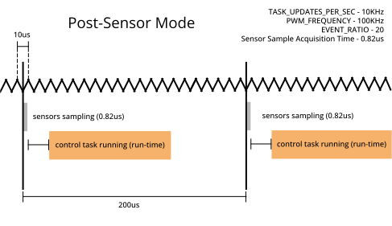

# Tutorial: Timing & Sensors

- **Goal:** Learn how to use the AMDC Timing Manager to synchronize task execution to sensor data acquisition.
- **Complexity:** 3 / 5
- **Estimated Time:** 40 min

## Tutorial Requirements

1. Working AMDC Hardware
2. Completion of the [Hardware Commands](/getting-started/tutorials/hw-commands/index.md) tutorial
3. Completion of the [Voltage Source Inverter](/getting-started/tutorials/vsi/index.md) tutorial
4. Completion of the [Profiling Tasks](/getting-started/tutorials/profiling-tasks/index.md) tutorial

This tutorial expands on the code created in the [Voltage Source Inverter](/getting-started/tutorials/vsi/index.md) tutorial and uses commands created in the [Profiling Tasks](/getting-started/tutorials/profiling-tasks/index.md) tutorial. Both must be completed before this tutorial.

## Introduction

In control applications, it is often important to be able to synchronize sensor data acquisition and control task execution with the PWM carrier. This is desirable to eliminate electromagnetic noise in motor drives (for example, switching harmonics in the phase current measurements) because the inverter does not switch at the peak and trough of the PWM carrier.

This tutorial shows how the AMDC's [Timing Manager](/firmware/arch/timing-manager.md) peripheral can be used to do the following:

1. synchronize the start of sensor data acquisition to the PWM carrier and
2. gaurantee that tasks are only run once new sensor data is available.

## Scheduling and Synchronizing

The [Timing Manager](/firmware/arch/timing-manager.md) leverages the underlying FPGA to generate a sensor acquisition start signal (`Sensor Trigger`) based on the PWM carrier and an interrupt (`Scheduler Interrupt`) once all sensors have finished acquiring their new data sample. The AMDC OS will only allow tasks to run one time per `Sensor Trigger` signal, regardless of how frequently the tasks have requested to be run.

### Timing Manager Modes

By default, the [Timing Manager](/firmware/arch/timing-manager.md) is set to `Legacy Mode`, in which the AMDC OS will start running tasks at the same time as starting sensor data acquisition (everytime `Sensor Trigger` is asserted).


Alternatively, when configured in `Post-Sensor Mode`, the [Timing Manager](/firmware/arch/timing-manager.md) will instruct the AMDC OS to wait to execute tasks until the sensor data collection is complete (when the `Scheduler Interrupt` occurs).


The `Post-Sensor Mode` gaurantees that every task has access to new sensor data since the last time it was run. It eliminates a race condition between when the sensors collect their data and when the tasks start running.

### Key Timing Parameters

There are multiple parameters that affect when and how fast tasks run:
- `TASK_NAME_UPDATES_PER_SEC`: This is set by the user in the [task header file](/getting-started/tutorials/vsi/index.md#template-task-h-file) for each task
- `PWM_FREQUENCY`: The PWM switching frequency (frequency of the PWM carrier).
- `EVENT_RATIO`: This is the `User Event Ratio` of the [Timing Manager](/firmware/arch/timing-manager.md).
- `Sensor Sample Acquisition Time`: This is the time it takes the slowest sensor to acquire a data sample (only relevant to `Post-Sensor Mode`).
- `Total Task Run Time`: The cumulative time it takes for all the scheduled tasks to run.

Read [this docs page](/firmware/arch/timing-manager.md) for detailed information on the Timing Manager.

### Timing Configuration Rules

The [Timing Manager](/firmware/arch/timing-manager.md) intiates sensor data acquisition (`Sensor Trigger`) every `EVENT_RATIO` PWM cycles. Tasks are allowed to run, at most, one time between `Sensor Trigger` events. This means that the system configuration must be carefully considered to ensure satisfactory task timing.

For `Post-Sensor Mode`, the following three inequalities should be satisfied:

$$
\rm EVENT\_RATIO \leq \frac{\rm PWM\_FREQUENCY}{\rm TASK\_NAME\_UPDATES\_PER\_SEC}
$$ (eq:tm1)

$$
\rm EVENT\_RATIO \ge {\rm PWM\_FREQUENCY} \times {\rm Sensor\ Sample\ Acquisition\ Time}
$$ (eq:tm2)

$$
\frac{1}{\rm TASK\_NAME\_UPDATES\_PER\_SEC} > \rm Total\ Task\ Run\ Time
$$ (eq:tm3)

From these inequalities,
- {eq}`eq:tm1` must be met for the highest frequency task to ensure it can run at its specified rate of `TASK_NAME_UPDATES_PER_SEC`;
- {eq}`eq:tm2` ensures that the sensors don't take up the entire timeslot;
- {eq}`eq:tm3` ensures that we are able to run all tasks in the allotted time slot.
  
These three combined inequalities give us both an upper and lower bound for `EVENT_RATIO` and `PWM_FREQUENCY` relative to each other.

```{attention}
For any tasks that must be run at precise intervals of `TASK_NAME_UPDATES_PER_SEC`, the right hand side of {eq}`eq:tm1` must be an integer. For the critical control task (the task that requires new sensor data each time it runs), inequality {eq}`eq:tm1` should become an equality:

$$
\frac{\rm PWM\_FREQUENCY}{\rm CONTROL\_TASK\_NAME\_UPDATES\_PER\_SEC} = \rm EVENT\_RATIO \\
\\
$$ (eq:tmeq)

To understand why, see [Experiment 2](#experiment-2---ratio-is-too-small)

```

## C-Code
To perform the tutorial, make the following modifications to the C code you created through the [Voltage Source Inverter](/getting-started/tutorials/vsi/index.md) and [Profiling Tasks](/getting-started/tutorials/profiling-tasks/index.md) tutorials.

### Set the Timing Manager Mode
In this tutorial, we will use the [Timing Manager](/firmware/arch/timing-manager.md) in `Post-Sensor Mode`. Enable this in the `user_config.h` file by setting `USER_CONFIG_ISR_SOURCE` to `1`:

`user_config.h`:
```c
// Specify the source of the scheduler ISR
// Mode 0: legacy mode - scheduler is triggered based on the PWM carrier events and ratio
//         of carrier frequency to desired control frequency
// Mode 1: post-sensor mode - scheduler is triggered when all the enabled sensors are done
//         acquiring their data

#define USER_CONFIG_ISR_SOURCE (1)
```

### Link the Timing Manager to Sensor Interaces

We need to link the sensor interfaces we wish to synchronize with the [Timing Manager](/firmware/arch/timing-manager.md). In this tutorial, we will consider only the internal ADC (analog to digital converter) of the AMDC. However, in general, this can include other sensor peripherals, such as the encoder interface and AMDS.

To link the ADC to the [Timing Manager](/firmware/arch/timing-manager.md), edit the  `app_controller_init()` function within `app_controller.c` to include the function call `timing_manager_enable_sensor(ADC)`:
```C
void app_controller_init(void)
{
    // Enable data sampling for ADC
    timing_manager_enable_sensor(ADC);
    // Register "ctrl" command with system
    cmd_controller_register();
}
```

### Reading Sensor Data
Data can be obtained from the sensor interaces in the usual manner, irrespective of the mode of the [Timing Manager](/firmware/arch/timing-manager.md). For example, the ADC can be read via `analog_getf(ANALOG_IN1, &output)` (see the [analog input page](/hardware/subsystems/analog.md)). Note that we won't be using the ADC's actual numerical output in this tutorial, we're just enabling it to activate the [Timing Manager](/firmware/arch/timing-manager.md).

### Reporting sensor acquisition time and sensor data staleness

We're also going to add functionality to report how old the ADC data is as well as how long it took the sensor to acquire that data. We'll add a global variable `sensor_flag` to indicate when the app callback functon should writeout a report of the sensor tmining statistics.

Add the following line to the top of `task_controller.h`:
```C
extern uint8_t sensor_flag;
```

Edit function `task_controller_callback(void *arg)` in `task_controller.c`:
```C
if (sensor_flag) {
    cmd_resp_printf("ADC time to acquire: %lfus\n", timing_manager_get_time_per_sensor(ADC));
    cmd_resp_printf("ADC time since done: %lfus\n", timing_manager_get_time_since_sensor_poll(ADC));
    sensor_flag = 0;
}
```

Add the following line to the top of `cmd_controller.c`:
```C
static uint8_t ctrl_initialized = 0;
```

Add a new `ctrl sensor timing` command to your controller app.

Edit function `int cmd_vsiApp(int argc, char **argv)` in `cmd_controller.c`:
```C
if (argc == 3 && strcmp("sensor", argv[1]) == 0 && strcmp("timing", argv[2]) == 0) {
    if (ctrl_initialized == 0) {
        cmd_resp_printf("ctrl must be initialized\n");
        return CMD_FAILURE;
    }
    sensor_flag = 1;
    return CMD_SUCCESS_QUIET;
}
```

Edit function `int cmd_vsiApp(int argc, char **argv)` in `cmd_controller.c`:
```C
if (argc == 2 && strcmp("init", argv[1]) == 0) {
    if (task_controller_init() != SUCCESS) {
        return CMD_FAILURE;
    }
    ctrl_initialized = 1;
    return CMD_SUCCESS;
}

if (argc == 2 && strcmp("deinit", argv[1]) == 0) {
    if (task_controller_deinit() != SUCCESS) {
        return CMD_FAILURE;
    }
    ctrl_initialized = 0;
    return CMD_SUCCESS;
}
```

## Determine System Timing
We will now have you use the updated project to determine the system timing parameters and construct a timing diagram for how the [Timing Manager](/firmware/arch/timing-manager.md) behaves.

Re-build your project and program the AMDC. 

### Step 1: Determine programmed timing parameters

Inspect your AMDC code to determine the following critical timing parameters:
 - The value of `TASK_CONTROLLER_UPDATES_PER_SEC` in `task_controller.h`. From the [VSI tutorial](/getting-started/tutorials/vsi/index.md#template-task-h-file), we expect its value is set to `(10000)`.
 - The PWM frequency. This can be set with a hardware command `hw pwm sw`, but the default value in `common/drv/pwm.h` is `(100000.0)`.
 - `EVENT_RATIO`. This is set in `common/drv/timing_manager.c` by the `timing_manager_init()` function to a default value of `TM_DEFAULT_PWM_RATIO`, which is `10`. Later in the tutorial, we will show you how to change this value.

### Step 2: Determine Sensor Acquisition Time
On your serial terminal, send the command `ctrl init` to start the controller task.

Send the command `ctrl sensor timing` to use your newly created functions to get the sensor timing information. Your terminal window should show a response from the AMDC similar to the following:

```
ADC time to acquire: 0.820000us
ADC time since done: 20.805000us
```

The `ADC time to acquire` refers to how long it took the ADC to acquire its most recent sample. This is the `Sensor Sample Acquisition Time` from inequality {eq}`eq:tm2`.

The `ADC time since done` is the "staleness" of the data. This refers to how long it has been since the ADC last finished a sample acquisition. This may be useful as a debugging tool when getting control code to work.

```{attention}
The AMDC also has a hardware command `hw tm time adc` that can be used to obtain the `ADC time to acquire`.
```

### Step 3: Determine the run time and loop time

Issue the command `ctrl stats print`. The AMDC should respond with approximately the following values:

```
Task Stats:
Loop Num:	21431 samples
Loop Min:	94.52 usec
Loop Max:	106.21 usec
Loop Mean:	100.00 usec
Loop Var:	0.02 usec
Run Num:	21513 samples
Run Min:	3.25 usec
Run Max:	3.92 usec
Run Mean:	3.40 usec
Run Var:	0.00 usec
```

The concepts of run time and loop time were introduced in the [Profiling Tasks](/getting-started/tutorials/profiling-tasks/index.md#step-4-profile-the-vsi-control-code) tutorial.

The `Loop Mean` is how much time there is between successive executions of the control task. It should be `1` / `TASK_CONTROLLER_UPDATES_PER_SEC`. And in this case it is, at `1` / `10000` seconds.

### Step 4: Construct system timing diagram

The information obtained above can now be used to create a timing diagram. This has been done for the default values that are provided in steps 1 - 3, shown below.



We can see that we are sampling the sensors once per control task. That is because our `EVENT_RATIO` of `10` fits perfectly with the ratio between the PWM frequency `100 kHz` and our control task's frequency `10 kHz`. This is the gold standard.

We will now experiment with changes to the parameters of the [Timing Manager](/firmware/arch/timing-manager.md) and observe the effects on control task timings.

## Experiment 1 - Ratio is too large

Increasing the `EVENT_RATIO` above the limit of {eq}`eq:tm1` will cause tasks to run at less than their desired frequency (`TASK_NAME_UPDATES_PER_SEC`). In this experiment, we will cause the control task to run at less than 10kHz. 

Let's increase `EVENT_RATIO` to 20 by putting `timing_manager_set_ratio(20)` in the `controller_init()` function. Edit `app_controller.c` to update this code:
```C

#define EVENT_RATIO 20

void app_controller_init(void)
{
    // Enable data sampling for ADC
    timing_manager_enable_sensor(ADC);
    // set User Event Ratio
    timing_manager_set_ratio(EVENT_RATIO);
    // Register "ctrl" command with system
    cmd_controller_register();
}
```
What does this do? We've made it so that the sensors will collect data every 20 PWM cycles. Since the AMDC's OS will only run tasks one time per sensor acquisition, this also means that the scheduler will wait 20 PWM cycles to run the control task.

Since our `PWM_FREQUENCY` is 100kHz, our sensors will collect data every 200us and our control task can only run once every 200us, instead of the 100us interval we specified in `TASK_CONTROLLER_UPDATES_PER_SEC`.



Rebuild and run the new program, and use the command `ctrl stats print` to view the loop time (after doing `ctrl init`).

```
Task Stats:
Loop Num:	26806 samples
Loop Min:	193.78 usec
Loop Max:	206.22 usec
Loop Mean:	200.00 usec
Loop Var:	0.02 usec
Run Num:	26932 samples
Run Min:	3.25 usec
Run Max:	4.23 usec
Run Mean:	3.41 usec
Run Var:	0.00 usec
```

Note that our `Loop Mean` (time elapsed between successive executions of the control task) is indeed `200 us` instead of `100 us`. This proves that the control task is only running at half of `TASK_CONTROLLER_UPDATES_PER_SEC` because the inequality {eq}`eq:tm1` has been violated.

## Experiment 2 - Ratio is too small

For control tasks (tasks which require new sensor data each time they run), {eq}`eq:tm1` is expected to be an equality. We will now explore what happens when `EVENT_RATIO` is decreased, so that {eq}`eq:tm1` is no longer an equality, but the inqequalities of {eq}`eq:tm1`-{eq}`eq:tm3` are still satisfied.

This scenario causes multiple sensor samples to occur between each cycle of the control task which we will now show creates a race condition in the control task.

Let's set the `EVENT_RATIO` to `1`.

Edit `app_controller.c` to update this code:
```C

#define EVENT_RATIO 1

void app_controller_init(void)
{
    // Enable data sampling for ADC
    timing_manager_enable_sensor(ADC);
    // set User Event Ratio
    timing_manager_set_ratio(EVENT_RATIO);
    // Register "ctrl" command with system
    cmd_controller_register();
}
```

What we've done now is tell the [Timing Manager](/firmware/arch/timing-manager.md) to sample the sensors every `1` PWM cycle.


The [Timing Manager](/firmware/arch/timing-manager.md) triggers the sensors to sample every PWM cycle, but the control tasks do not run every cycle. Remember that the control tasks can only run directly following a sensor sampling, but that doesn't mean that the control task always runs after every sensor sampling. In this way, the `EVENT_RATIO` can only slow down the rate of control tasks, not speed them up.

Rebuild and run the new program, and use the command `ctrl stats print` to view the loop time (after doing `ctrl init`).

```
Task Stats:
Loop Num:	48373 samples
Loop Min:	80.46 usec
Loop Max:	119.44 usec
Loop Mean:	100.00 usec
Loop Var:	0.24 usec
Run Num:	48624 samples
Run Min:	9.85 usec
Run Max:	17.02 usec
Run Mean:	10.25 usec
Run Var:	1.40 usec
```

The `Loop Mean` has returned to `100.00 usec` (the value specified by `TASK_CONTROLLER_UPDATES_PER_SEC`). Unlike Experiment 1, the [Timing Manager](/firmware/arch/timing-manager.md) is no longer slowing down the rate of the control task.

However, the task's `Run Mean` value has increased significantly. This is a bug under review that may appear from sub-optimal timing configuration. While this doesn't break any of the [timing manager rules](#timing-configuration-rules), this is an example of a critical task not satisfying equality {eq}`eq:tm1`. This is because our sensor data will have inconsistent staleness (depending on which sensor tick is most recent).

## Experiment 3 - Changing PWM frequency

If the AMDC's `PWM_FREQUENCY` is changed, the user needs to appropriately update the `EVENT_RATIO` to be compatible with the desired `TASK_CONTROLLER_UPDATES_PER_SEC`. 

To illustrate this, let's return to the situation with an `EVENT_RATIO` of `10`, but this time modify the PWM ratio from 100kHz to 50kHz. We can do this by adding the code `pwm_set_switching_freq(50000)` to our init function (remember to `#include "drv/pwm.h"` at the top of the file).

Edit `app_controller.c` to update this code:
```C
#include "drv/pwm.h"

#define EVENT_RATIO 10

void app_controller_init(void)
{
    // Enable data sampling for ADC
    timing_manager_enable_sensor(ADC);
    // set User Event Ratio
    timing_manager_set_ratio(EVENT_RATIO);
    // set PWM frequency
    pwm_set_switching_freq(50000);
    // Register "ctrl" command with system
    cmd_controller_register();
}
```

Now we're sampling sensors every `10` PWM cycles, but each PWM cycle takes twice as long as it used to. This means that our sensors are only sampled every 200us again, which will slow down our control task rate!


Rebuild and run the new program, and use the command `ctrl stats print` to view the loop time (after doing `ctrl init`).

```
Task Stats:
Loop Num:	10847 samples
Loop Min:	193.82 usec
Loop Max:	206.22 usec
Loop Mean:	200.00 usec
Loop Var:	0.04 usec
Run Num:	10973 samples
Run Min:	3.25 usec
Run Max:	4.24 usec
Run Mean:	3.39 usec
Run Var:	0.00 usec
```

Indeed our `Loop Mean` is back to `200us`.

We can fix this by adjusting the `EVENT_RATIO` ratio from `10` down to `5`:

```C
#include "drv/pwm.h"

#define EVENT_RATIO 5

void app_controller_init(void)
{
    // Enable data sampling for ADC
    timing_manager_enable_sensor(ADC);
    // set User Event Ratio
    timing_manager_set_ratio(EVENT_RATIO);
    // set PWM frequency
    pwm_set_switching_freq(50000);
    // Register "ctrl" command with system
    cmd_controller_register();
}
```

Now we're sampling sensors every `5` PWM cycles. Since each PWM cycle takes 20us, that means our sensor sampling and control task will run every 100us once again.


Rebuild and run the new program, and use the command `ctrl stats print` to view the loop time (after doing `ctrl init`).

```
Task Stats:
Loop Num:	27497 samples
Loop Min:	93.69 usec
Loop Max:	106.35 usec
Loop Mean:	100.00 usec
Loop Var:	0.02 usec
Run Num:	27748 samples
Run Min:	3.25 usec
Run Max:	3.84 usec
Run Mean:	3.39 usec
Run Var:	0.00 usec
```
