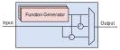

################
Signal Injection
################

The AMDC is designed to run control algorithms implemented in C-code.
Control algorithms can usually be described in block digram form where signals flow between various blocks.
Injecting and manipulating signals as they flow is often useful for validation of controllers.

For easy signal injection, the AMDC firmware library includes a module called :code:`sys/injection` which handles the common signal creation and user command interface.
Users can easily build numerous injection points into their controller code.

The remainder of this document explains how to add injection points, how to use the injection module, and example use cases.

.. seealso::
    Injections pair nicely with :doc:`../logging/index`!

-----------------------
What Are Injections?
-----------------------

Injections refer to adding or modifying signals in a control algorithm.
For each location a signal is modified, a so-called **injection point** is added.
Each injection point can be visualized as a block which takes an optional input and provides an output.
Internally, the injection point block computes a prescribed function and combines it with the input signal to create the output signal.
The output combination can either replace or augment the input signal.

Each injection point can be visualized like this:

Each :code:`Function Generator` block in the stack implements one type of function: constant, white noise, triangle, square, chirp, sine, etc.
The output is formed via the mux selecting either: (i) just the function generator output, or (ii) a sum/difference of the function generator output with the input signal.

These blocks are generic and can be used many times through-out a control algorithm.

**Note that, by default, the injection point is "disabled" and acts as a pass-through -- the output signal is the input signal.**
**The user must manually enable the injection during operation.**

-----------------------
Example Use Cases
-----------------------

Consider the following (typical) control structure:

.. image:: images/control-diagram.svg
    :align: center

The :code:`Controller` tries to regulate the :code:`Output` to match the :code:`Reference`.
The :code:`Controller Output` is applied to the :code:`Plant`, along with the :code:`Disturbance`.
The total applied input to the plant is called the :code:`Plant Input`.

~~~~~~~~~~~~~~~~~~~~~~
Use Case 1: References
~~~~~~~~~~~~~~~~~~~~~~

The first use case is to place an injection point supplying the :code:`Reference` signal.
Doing so allows generic signals to be commanded to the system, such as constants, noise, etc.
This could be implemented in "user-land" as a custom command, but building on top of the injection module is much easier.

~~~~~~~~~~~~~~~~~~~~~~~~~~~~~~~~~~~~~~~~~~~~
Use Case 2: Controller Output
~~~~~~~~~~~~~~~~~~~~~~~~~~~~~~~~~~~~~~~~~~~~

By inserting an injection point for the :code:`Controller Output`, the injection can be used to either add a simulated disturbance, or to replace the controller and apply open-loop inputs to the `Plant`.

^^^^^^^^^^^^^^^^
Disturbance
^^^^^^^^^^^^^^^^

If the injection point is configured to sum the internal function with the input signal, this injection point effectively adds an artificial disturbance to the system.
This can be used to estimate the controller's disturbance rejection properties.

^^^^^^^^^^^^^^^^^^^^^^^^^^^^^^^^
Open-Loop Plant Input
^^^^^^^^^^^^^^^^^^^^^^^^^^^^^^^^

If the injection point is configured to override the input signal and simply use the internal function generator output as the block output, the controller is effectively disabled and the injection point allows the user to apply arbitary inputs to the plant.
Remember that this is possible without any changes to the running control code; after an injection point is added (while writting the C-code), it can be activated any time.

~~~~~~~~~~~~~~~~~~~~~~~~~~~~~~~~~~~~~~~~~~~~
Use Case 3: Non-Ideal Sensor
~~~~~~~~~~~~~~~~~~~~~~~~~~~~~~~~~~~~~~~~~~~~

The first two use cases are the most common places to add injection points.
However, they can be added anywhere and everywhere in the control algorithm!
For example, adding an injection point inline with the sensor feedback can be used to emulate sensor offsets or noise.

In general, you might consider adding injection points to all signals flowing in the controller.

----------------------------------------------
Adding Injection Points to C-Code
----------------------------------------------

Now that you understand injection points and how they can be used in control algorithms, we will discuss how to modify the C-code.

All relevant system code can be found in the :code:`sys/injection` and :code:`sys/cmd/cmd_inj` modules.

~~~~~~~~~~~~~~~~~~~~~~~~~~~~~~~~~~~~~~~~~~~~
Step 1: Create Context
~~~~~~~~~~~~~~~~~~~~~~~~~~~~~~~~~~~~~~~~~~~~

You must create a **context** for each injection point.
The context is of type :code:`inj_ctx_t`.
Normally, these are :code:`static` variables defined within task C files.

For example, in :code:`task_foo.c`:

.. sourcecode:: c

    #include "sys/injection.h"
    
    // ...

    // Array of 4 contexts (i.e., 4 injection points)
    static inj_ctx_t inj_ctx_ctrl[4] = { 0 };

    // ...

.. hint::
    If you receive code complilation errors, make sure you have enabled the injection module in ``app_cpu1/usr/user_config.h`` by editting the ``USER_CONFIG_ENABLE_INJECTION`` define.
    
    
~~~~~~~~~~~~~~~~~~~~~~~~~~~~~~~~~~~~~~~~~~~~~~~~~~~~~~~~~~~~~~~~~~
Step 2: Initialize and Register Context
~~~~~~~~~~~~~~~~~~~~~~~~~~~~~~~~~~~~~~~~~~~~~~~~~~~~~~~~~~~~~~~~~~

Next, you need to initialize and register the context once when the system boots.

You will need to determine suitable ASCII names for each injection point.
These strings will be typed into the commands so the system knows which injection point is being used.
For example, :code:`Iq*` might mean the q-axis current reference.

For example, in :code:`task_foo.c`:

.. sourcecode:: c

    void task_foo_init(void)
    {
        // ...

        // Initialize signal injection points
        injection_ctx_init(&inj_ctx_ctrl[0], "Id*");
        injection_ctx_init(&inj_ctx_ctrl[1], "Iq*");
        injection_ctx_init(&inj_ctx_ctrl[2], "Tem*");
        injection_ctx_init(&inj_ctx_ctrl[3], "omega_m*");

        // Register all signal injection points
        for (int i = 0; i < ARRAY_SIZE(inj_ctx_ctrl); i++) {
            injection_ctx_register(&inj_ctx_ctrl[i]);
        }

        // ...
    }

    void task_foo_clear(void)
    {
        // ...

        // Clear all injection points
        for (int i = 0; i < ARRAY_SIZE(inj_ctx_ctrl); i++) {
            injection_ctx_clear(&inj_ctx_ctrl[i]);
        }

        // ...
    }

~~~~~~~~~~~~~~~~~~~~~~~~~~~~~~~~~~~~~~~~~~~~
Step 3: Inject During Callback
~~~~~~~~~~~~~~~~~~~~~~~~~~~~~~~~~~~~~~~~~~~~

Finally, you use the injection points by calling :code:`injection_inj()` once per callback, once per injection point.
This function requires 3 arguments:

1. Pointer to the variable into which you want to inject
2. Pointer to the injection context
3. Timestep length since last calling the function (i.e. :code:`Ts`)

For example, in :code:`task_foo.c`:

.. sourcecode:: C

    static double Id_star = 0;
    static double Iq_star = 0;
    static double Tem_star = 0;
    static double omega_m_star = 0;

    void task_foo_callback(void)
    {
        // ...

        // Perform signal injections
        injection_inj(&Id_star, &inj_ctx_ctrl[0], Ts);
        injection_inj(&Iq_star, &inj_ctx_ctrl[1], Ts);
        injection_inj(&Tem_star, &inj_ctx_ctrl[2], Ts);
        injection_inj(&omega_m_star, &inj_ctx_ctrl[3], Ts);

        // Now, the local variables have the signal contents
        // injected into them as requested by the user.

        // ...
    }

----------------------------------------------
Using Injection Commands
----------------------------------------------

Now that the C-code has been instrumented for signal injection, the :code:`inj` commands can be used.

Per the :code:`help` output, the :code:`inj` sub-commands are:

- :code:`clear` - Clear all injections
- :code:`list` - List all available injection points
- :code:`const <name> <set|add|sub> <value>` - Inject a constant
- :code:`noise <name> <set|add|sub> <gain> <offset>` - Inject noise
- :code:`chirp <name> <set|add|sub> <gain> <freqMin> <freqMax> <period>` - Inject chirp
- :code:`triangle <name> <set|add|sub> <valueMin> <valueMax> <period>` - Inject triangle
- :code:`square <name> <set|add|sub> <valueMin> <valueMax> <period>` - Inject square

Start by typing :code:`inj list` to see all registered injection points.

Next, to clear previous injections, type :code:`inj clear`.

To inject a signal, all commands follow a similar flavor.
First, determine the type of signal (e.g., noise).
Next, determine the signal name, as defined in the :code:`register()` command in the C-code.
For the previous example, :code:`Id*` and :code:`Iq*` would be valid.
Then, determine if the signal generator should override (i.e., :code:`set`) or sum (i.e., :code:`add/sub`) with the input signal.
Finally, determine the parameters for the specific function generator.

Note that parameter values can be entered in normal decimal format, or scientific format.
For example, to specify 1 micro-unit, type either :code:`0.000001` or :code:`1e-6`.

~~~~~~~~~~~~~~~~~~~~~~
Constant Injection
~~~~~~~~~~~~~~~~~~~~~~

Example :code:`constant` injection where the :code:`gain = 0.6`:

.. plot::
    :context: close-figs
    :class: align-plot-left

    import matplotlib.pyplot as plt
    import numpy as np

    my_value = 0.6

    fig, ax = plt.subplots(nrows=1, ncols=1, figsize=(5,3))
    ax.plot([0, 1], [my_value, my_value])

    ax.set_ylim(-0.1, 1)

    ax.set_xlabel("Time (sec)")
    ax.set_ylabel("Injected Signal")

    anno_lw = 2

    # Add value label
    ax.plot([0.5-0.02, 0.5+0.02], [my_value, my_value], color='black', linewidth=anno_lw)
    ax.plot([0.5-0.02, 0.5+0.02], [0, 0], color='black', linewidth=anno_lw)
    ax.plot([0.5, 0.5], [0, my_value], color='black', linewidth=anno_lw)
    ax.text(0.5 + 0.04, my_value/2, "value",  ha="left", bbox=dict(facecolor='white', alpha=0.8))

    fig.tight_layout()

    fig.show()

**Syntax:** :code:`inj const <name> <set|add|sub> <value>`

The most basic injection.

Only requires specifying the constant value.
The units of the value are relative to the control variable.

~~~~~~~~~~~~~~~~~~~~~~
Noise Injection
~~~~~~~~~~~~~~~~~~~~~~

Example :code:`noise` injection where the :code:`gain = 0.3` and the :code:`offset = 0.5`:

.. plot::
    :context: close-figs
    :class: align-plot-left

    import matplotlib.pyplot as plt
    import numpy as np
    import random

    t_step = 1e-3
    tt = np.arange(0, 1, t_step)
    yy = np.zeros_like(tt)

    offset = 0.5
    gain = 0.3

    t_local = 0
    for idx,t in enumerate(tt):
        yy[idx] = random.uniform(-1, 1)*gain + offset

    fig, ax = plt.subplots(nrows=1, ncols=1, figsize=(5,3))
    ax.plot(tt, yy)

    ax.set_ylim(-0.1, 1)

    ax.set_xlabel("Time (sec)")
    ax.set_ylabel("Injected Signal")

    anno_lw = 2

    ax.plot([0,1], [offset, offset], color='red', linewidth=anno_lw, linestyle='dashed')
    ax.plot([0.5-0.02, 0.5+0.02], [offset, offset], color='black', linewidth=anno_lw)

    # Add gain label
    ax.plot([0.5-0.02, 0.5+0.02], [offset+gain, offset+gain], color='black', linewidth=anno_lw)
    ax.plot([0.5, 0.5], [offset, offset+gain], color='black', linewidth=anno_lw)
    ax.text(0.5 + 0.04, offset+gain/2, "gain",  ha="left", bbox=dict(facecolor='white', alpha=0.8))

    ax.plot([0.5-0.02, 0.5+0.02], [0, 0], color='black', linewidth=anno_lw)
    ax.plot([0.5, 0.5], [0, offset], color='black', linewidth=anno_lw)
    ax.text(0.5 + 0.04, offset/2, "offset",  ha="left", bbox=dict(facecolor='white', alpha=0.8))

    fig.tight_layout()

    fig.show()

**Syntax:** :code:`inj noise <name> <set|add|sub> <gain> <offset>`

Injects white noise into the signal.
The noise is computed using :code:`rand()` (ranges from -1.0 to 1.0) and is scaled to +/- :code:`gain`.
The :code:`offset` is summed with the noise to provide average-valued noise.

Note: noise injection with :code:`gain = 0` and :code:`offset = G` is the same as constant injection with :code:`value = G`.

~~~~~~~~~~~~~~~~~~~~~~
Chirp Injection
~~~~~~~~~~~~~~~~~~~~~~

Example :code:`chirp` injection where the :code:`gain = 0.6`, :code:`freqMin = 1`, :code:`freqMax = 3`, and :code:`period = 5`:

.. plot::
    :context: close-figs
    :class: align-plot-left

    import matplotlib.pyplot as plt
    import numpy as np

    # See: https://github.com/Severson-Group/AMDC-Firmware/pull/216#issuecomment-961394976
    #
    def func_chirp(w1, w2, A, period, time):
        half_period = period / 2.0
        
        freq_slope = (w2 - w1) / half_period

        if (time < half_period):
            mytime = time
            mygain = 1
        else:
            mytime = period - time
            mygain = -1
        
        freq = freq_slope * mytime/2.0 + w1
        
        return (A * mygain * np.sin(freq * mytime))

    t_step = 1e-3
    tt = np.arange(0, 7.5, t_step)
    yy = np.zeros_like(tt)

    w1 = 2*np.pi*1 # [rad/s]
    w2 = 2*np.pi*3 # [rad/s]
    A = 0.6
    period = 5 # [sec]

    t_local = 0
    for idx,t in enumerate(tt):
        yy[idx] = func_chirp(w1, w2, A, period, t_local)

        t_local += t_step
        if (t_local > period):
            t_local = 0

    fig, ax = plt.subplots(nrows=1, ncols=1, figsize=(5,3))
    ax.plot(tt, yy)

    ax.set_ylim(-1, 0.9)

    ax.set_xlabel("Time (sec)")
    ax.set_ylabel("Injected Signal")

    anno_lw = 2

    # Add period label
    period_label_y = -0.9
    ax.plot([0, period], [period_label_y, period_label_y], color='black', linewidth=anno_lw)
    ax.plot([0, 0], [period_label_y-0.06, period_label_y+0.06], color='black', linewidth=anno_lw)
    ax.plot([period, period], [period_label_y-0.06, period_label_y+0.06], color='black', linewidth=anno_lw)
    ax.text(period/2, period_label_y + 0.10, "period",  ha="center", bbox=dict(facecolor='white', alpha=0.8))

    # Add gain label
    ax.plot([0.5-0.2, 0.5+0.2], [0, 0], color='black', linewidth=anno_lw)
    ax.plot([0.5-0.2, 0.5+0.2], [A, A], color='black', linewidth=anno_lw)
    ax.plot([0.5, 0.5], [0, A], color='black', linewidth=anno_lw)
    ax.text(0.5 + 0.15, A/2, "gain",  ha="left", bbox=dict(facecolor='white', alpha=0.8))

    fig.tight_layout()

    fig.show()

**Syntax:** :code:`inj chirp <name> <set|add|sub> <gain> <freqMin> <freqMax> <period>`

Injects a linear `chirp <https://en.wikipedia.org/wiki/Chirp>`_ signal that ramps up and down in frequency, i.e., a back-to-back chirp.
Ideally, there are no discontinuities in the output.

The frequency values (:code:`freqMin` and :code:`freqMax`) are in Hz and :code:`period` is in seconds.

The chirp implementation ramps the frequency from the min to max value over :code:`period/2` seconds, then ramps from the max to min frequency over the second half of the period.
This allows for continuous output.

The :code:`gain` value is in units relative to the injected control variable.

Note that a chirp can become a simple sinusoid by setting the min and max frequency equal and an appropriate period.
The period should be set such that it does not clip the sinusoidal output, i.e., period should contain an integer number of complete waveforms.

~~~~~~~~~~~~~~~~~~~~~~
Triangle Injection
~~~~~~~~~~~~~~~~~~~~~~

Example :code:`triangle` injection where the :code:`valueMin = 0.35`, :code:`valueMax = 0.85`, and :code:`period = 0.65`:

.. plot::
    :context: close-figs
    :class: align-plot-left

    import matplotlib.pyplot as plt
    import numpy as np

    t_step = 1e-3
    tt = np.arange(0, 1, t_step)
    yy = np.zeros_like(tt)

    period = 0.65
    minValue = 0.35
    maxValue = 0.85

    my_slope = (maxValue-minValue) / (period/2)

    t_local = 0
    for idx,t in enumerate(tt):
        if (t_local < period/4):
            yy[idx] = +my_slope * t_local + (maxValue+minValue)/2
        elif (period/4 <= t_local and t_local < 3*period/4):
            yy[idx] = -my_slope * (t_local-period/4) + maxValue
        elif (3*period/4 <= t_local):
            yy[idx] = +my_slope * (t_local - (3*period/4)) + minValue
        else:
            yy[idx] = 0

        t_local += t_step
        if (t_local > period):
            t_local = 0

    fig, ax = plt.subplots(nrows=1, ncols=1, figsize=(5,3))
    ax.plot(tt, yy)

    ax.set_ylim(0, 1)

    ax.set_xlabel("Time (sec)")
    ax.set_ylabel("Injected Signal")

    anno_lw = 2

    # Add annotations
    ax.plot([0, 1], [maxValue, maxValue], color='black', linewidth=anno_lw, linestyle='dashed')
    ax.text(0, minValue + 0.06, "valueMin", bbox=dict(facecolor='white', alpha=0.8))
    ax.plot([0, 1], [minValue, minValue], color='black', linewidth=anno_lw, linestyle='dashed')
    ax.text(0, maxValue + 0.06, "valueMax", bbox=dict(facecolor='white', alpha=0.8))

    # Add period label
    ax.plot([0, period], [0.1, 0.1], color='black', linewidth=anno_lw)
    ax.plot([0, 0], [0.1-0.02, 0.1+0.02], color='black', linewidth=anno_lw)
    ax.plot([period, period], [0.1-0.02, 0.1+0.02], color='black', linewidth=anno_lw)
    ax.text(period/2, 0.1 + 0.06, "period",  ha="center", bbox=dict(facecolor='white', alpha=0.8))

    fig.tight_layout()

    fig.show()

**Syntax:** :code:`inj triangle <name> <set|add|sub> <valueMin> <valueMax> <period>`

Injects a triangle wave ranging from the min value to the max value and back, over the period.
The waveform starts at the mid-value between min and max.

The :code:`period` parameter is in seconds.

~~~~~~~~~~~~~~~~~~~~~~
Square Injection
~~~~~~~~~~~~~~~~~~~~~~

Example :code:`square` injection where the :code:`valueMin = 0.3`, :code:`valueMax = 0.8`, and :code:`period = 0.75`:

.. plot::
    :context: close-figs
    :class: align-plot-left

    import matplotlib.pyplot as plt
    import numpy as np

    t_step = 1e-3
    tt = np.arange(0, 1, t_step)
    yy = np.zeros_like(tt)

    period = 0.75
    minValue = 0.30
    maxValue = 0.80

    t_local = 0
    for idx,t in enumerate(tt):
        if (t_local < period/2):
            yy[idx] = minValue
        else:
            yy[idx] = maxValue

        t_local += t_step
        if (t_local > period):
            t_local = 0

    fig, ax = plt.subplots(nrows=1, ncols=1, figsize=(5,3))
    ax.plot(tt, yy)

    ax.set_ylim(0, 1)

    ax.set_xlabel("Time (sec)")
    ax.set_ylabel("Injected Signal")

    anno_lw = 2

    # Add annotations
    ax.text(0, minValue + 0.06, "valueMin", bbox=dict(facecolor='white', alpha=0.8))
    ax.text(period/2, maxValue + 0.06, "valueMax", bbox=dict(facecolor='white', alpha=0.8))

    # Add period label
    ax.plot([0, period], [0.1, 0.1], color='black', linewidth=anno_lw)
    ax.plot([0, 0], [0.1-0.02, 0.1+0.02], color='black', linewidth=anno_lw)
    ax.plot([period, period], [0.1-0.02, 0.1+0.02], color='black', linewidth=anno_lw)
    ax.text(period/2, 0.1 + 0.06, "period",  ha="center", bbox=dict(facecolor='white', alpha=0.8))

    fig.tight_layout()

    fig.show()

**Syntax:** :code:`inj square <name> <set|add|sub> <valueMin> <valueMax> <period>`

Injects a square wave going from the min value to the max value and back, over the period.
The waveform starts at the min value.
The duty cycle is 50%.

The :code:`period` parameter is in seconds.

.. raw:: html

    <!-- This block updates all the inline plots on the page and makes them left justified -->
    
