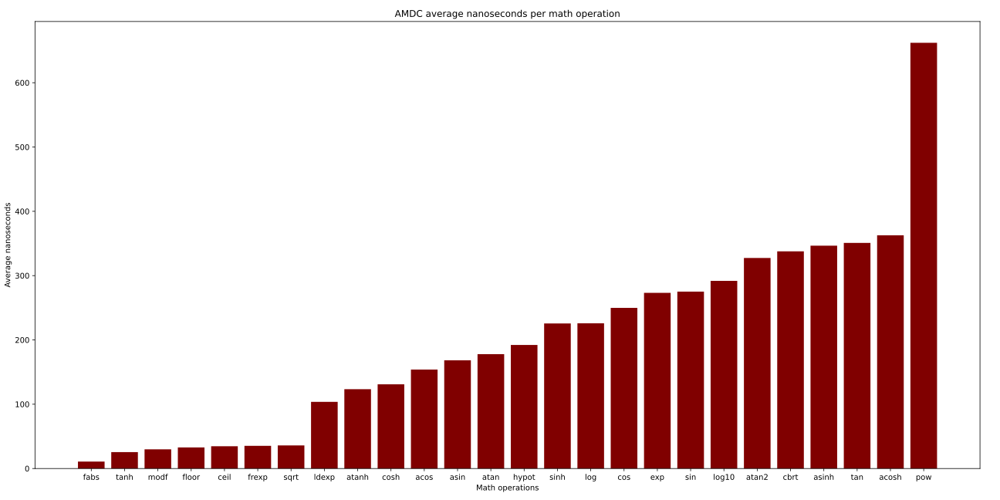

# Math Benchmarks

The AMDC is used for real-time control of motor drive systems: every X seconds, the AMDC samples various sensor input, performs some math on the sampled values, and then updates the PWM outputs based on the math. In the default firmware, the value of X is 100 microseconds, or a control rate of 10 kHz. For this all to work correctly, the firmware must compute the required math operations in a short time, i.e., much less than 100 us.

The AMDC uses a PicoZed system-on-module for its "brains". On this module, it has a AMD Xilinx Zynq-700 system-on-chip which is the main processor. This processor has dual core DSP and FPGA. The code which computes the math operations as described above runs on the DSP. The DSP is a standard ARM Cortex-A9 core. This is a relatively powerful processor.

We are interested in understanding how long various math operations take to complete on the Cortex-A9 processor. For example, `sin()`, `sqrt()`, `/`, etc. In order to get a better idea of the timing budget per callback cycle.

Mathematical operations from the <[math.h](https://pubs.opengroup.org/onlinepubs/9699919799/basedefs/math.h.html)> library as well as common operations and casts were timed and benchmarked.

## Benchmark Methodology

For each test, each operation was run 100 times with different operands. Clock cycles were counted for the total 100 operations, then a baseline number of clock cycles were subtracted from this total. The baseline was also gathered empirically for every test. It was how many clock cycles it took to set the output variable of the operations to an increasing value.

To understand the sequence of events, take the example of the `addi` test:
- First, the baseline was calculated. The global variable `mathCommandOutputInt` was set to `(1 + 0)` and the number of clock cycles taken to perform the operation was logged. Then `mathCommandOutputInt` was set to `(1 + 1)`, then `(1 + 2)`, etc. The total number of clock cycles for 100 sets of the variable was summed.
- Then, the operations were performed. Two random numbers (from 0 to 1024) were selected for the inputs to `addi`. Lets use the examples `639` and `912`. The time taken to set `mathCommandOutputInt` to `(639 + 912 + 0)` is recorded. Then `mathCommandOutputInt` is set to `(639 + 912 + 1)`, then `(639 + 912 + 2)`, etc, and the clock cycles taken for all 100 operations are summed. The reason for the changing variable is to avoid caching of the results and ensure that the processor must redo the add operation every time.
- With the measured and baseline numbers of clock cycles logged, the totals are subtracted from each other. The average number of clock cycles is calculated as `(measured - baseline) / 100.0` clock cycles.

Additional information:
- In some cases, the time taken to perform the operation was less than the baseline, like in the case of muli. This results in a negative number on the graph. This is unexpected and further tests would be required to determine the cause.
- Tests were ran on the debug version of the code. This uses the -O2 optimization flag with the gcc compiler
- The code that ran these tests lives [here](https://github.com/Severson-Group/RyansRepo/blob/math/AMDC-Firmware/sdk/app_cpu1/user/usr/math/cmd/cmd_math.c) and the python driver code is [here](https://github.com/Severson-Group/RyansRepo/blob/math/AMDCmathBenchmarks.py)
- Different output variables were used for integers, floats, and doubles to avoid implicit casting.
- It was difficult to control caching speedups. Operands to the operations were either constants or declared as register to try to mitigate this problem, but with more complex operations there are many factors that cannot be controlled.

## Results

### Common Operations


The `addi`, `subi`, `muli`, and `divi` refer to integer addition, subtraction, multiplication, and division.

Similarily `addf`, `subf`, `mulf`, and `divf` refer to 32-bit floating point operations.

Finally, the `add`, `sub`, `mul`, and `div` refer to 64-bit floating point (double) operations.

A few of these results are negative, which indicates that this operation performed faster than the baseline. This shouldn't happen, but there are likely factors that not accounted for or extra optimizations that the compiler figured out that results in this behaviour. In any case we can conclude that doing these operations are essentially "free", as it takes as long to compute and output the result as it does to output a constant result.

### Other Operations
<!-- START SECTION FOR PLOT WITH TOGGLE BUTTON -->

<script>
function toggle_plot() {
    var plot1 = document.getElementById("plot_show_1");
    var plot2 = document.getElementById("plot_show_2");

	plot1.style.display = plot1.style.display === 'none' ? 'block' : 'none';
	plot2.style.display = plot2.style.display === 'none' ? 'block' : 'none';
}
</script>

<button class="sd-badge sd-outline-light sd-text-light" style="cursor:pointer; padding:0.5em;" onclick="toggle_plot()">
Change plot sorting...
</button>

<div id="plot_show_1"  style="display:block;">


</div>

<div id="plot_show_2"  style="display:none;">



</div>

<!-- END SECTION FOR PLOT WITH TOGGLE BUTTON -->

All of these functions come from the <[math.h](https://pubs.opengroup.org/onlinepubs/9699919799/basedefs/math.h.html)> library.

### Casts


Naming format:
- `castfi` refers to a cast from a float (f) to an int (i).
- `castid` refers to a cast from an int (i) to a double (d).

## Conclusions

The numbers in the graphs are in nanoseconds, not clock cycles. However the conversion is simple. At a current frequency of 666.666 MHz, 1 clock cycle equals 1.5 nanoseconds. Changing the frequency of the clock will not change the number of clock cycles needed to complete an operation, but it will change the number of nanoseconds per clock cycle.

Quick analysis:
- Integer division and integer and double modulo are the slowest common operations by far
- Both float and double common operations tended to outperform their integer counterparts.
- the `sqrt` function was significantly faster than others in a similar complexity group
- Inverse trig operations outperformed normal trig operations.
- Normal trig and inverse trig operations outperformed hyperbolic trig and inverse trig operations. With the exception of `tanh` and `atanh` which performed much faster than expected.
- ceiling and floor operations were slower than I thought, being much slower than any floating point common operations and almost as slow as `sqrt`
- By far the slowest operation was `pow`, which is likely because it takes in two doubles and also allows negative inputs
- The natural log was quite a bit faster than log base 10.
- `cbrt` was significantly slower than `sqrt`

## Acceleration strategies

Integer division is so slow. It's faster to cast both inputs to doubles, do double division, and then cast that back to an integer.
```
// Computes (arg1 / arg2) for two integers
int fastdivi(int arg1, int arg2) {
	return (int) ((double) arg1 / arg2);
}
```

Likewise, why bother using the slow `floor()` function when you can just cast the double to an int and then back to a double.
```
// truncates the decimal portion of a double
double fastfloor(double arg) {
	return (double) (int) arg;
}
```

One strange result is the slowness of the `hypot()` function, which takes in two lengths and returns the hypotenuse as if the two inputs were sides of a right triangle. This function is abnormally slow, given that the formula is sqrt(x * x + y * y). Which should be around 42.615 nanoseconds but instead it takes on average 181.5 nanoseconds.
```
// calculates the hypotenuse of a right triangle given the lengths of the two legs
double fasthypot(double arg1, double arg2) {
	return sqrt(arg1 * arg1 + arg2 * arg2);
}
```

Perhaps the common cause for these operations taking longer is that there is overhead associated with setting extra variables. In order to find out, I ran some extra tests to see if I could increase the speed of certain operations.


The fast functions outperform their standard counterparts in every case.

# Conclusion

Use this page as a reference for ballparking about how many of a certain operation will fit within the allocated 100us timeframe. For instance, using the pow() function 140 times would be the around the limit, or doing 4350 integer divisions.

If you have any other ideas for speeding up operations, create a discussion thread on the AMDC-Firmware repo [here](https://github.com/Severson-Group/AMDC-Firmware/discussions)!