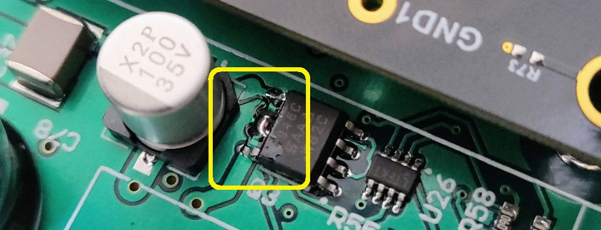
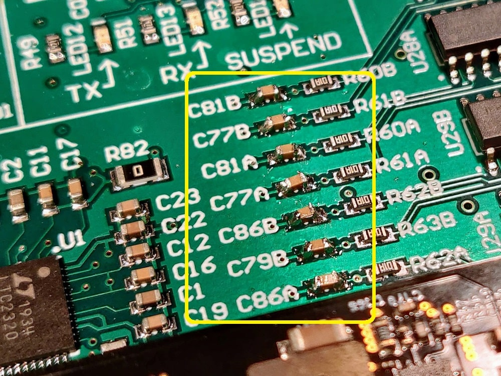
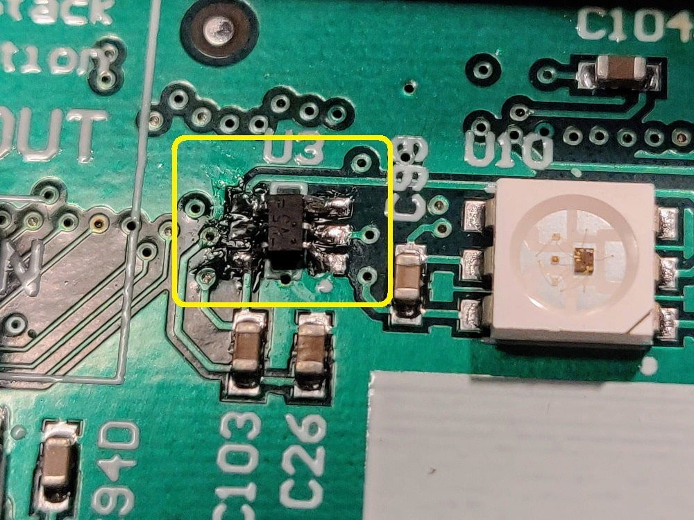
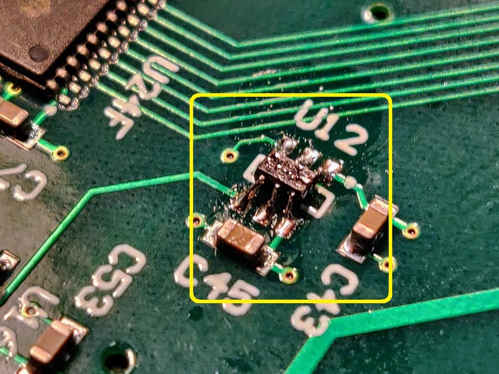
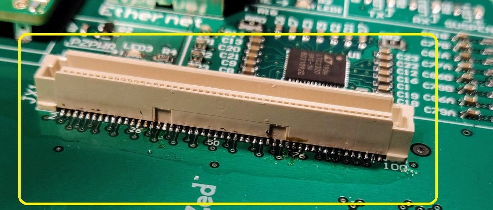
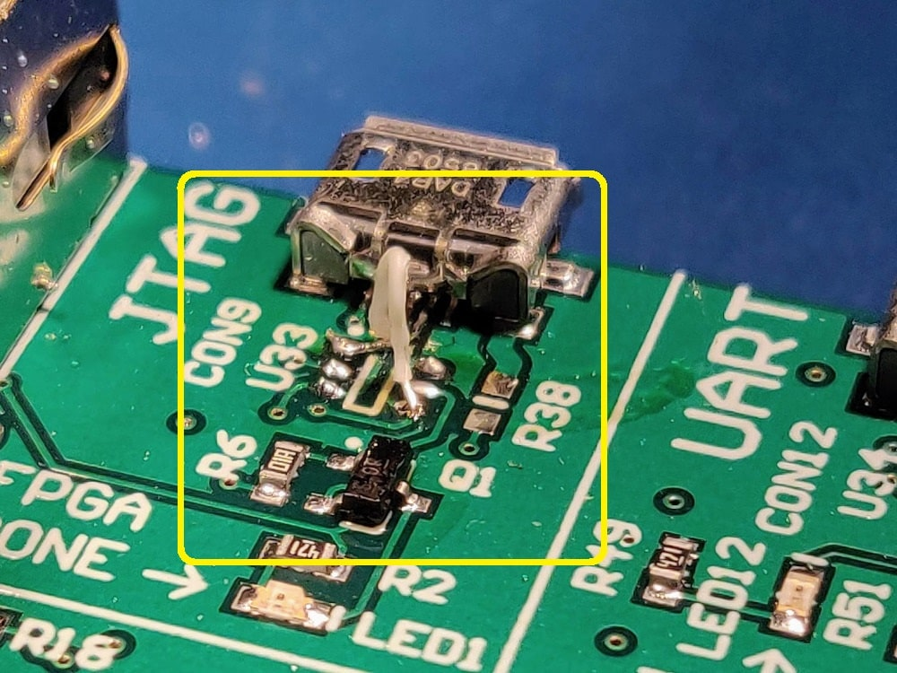
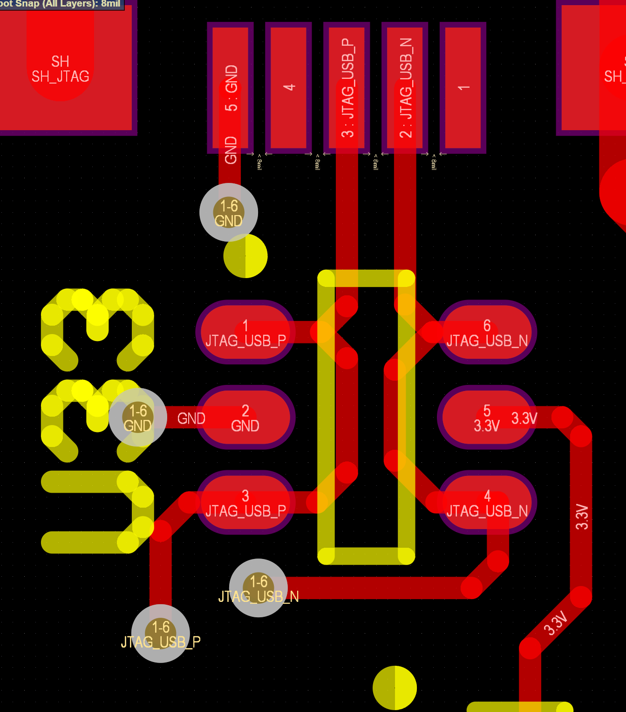
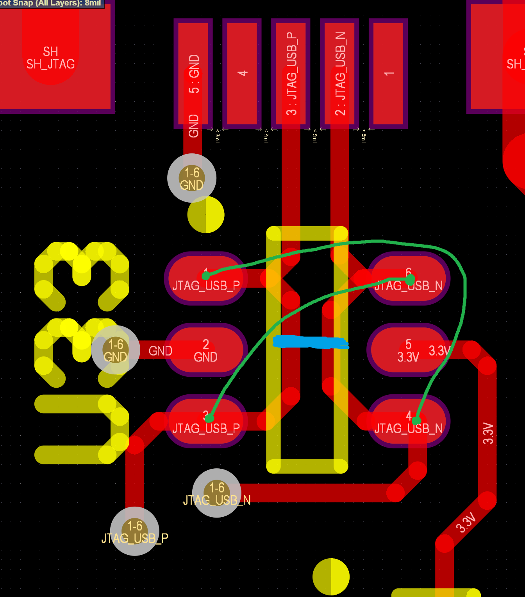

# REV D Errata

This document describes problems with the REV D AMDC hardware and the required rework to make the board functional.

## 1. Power protection broken

**Issue:** The input power protection does not work. It keeps the protection MOSFET off even when valid input voltage is present.

**Fix:** Short pins 6 and 7 together on Q3. This disables the input protection.

## 2. Analog RC filter caps missing

**Issue:** The BOM specified incorrect size capacitors for the passive RC filters on the analog inputs.

**Fix:** Solder correct 0603 size caps for C81, C77, C86, C79 (2x A/B). For 50kHz bandwidth, use 33nF.

## 3. Single channel voltage translator IC missing.

**Issue:** U3 and U12 footprint is too large for the IC, thus not soldered onto PCB by default.

**Fix:** Solder U3 and U12 onto PCB. They fit onto existing footprint, just have to create solder bridges to the pins so they connect.

## 4. PicoZed connectors missing

**Issue:** The 3x 100-pin PicoZed connectors were not populated.

**Fix:** Solder them on. Hot air will melt them, so use a fine-tip iron and lots of patience. 

## 5. JTAG USB data lines swapped

**Issue:** The schematic drawing for the JTAG-SMT2-NC module labeled the USB data line pins incorrectly, so they are swapped on the PCB (i.e. USB_D+ should go to USB_D-, etc).

**Fix:** Rework board to swap the JTAG USB data lines.

Due to the layout, this rework must be done on the top of the PCB. Below is a screenshot from Altium of the board layout. Use this image to figure out where you want to cut traces so you can swap the JTAG USB data lines.

**Suggestioned Method:** To do this rework in a fairly easy way, consider following these steps:

1. Remove U33 TVS diode (this is used to protect against ESD events, but is not strictly required).
2. Cut traces at blue line below.
3. Attach jumper wires (recommended to use 30AWG) at the green locations below.

