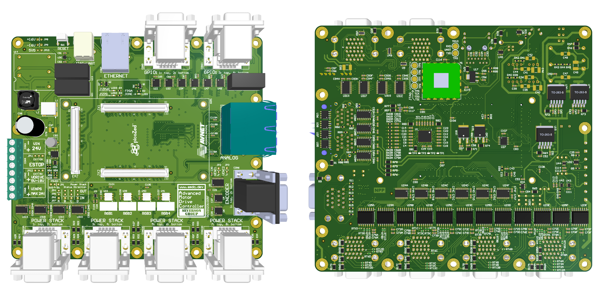

# REV F Hardware



## Quick Links

- [Changelog](https://github.com/Severson-Group/AMDC-Hardware/blob/develop/CHANGELOG.md#REV20231005F)
- [GitHub Milestone](https://github.com/Severson-Group/AMDC-Hardware/milestone/8)
- [Orderable Design Files](https://github.com/Severson-Group/AMDC-Hardware/tree/develop/REV20231005F)

## Description

The 6th revision of the AMDC hardware, REV F, fixes minor issues from the REV E design:

- The addition of termination resistors on incoming GPIO lines
- PWM gate signals are now properly held low during AMDC boot-up

```{toctree}
:hidden:

rev-f-bring-up
rev-f-pin-mapping
```