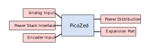

# Subsystems

The AMDC circuit design is explicitly a modular system with abstraction between the subsystems.
Each subsystem is documented in detail in the subpages here.



```{toctree}
:hidden:

picozed
analog
encoder
power-distribution
power-stack
expansion-port
```